# TE 2
## 6 CONVOLUTIONAL NEURAL NETWORKS
#### Pattern matching problem
quand on deal avec on a souvnet beaucoup variablitée. Le mieux ça serais de reconaitre les choses avec un "template"

du coup, on ce retrouve avec un system de couche ou les couche les plus basse check pour les features (nez, eye, chapeau, etc...) et les couches les plus haute server elle a reconaitre ce que ces feature ensemble voudrais dire (en théorie, 3blue1brown video)
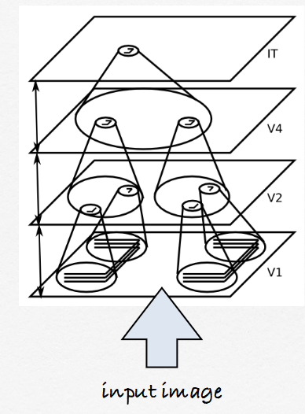

##### Convolutions on image processing (OMG blure)
En gros, classic blure tech que l'on peut utiliser pour faire une detection d'edge simple (la matrice s'appel un "kernel")
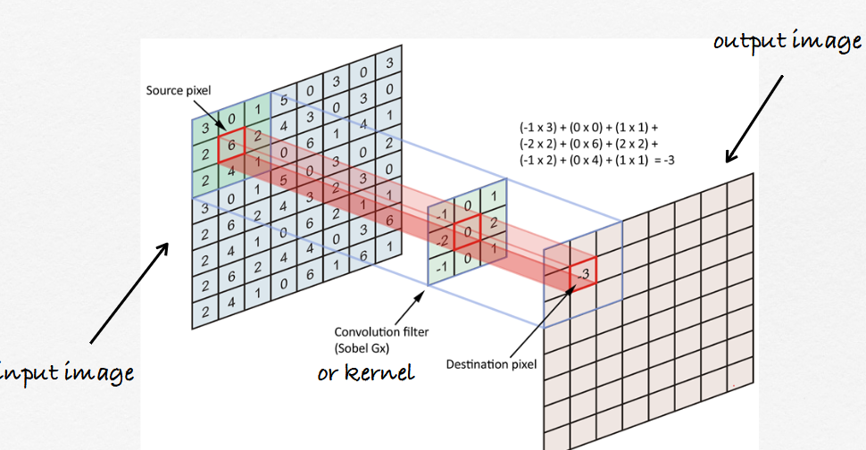

On peut utiliser ce system "kernel" pour trouver un paterne
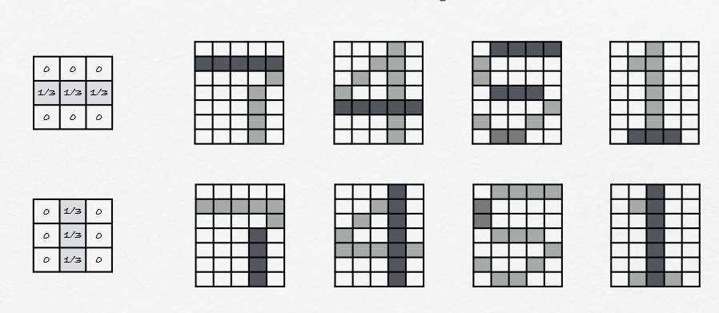

### Convolutional Neural Networks (CNN)
c'est un neural networks qui sert a trouver une "Kerenel" pour choper le parterne d'une image

###### Architecture
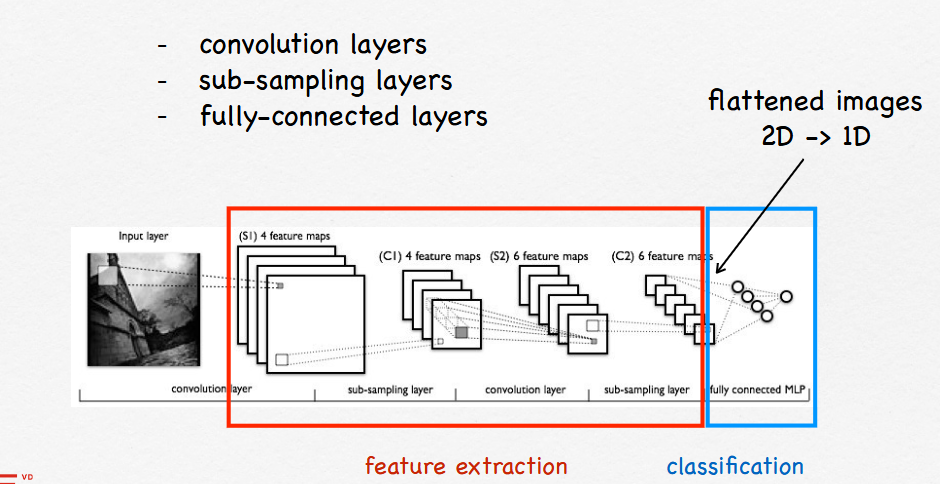

#### recognition
Le CNN permette de réglé un problème, vue que logiquement un perternne de base seras ineficase dans le cas ou l'image change de taille ou varie trop

Donc pour faire ça, d'abort on train un modèle a reconaitre des feature peut import où dans l'image

(pour géré le RGB, tu fais 3 "kernel")

Puis, on a le ***MAXPOOL*** (omg cool font)
C'est en gros, les layers superieur qui vont check le "pourcentage" de chaque feature pour classifier
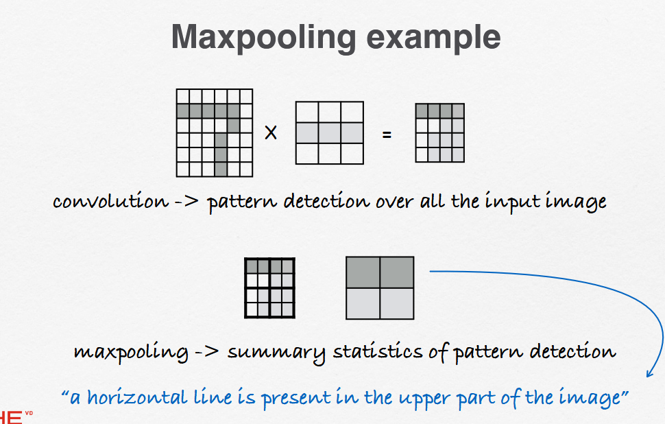

###### (random, "Fully-connected layers" => multilayer perceptron mais c'est devenue un peu geez)

#### Flattening phase
c'est juste la phase où on chope toute les features et qu'on vas dire ce que l'on pense que c'est
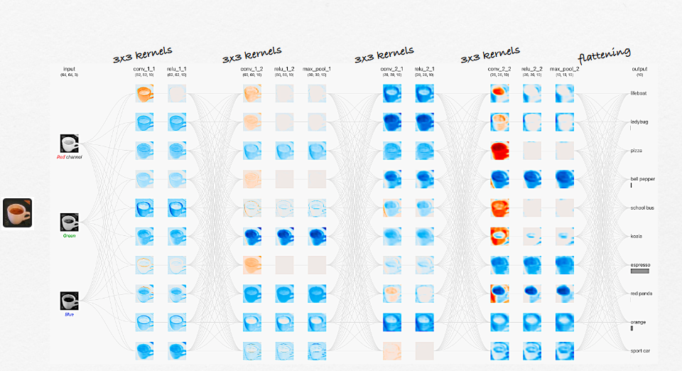

## 7 FROM SHALLOW TO DEEP NEURAL NETWORKS
SHALLOW network = network avec peut de couche

### Ensemble neural networks
tu mette plusieur model ensemble pour fair une tache complex
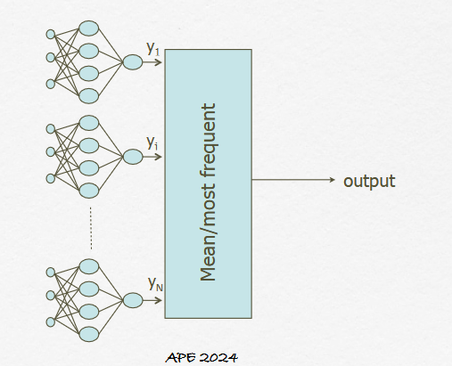

### Deep networks
- Deep Belief Networks : multiple layer of stochastic neural networks. They recursively learn
layers of feature detectors in an unsupervised way. turn out, c'est pas super efficace
- CNN on a vue avant
#### Trick pour train des deep network
En gros, tu traine les partie séparément, genre tu fixe les wieght des layer de transition entre les n partie, puit tu traine chaque partie a sépraément a recrée le bon weight
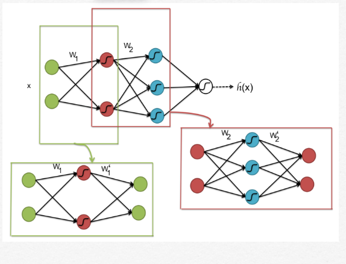

#### IDK part, just random fact
##### 1 - Spatial processing
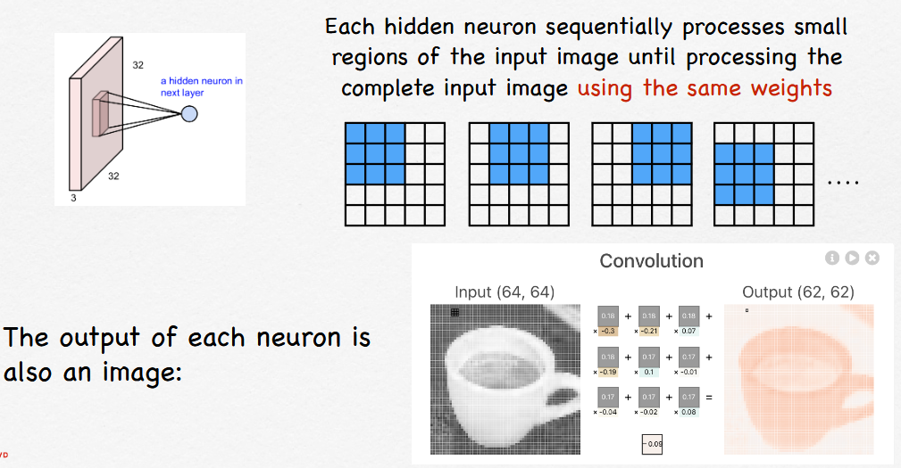 genre, no way

##### 2 - Multiple convolutions with different kernels to detect multiple features
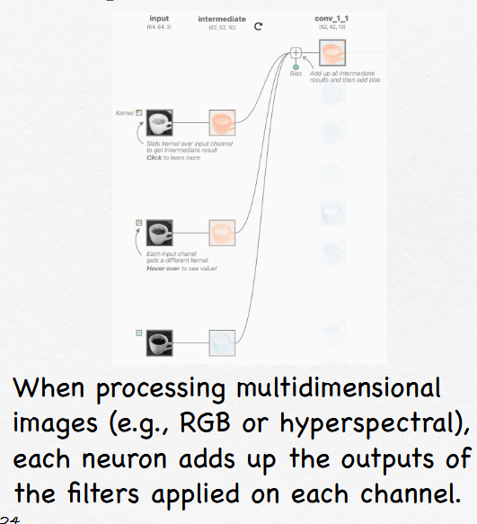 ???

##### 3 - Hierarchical feature detection
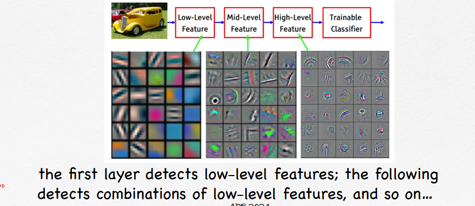 💀

##### 4 - New activation functions
- ReLu function sont préfré to avoid vanaishing of gradients
- softmax function is often used in classification
  ( $f(x_i) = \frac{e^{xi}}{\sum{e^{xj}}}$ $,j = 1...k$ )
- The sum of f(xi) equals 1, thus the outputs represent a categorical probability distribution.

##### 5 - Dropout to avoid overfitting
Le "Dropout" c'est une tech
l'idée c'est de dégager des donner durant le training pour evitre l'overfitting

#### Data augmentation
tu prend une image, tu la transform et bam, nouvel image
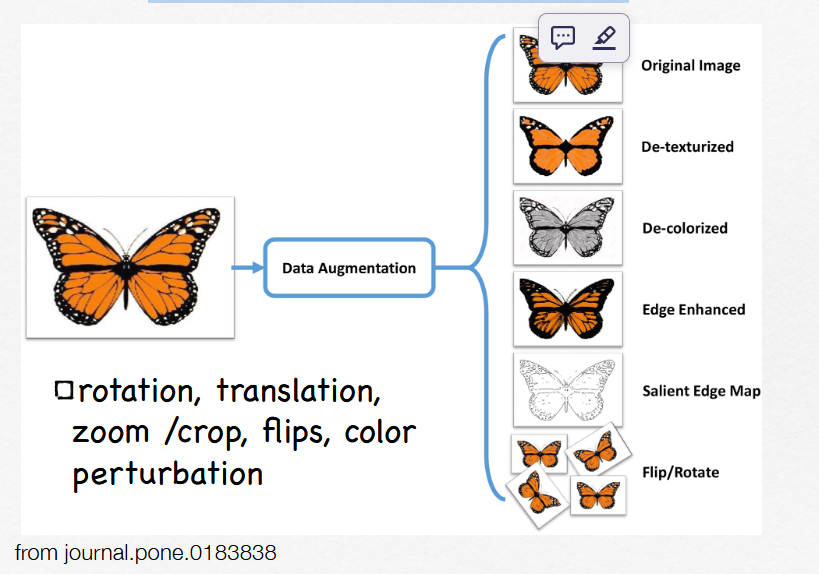

### JSP ou le mettre
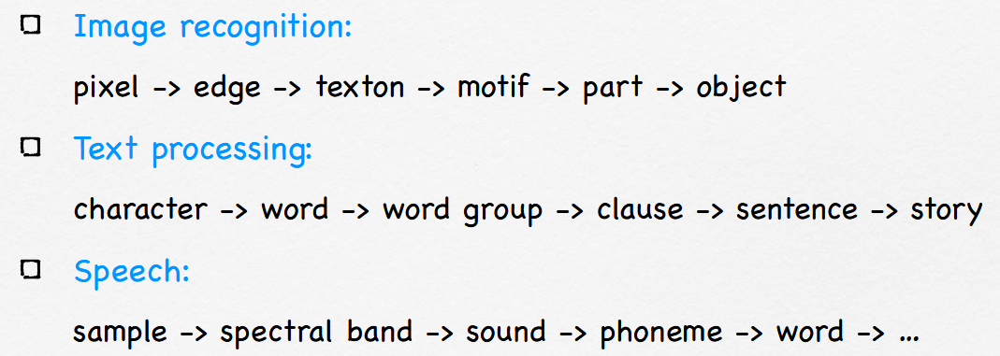

## 8 CONVOLUTIONAL NEURAL NETWORK ARCHITECTURES
- **LeNet-5** (1989) : c'est le model par Yann LeCun pour reconnaitre les nombres
- **ImageNet** : c'est une competition de reconightion d'image
- **AlexNet** (2012) : c'est un modle de reconnaisant d'image cool pour l'époque
  il utiliser un ReLus
- **ZF Net** (2013) : par Matthew Zeiler and Rob Fergus, il a été train sur 1.3M d'image
  il utilise un kernel 7x7
- **VGG Net** (2014) : il été cool pour l'époque
  avec plusieur krenel 64, 128, 256, 512, 512 (oui 2 fois 512)
## 9 TRANSFER LEARNING, EMBEDDINGS AND META-LEARNING
#### Transfer learning
Tu prend les premier layer tu voie, et bam tu les bouge ver un autre network pour que tu evite de devoire les re-train et permettre de les changer tache

de cette idée, on peut faire ce qu'on avait dit [7- Ensemble neural networks]

#### MobileNet
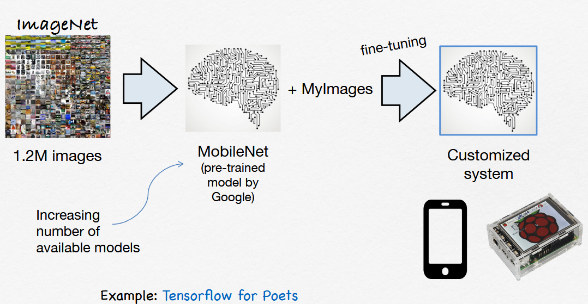

#### Typical transfer learning process
- tu trouve les partie que tu pourais remplacer
- tu load les params (wieght et connection)
- tu modifi le dernier layers pour qu'il prenne les nouveau outpute
- tu freez la partie qui tu vien d'importer pour pas la modifier durant le training
- et good to go

#### Vector Embeddings
Tu peus reduire un ensemble de feature en un vector. l'interet, c'est que vue que c'est un vector, tu peux faire des check de distance et donc fair des raprochement comme ça

##### Embeddings for transfer learning
A la place de placer le neuronne dans un nouveau model, tu peux faire en sorte que le model 1 te sorte un vector et train le model 2 dessus
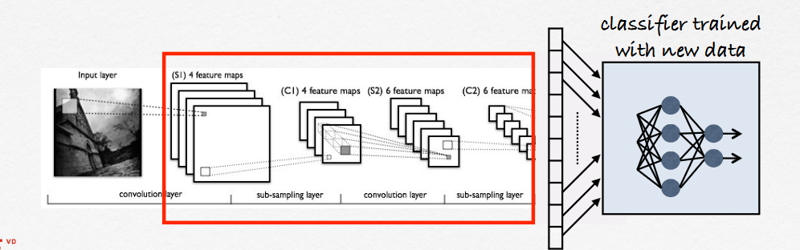

#### Meta learing
en gros, l'idée c'est que tu traine un modle sur N epoche et tu repette ça sur X tache. Le bute a terme c'est de reconnaitre la tache et la manière de la resoudre avec le moins d'epoche possible

## 10 DEEP TROUBLES
turn out, les model ça ce trompe, comment aider les pauvre model ?
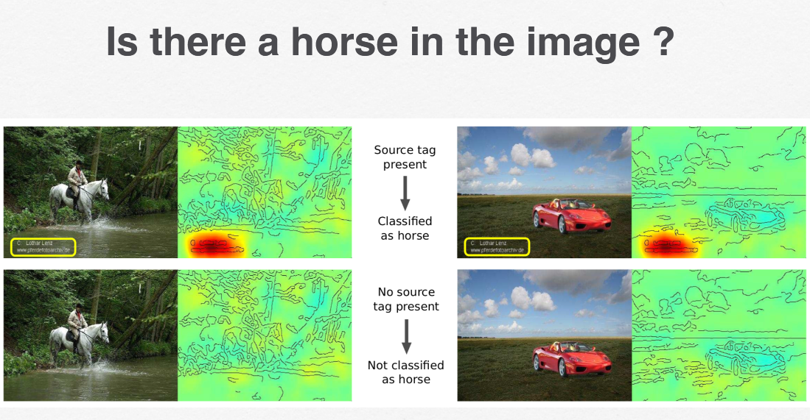

- check si y a pas de bier
- check si y a pas des partie qui peuvent aider trop
### Spatial translation invariance
vue que ls CNN sont peuvent reconaitre peut import la taille est le offset, bah ils peuvent faire ça
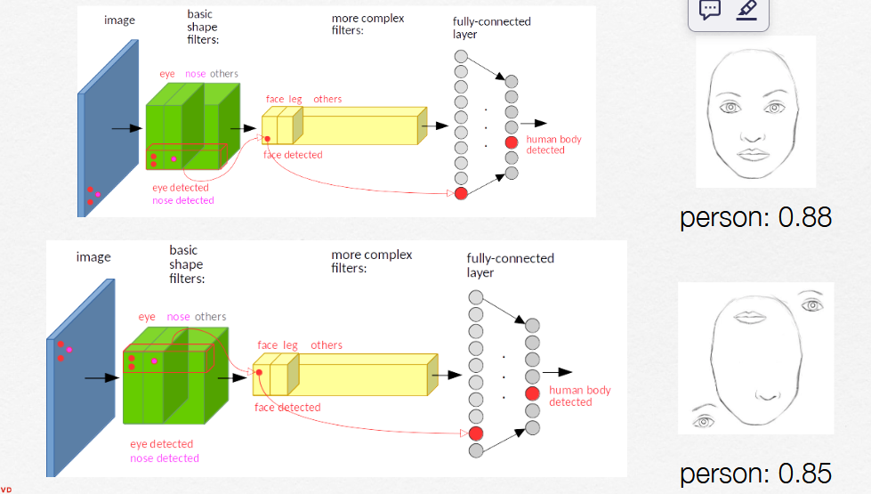

#### Adversarial attacks
Tu peux douiller un modèl avec des partenne particuler
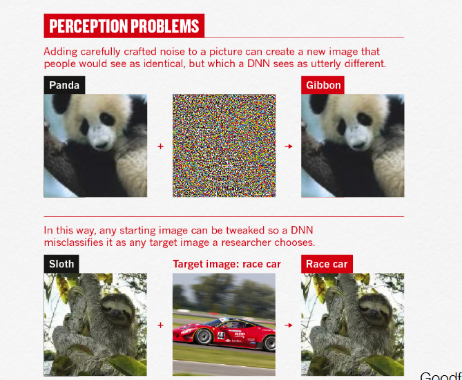
ça peut ce faire en superposant des image

#### Feature Map visualization
c'est un outil pour checker quel feature sont checker par layer et voir si y a pas de bier

pour ça, on check sur l'image de quel partie de celle si le model c'est plus baser pour tiré ça conclusion (en partant de la sortie et en retournant en arrière)
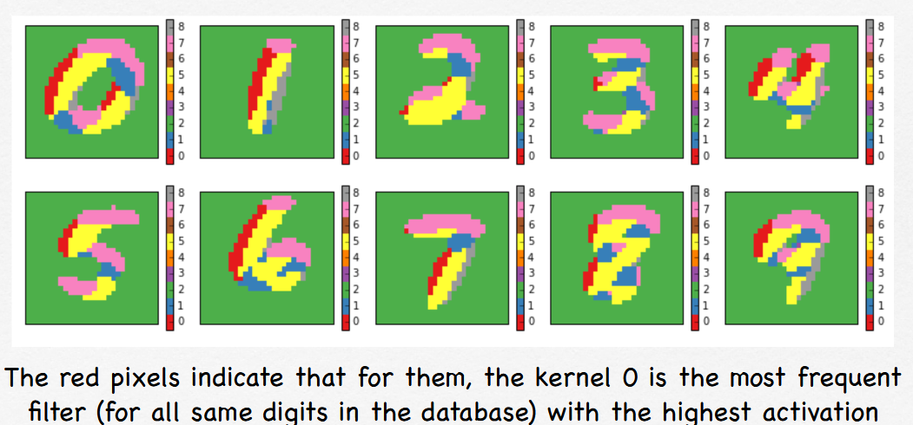

###### Occlusion Analysis
De la on peut faire de Occlusion Analysis
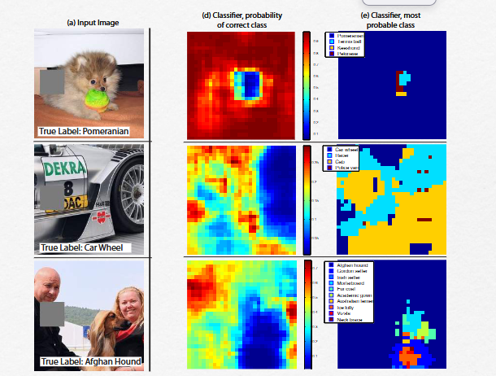

###### Class Activation Maps
C'est une map qui permette devoir qu'elle partie de l'image a le plus été regarder pour savoir la catégorisé
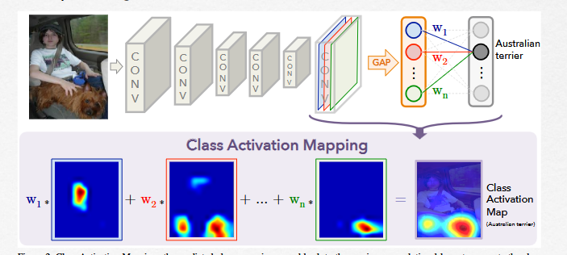

###

## 11  APPLICATIONS OF DEEP NEURAL NETWORKS
...
## 12 BEYOND CONVOLUTIONAL NEURAL NETWORKS
...