# Formule
##### Stats
- Accuracy = $\frac{TP + TN}{P + N}$
 

- Precision = $\frac{TP}{TP + FP}$
 

- Recall = $\frac{TP}{P}$
 

- Standare deviation =
  pour $v_i \in values$, $\mu=$ moyen des valeurs, $n = $ n values
  $\sqrt{\frac{\sum{(v_i - \mu)^2}}{n}}$
###### F-score
- $F_1$ = $\frac{2 * TP}{2 * TP + FP + FN}$
 
- $F_\beta$ = $\frac{(1 + \beta^2) * TP}{\beta^2*(TP + FN) + (TP + FP)}$

##### Perceptron
- base formule = $\sum{x_i*w_i} - w_0$ → activation function (basic = $ \ge 0?1:0 $ )
$w_0$ = bias = $-\Theta$ |
- update weight = $w_j(t+1) = w_j(t) + \eta(d-y)x$
$d$ = target output | $\eta$ = learning rate (0-1) | $x$ = value | $y$ = result
- Error function

##### Gradiant decent forumle

##### Backpropagtion
- classic = $\delta w_{ij}^k = - \frac{\eta*\delta*E}{\delta*w_{ij}^k}$
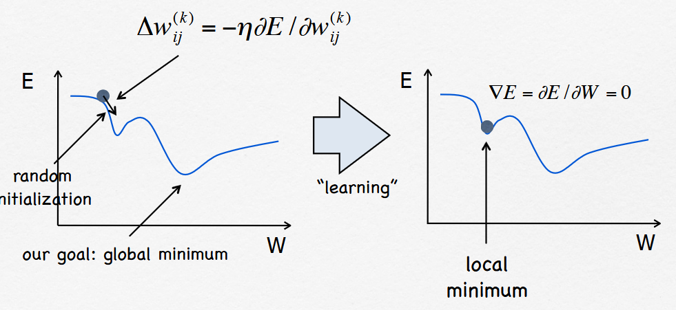
- momentum = $\delta w_{ij}^k = - \frac{\eta*\delta*E}{\delta*w_{ij}^k} + \mu*\Delta*w_{ij}^k * (t-1)$
  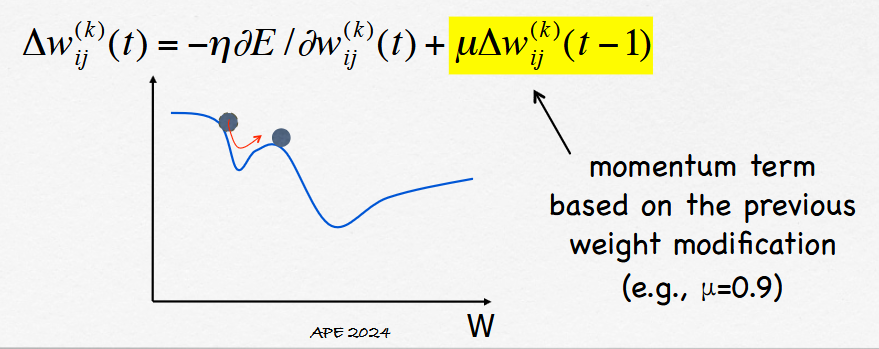
###### type of gradient decent
- Batch gradient descent : Gradient is calculed with the full data set
- Stochastic gradient descent : gradiant is calculate with data sample
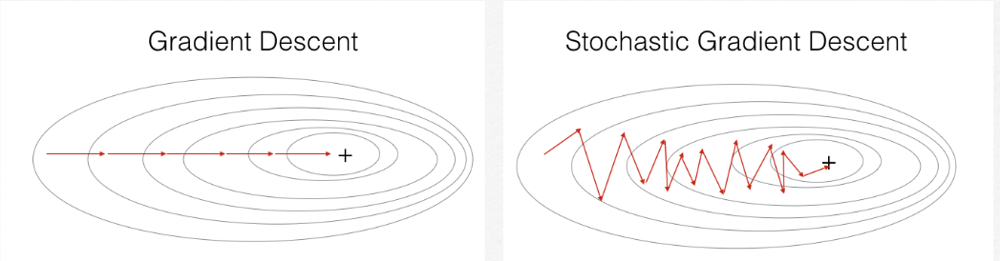

##### Loss function

##### Calcule matriciel
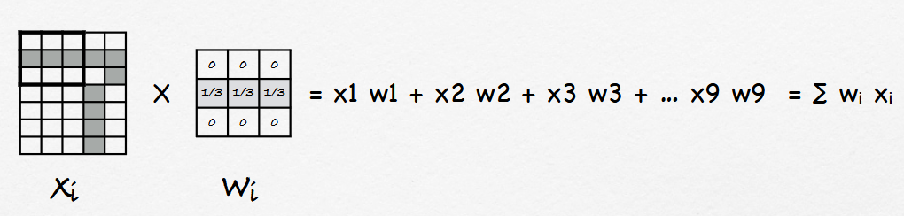
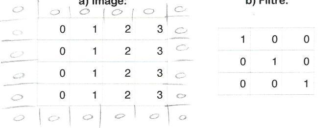

Padding : valeur des extras pixel au borde de l'image
Stride : de combien le kernel bouge a chaque step (defaut 1)

Si same padding et stride = 1 → aucun changement

#### Truc random
- N params (dense MLP) = $(nEntree + 1)*nNeurons$
- ReLu = $max(0,x)$
- tanH : $\frac{e^x-e^{-x}}{e^x+e^{-x}}$
- Sigmoid = $\frac{1}{1+e^{-x}}$ (2 class)
- SoftMax = {cours} $f(x_i)=\frac{e^{x_i}}{\sum^{K}_{j=i}{e^{x_j}}}$ ??
  (definition)
  $R^K \rarr (0,1)^K$ (+2 class)
  $z = (z_1,z_2,...,z_n)$
  $K\ge1$ = paramètre
  $softmax(z)_i = \frac{e^{z_i}}{\sum^{K}_{j=i}{e^{z_j}}}$

###### Convolution 2d
$H*W$ = taille imagine
$F$ = nombre filtre
$K*K$ = taille filtre
$C$ = nombre de cannaux
$B$ = bias
- N params (convolution 2d) = $F * K * K * C + B$
- Calcule pour couche de convolution = $H*W*F*K*K*C$ mult/add
- Depthwise convolutions : $H*W*(K*K)*C + H*W*C*F$ mult/add

# Keras
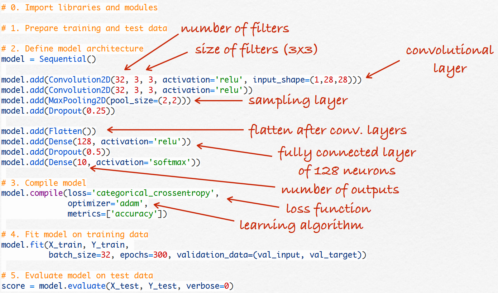
- Convolution2D(n filter, width, height)
- MaxPooling2D(pool_size) : smapling layer
- Dropout(pourcentage) : drop n pourcent des donnée en random
- Flatten :
- Dense(n input) : classic layer

Pretrained
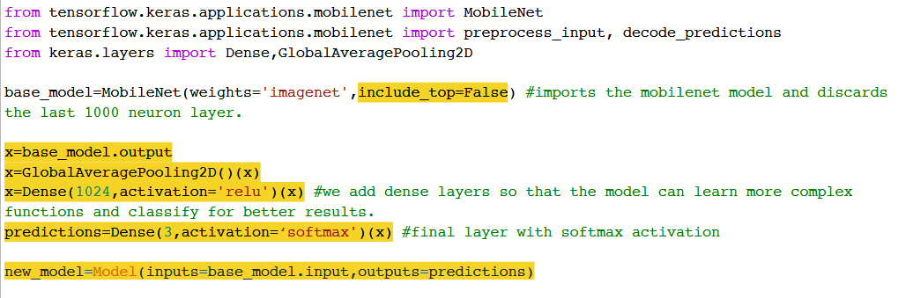
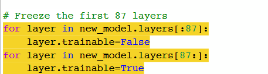

# Tech
- Data normalization = pour rendre les donner sur la meme range
  $x'=\frac{x-x_{min}}{x_{max} - x_{min}}$ ou $x' = \frac{x-mean}{\text{standare deviation}}$
- hyper parameter tuning :

- MaxPooling : 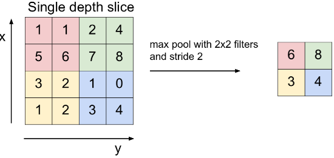
- avoiding overfting :
  - more data
  - data augmentation
  - regularization
  - reduce architecture complexity
  - change architecture
- Inception Networks :
  En gros, si tu veux concidéré plein de filtre différent, tu dois tous additionner et c'est tristre
  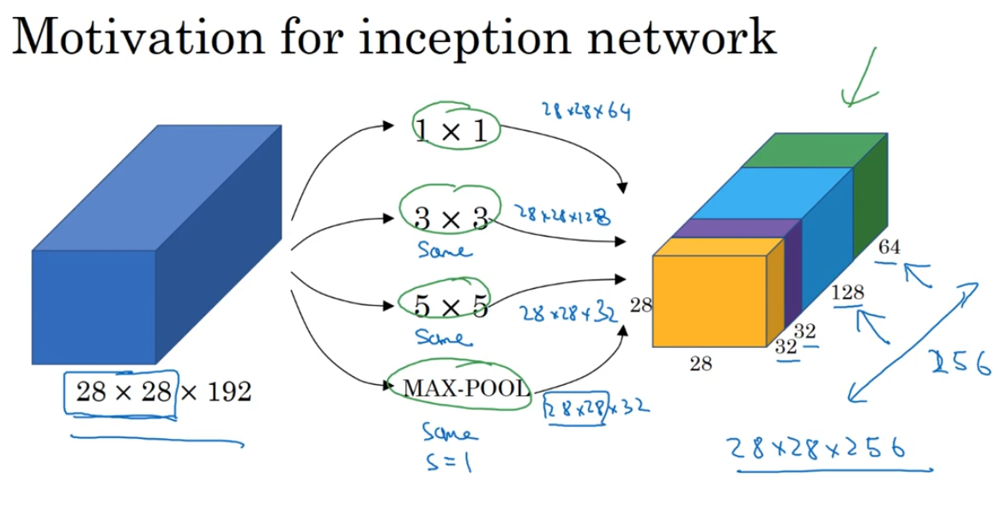
  Au lieu de ça, convolution layer pour reduire le nombre d'op
  $W_1*H_1*C_1 \rArr W_c*H_c*C_c = (W_1*H_1*C_c) * W_c * H_c * C_1 = computional cost$
- Batch normalization : en gros, t'as des batch avec des scale différent, bah tu scale par batch
  $y_i = $
- Transfer leraning :
  - Choisire le pre-trained model
  - load le pre-trained model
  - modifier le dernier layer et le connecter au reste
  - free le premier layer et mettre le dernier en entrainable
  - re-compiler le modèle, train et evaluer
- Vector Embedding : En gros tu peux mettre les feature dans une vector et checker le proximiter
- Meta learning : en gros tu traine a modèle a optimizer ça manière d'apprendre sur plein de petit tâche avec peut de donner, comme ça tu peut l'utiliser sur des petit donner

## CNN problème et outils
#### Problème
- Spatial translation invariance : feature mais pas au bonne endroit
- brute force correlation : trouve des truc dans du random
- Adversarial attacks : attacker le modéle avec des image cachées

#### Tool
- Feature map visualization : pour checker les filtre par layer
- Activation Maximization : first layer mais interpretable
- Filter Activation Statistics : marque les pixel par le probabilier d'apartenire a une classe 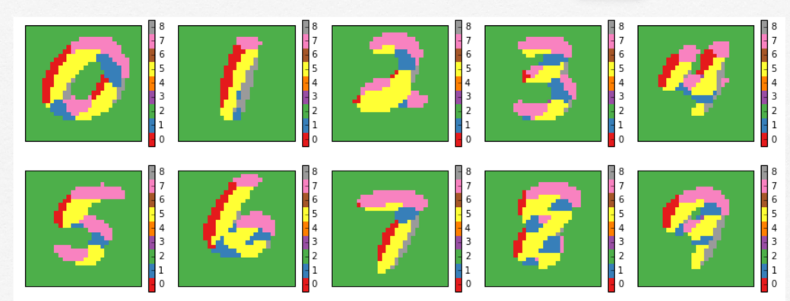
- Class Activation Maps : la heat map

#### useful
- Classifacation / identification
- Regression

## Chap 12
Tu peux comprésé des donner et les décomprésé avec un "Auto-encoders"

# Vocabulaire
|mot| definition|
|--|--|
|MLP(Muli-Layer-Perceptron)||
|CNN|Convolutional Neuron Network, utilisatble pour : image, text, sound, time|
|Vanishing gradients problem |quand on fait de la backpropagation, par definition les poid des neuronnes vont reduire et les poid des neurone de primière couche seront le plus affecter, bas defois il reduise trop et on est triste|
|residual blocks|l'idée que c'est plus simple de fair $x \rArr F(X)+x$ que $x\rArr H(x)$, en ARN ça veux just dire que tu fait des layers d'affiler qui s'ajoute|
|Generative Adversarial Netwokr (GNA)| c'est le model de encode -> decode|
|Transformers| type de modèle qui prend un sequence et qui la transforme, genre text to token par exemple|
|Deep Q-Networks|Q-learning c'est le fait bien +Q point, fait male -Q point|

# Random
- **LeNet-5** (1989) : c'est le model par Yann LeCun pour reconnaitre les nombres
- **ImageNet** : c'est une competition de reconightion d'image
- **AlexNet** (2012) : c'est un modle de reconnaisant d'image cool pour l'époque
  il utiliser un ReLus
- **ZF Net** (2013) : par Matthew Zeiler and Rob Fergus, il a été train sur 1.3M d'image
  il utilise un kernel 7x7
- **VGG Net** (2014) : il été cool pour l'époque
  avec plusieur krenel 64, 128, 256, 512, 512 (oui 2 fois 512)

- **MobileNets** :
  Porcess une image et rend une image (feature map)
  utilise un Deathwise convolution

- Physics-Informed Neural Networks : modèle crée avec un agents de check qui check que tous sois physiquement possible