# BDR
## Modèle EA
EA = Entity-association


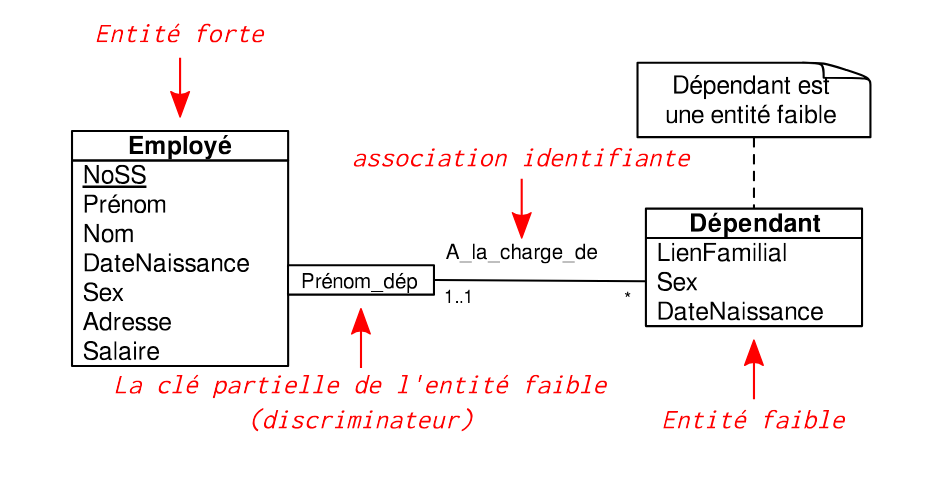

#### EAE : Entité-Association Etendu
EA + : 
- Super classes et sous-classes
- Spécialisation/généralisation
- Héritage

Sous-classes et super class
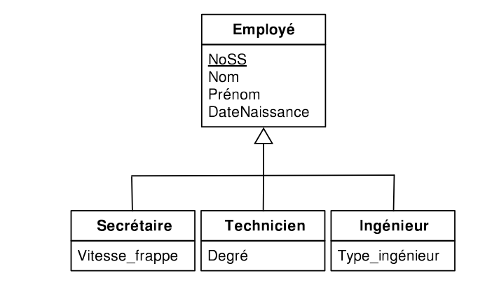

- Disjoint : toutes les sous class sont séparé (pas de sous-sous class qui herite de 2 sous classes)
- Chevauchante : pas disjoint
- Total : en gros, c'est comme un abstarct
- Partielle : paas total

## Modèle relationnel
Definition : 
- Relation : R
- Domain => esemble de valeur possible pour un attribut (genre pour nombre ça sera par exemple *N* )
- relation = esemble de tuples
- état = esemble des tuples actuelement dans la base
## Modèle EA > Modèle relationnel 
The funny part lmao >:[

alors, dans le désordre : 
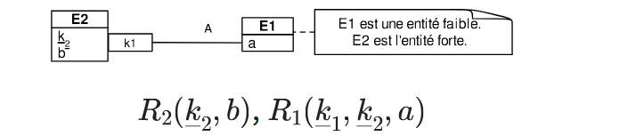
1..1-1..1
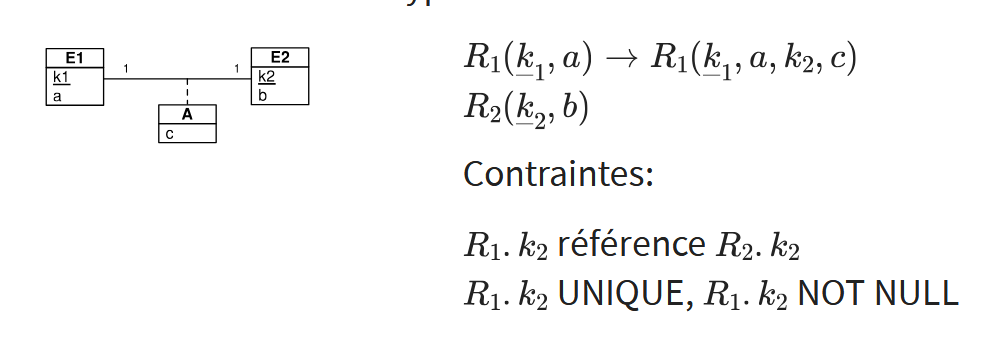

0..1-1..1
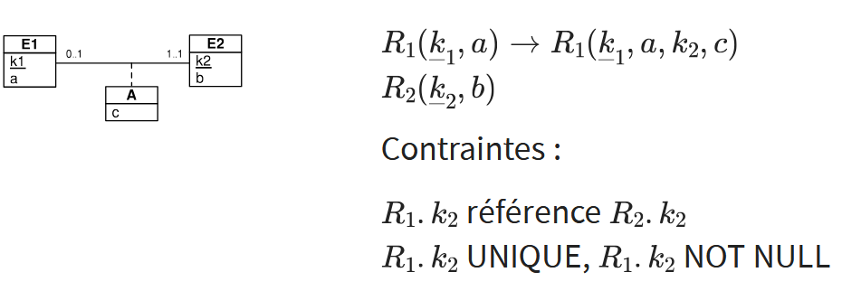

0..1-0..1
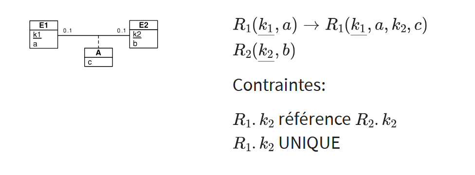

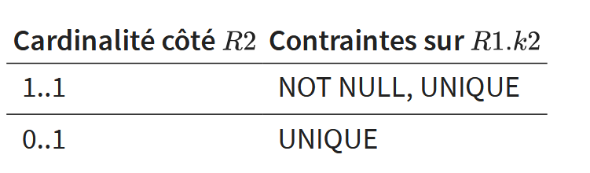

0..\*-1..1
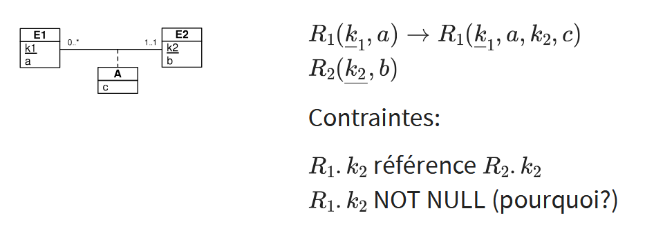

0..\*-0..\*
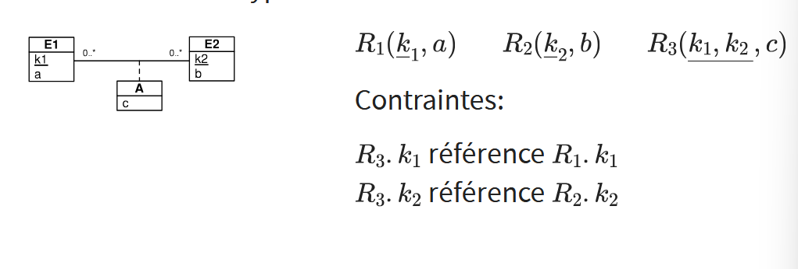

muliValue 
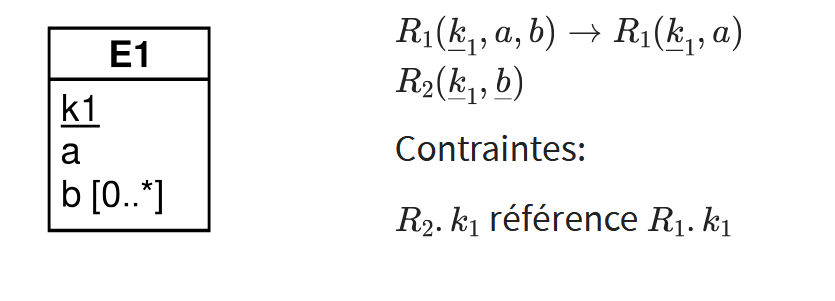

héritage
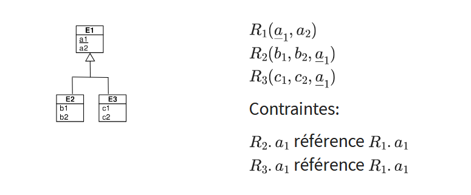

## Algèbre relationnel
More funny things

### Selection σ
$\sigma_{(condition)}(Target)$

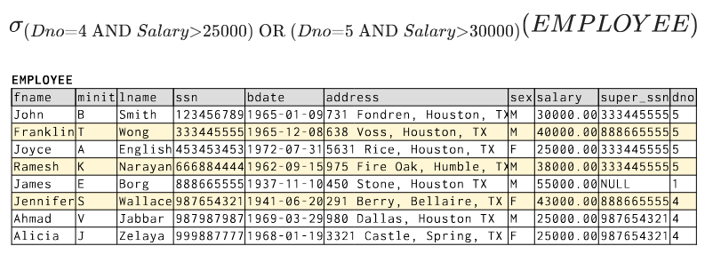

###### Cascade
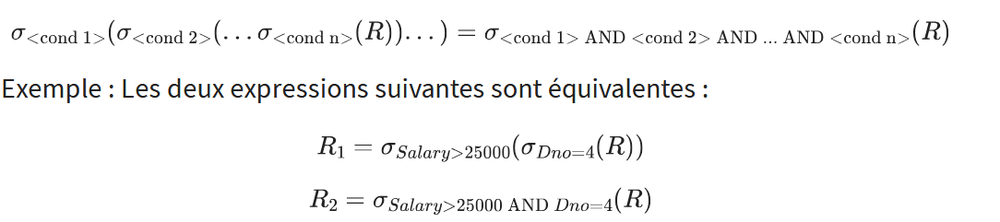

### Projection π
$\pi_{A_1, A_2, ..., A_n}(Target)$

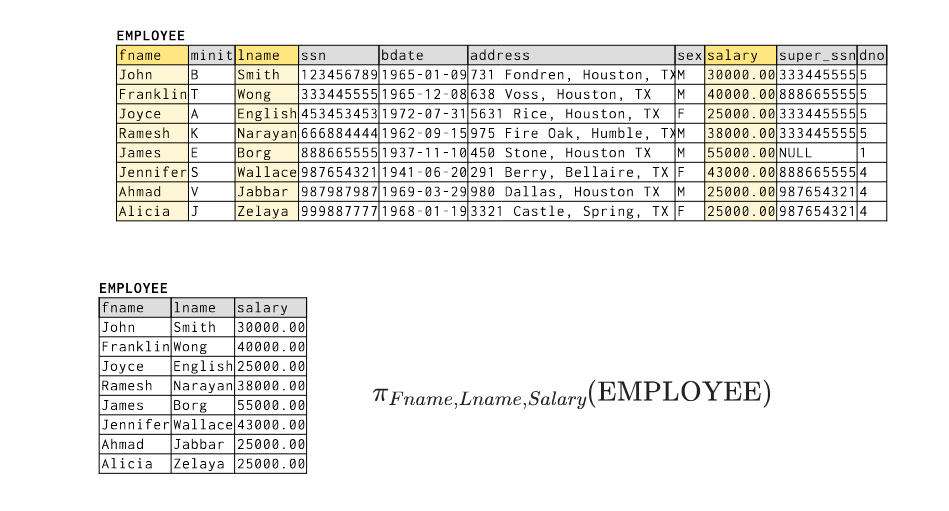

### Renomage ρ
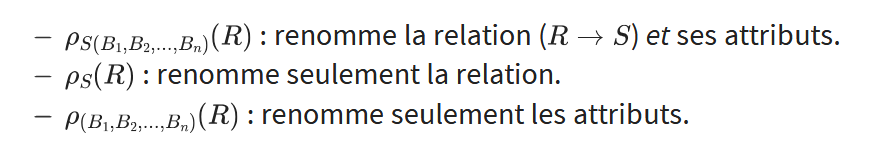
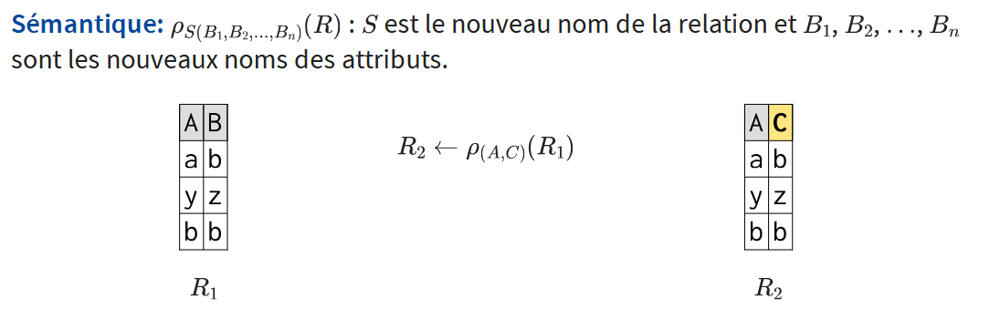


### Union ∪
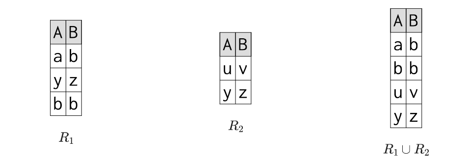

### Intersection ∩
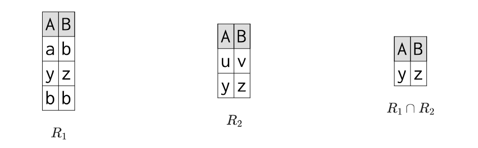

### Différence -
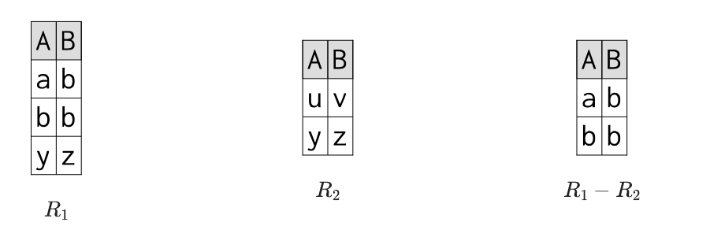

### Produit Cartésien ×
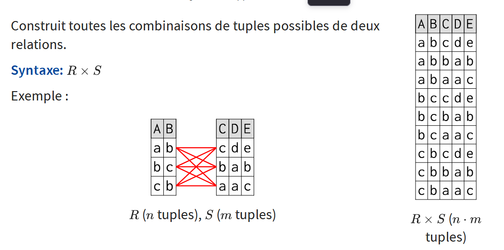

**!! Si y a des attribut avec meme nom => ambiue => faut renomer pour distinger !!** 

### Jointure θ (⊗)
$R⊗_{(Condition)}S$

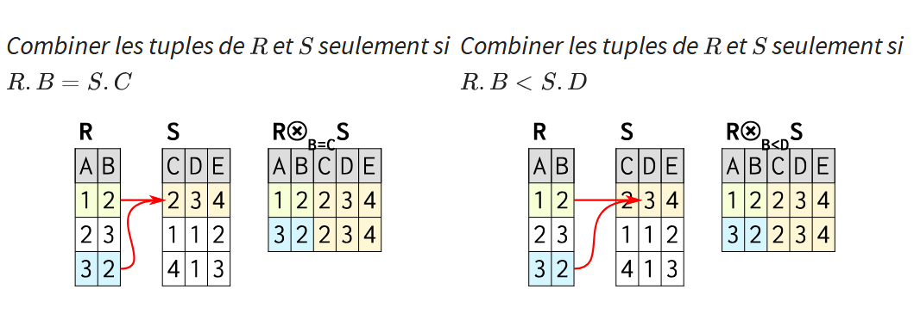
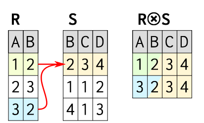

### Division /
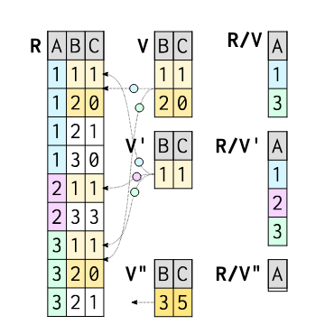

En gros, ça selection les tuple qui sont telle que le diviseur

genre, R/V ça vas prendre que les tupple qui ont (B=1,C=1) ET (B=2,C=0)

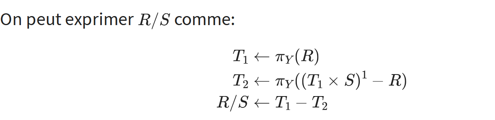


### Priotité


## SQL 

### Crée la base
```SQL
CREATE DATABASE nom;
```

Groupe de table
```SQL
CREATE SCHEMA Company;
```

Crée table
```SQL
CREATE TABLE Table{
  name1 varchar(15),
  name2 bigint,
  date1 date,
  salary decimal(5,2) /*AAAAA.BB*/
}
```
- date : 1999-01-08
- time : 04:05:06.789 ou 04:05 PM
- timestamp : 2004-10-19 10:23:54

default value : 
```SQL
CREATE TABLE Table{
  name1 varchar(15) DEFAULT 'Prout'
}
```

Check : ça permette de mettre un condition d'insertion
```SQL
CREATE TABLE Table{
  name1 decimal(10,2) CHECK (name1 > 200.00)
}
```

Constraint : c'est juste pour donner un nom a un CHECK
```SQL
CREATE TABLE Table{
  v2 decimal(10,2) CHECK (v2 > 200.00)
  v1 decimal(10,2) CONSTRAINT nameConstr CHECK (v1 > v3)
  v3 decimal(10,2) NOT NULL,
  v4 decimal(10,2) UNIQUE,

}
```


Key 
```SQL
CREATE TABLE Table{
  id char(9),
  name1 varchar(15)
  PRIMARY KEY (id)
}
```

Foreign Key 
```SQL
CREATE TABLE Table{
  id char(9),
  owner_id char(9),
  name1 varchar(15)
  PRIMARY KEY (id),
  FOREIGN KEY (owner_id) REFERENCES OtherTable(id)
}
```

On peut specifier un comportement special au changement d'une Foreign Key 
- CASCADE : del ou update toute les occurence de la clef
- SET NULL : mette a null toute les ref de la clef
- SET DEFAULT : met la valeur par defaut a toute les ref de la clef
`ON (DELETE | UPDATE) {NO ACTION ¦ RESTRICT ¦ CASCADE ¦ SET NULL ¦ SET DEFAULT}`
```SQL
CREATE TABLE Table{
  id char(9),
  owner_id char(9),
  name1 varchar(15)
  PRIMARY KEY (id),
  FOREIGN KEY (owner_id) REFERENCES OtherTable(id) ON UPDATE SET DEFAULT
}
```


### Query

HAVING
en gros, ça permet d'ajouter un condition mais uniquement à l'interne d'un group (DEF par GROUP BY)


##### Recrusive
En gros
```SQL
WITH sub_player AS (
  /*Base case*/
  SELECT id, 1 AS lvl
  FROM player

  /*union*/
  UNION ALL 
  
  /*LOOP*/
  SELECT p.id, p.lvl+1
  FROM sub_player p
  WHERE p.lvl<5 /*STOP WHEN QUERY IS EMPTY*/
)
SELECT * FROM test
```

### Window
En gros, y a des fonctions qui group (genre AVG,SUM,MIN,MAX)
Bah on peut faire la meme mais sur une fenêtre defini 

EX 
```SQL
SELECT productor_id, avg(note) OVER (PARTITION BY productor_id)
FROM film
```

rank() 
ça fait un ranking par rapport au ORDER BY
`rank() OVER (PARTITION BY productor_id ORDER BY note DESC)`


Mini tech
on peut utiliser un ORDER BY pour faire un sum cumullative
`sum(salary) OVER (ORDER BY salary)` 
1. s1
2. s1 + s2
3. s1 + s2 + s3

Si pas de PARTITION = partition sur toute la table
Si pas de ORDER BY = cardre de fenêtre couvre toute la fenetre


### Trigger
mini détaile
On peut fait ça 
```SQL
NEW.value := 10
```
```SQL
NEW.value := (SELECT id FROM player WHERE id = 1) /*si la value est unique*/
```
:= c'est le égale


## Dépendance fonctionnel
Bon en gros le but c'est de dégager les redondances.

($AB \rarr C$ = AB-C pour que se sois plus simple à écrire)

#### 3 move de base
- Réfléxion : Si XY-D > XY-X
- Augmentation : X-Y > XZ-YZ
- Transitivité : X-Y, Y-Z > X-Z

#### 3 move *spéciaux*
- Décomposition : X-YZ > X-Y et X-Z
- Union : X-Y, X-Z > X-YZ
- Pseudo-transitivité : X-Y, WY-Z > WX-Z


#### Fermeture X+
Essemble des tuples accésible a partire d'un essemble de DF 
EX : 
A-BC, E-CF, B-E, CD-EF
{A,B}+
- A-BC > A,B,C
- B-E > E
- E-CF > F
= {A,B,C,E,F}

#### Fermeture transitive X^T
C'est l'esemble des DF qui peuvent être deduite d'un esemble de DF
Ex : 
- F = {A-B, B-C, B-D}
- F^T = {A-B, B-C, B-D, A-C, A-D}

#### Couverture minimal
En gros, c'est un essemble de DF dont : 
- Chaque DF est élémentaire : A-X, AB-C ✅ | A-BC, AB-CD ❌
- Pas de DF redondante : Genre pas aucun DF ne peut être deduite d'autre DF

EX : 
A-BC, B-C, A-B, AB-C, AC-D
(A-BC > A-B, A-C)
(A-C > AC-D = A-D)

Fmin = {A-B,B-C,A-D}


#### LE FN 💀
###### FN1
Attribut pas mutlivalue (genre les attributes sont pas des array quoi)

###### FN2
Tous les attribut dépende de la clef complet
Ex de **PAS FN2**
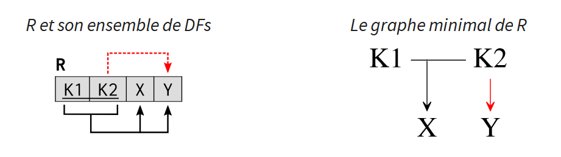

###### FN3
Tous les attribut non-clef dépensde d'attribut clef

Ex de **PAS FN3**
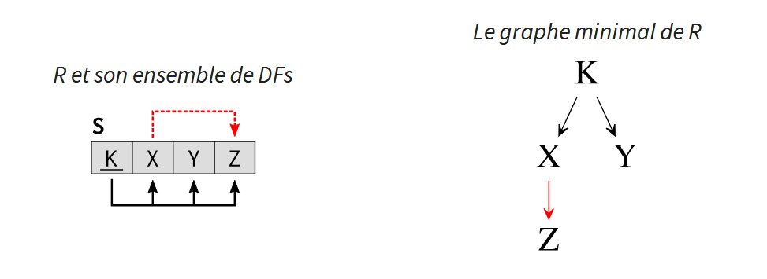

###### FNBC (Frome Normale de Boyce-Codd)
En gros, c'est juste qu'il faut pas qu'un attrbut non clef definise unattribut clef

Ex de **PAS FNBC**
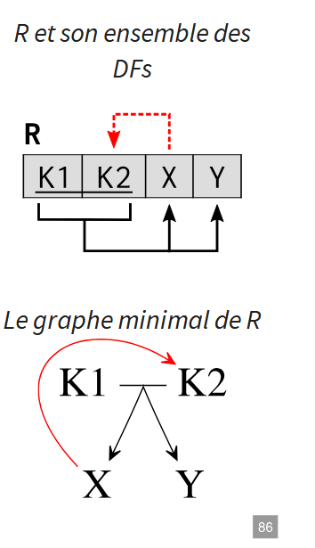

#### Normalisation
- SPI (Sans Perte d'informations)
- SPDF (Sans Perte de DF)
##### Algo
###### Synthèse > FN3
SPI et SPDF 
1. Fmin
2. Grouper les DF avec leur partie de gauche
3. Si y a pas de Relation avec les clef dedans, en ajouer une

EX : 
A-BC, AD-F, D-E 

1. Fmin = {A-B, A-C, AD-F, D-E}
2. R1 = {_A_, B, C}, R2 = {_A_, _D_, F}, R3 = {_D_, E}
3. Y a R2 qui à é les 2 clef, donc c'est good

Result : R1 = {_A_, B, C}, R2 = {_A_, _D_, F}, R3 = {_D_, E}

###### Décomposition > FNBC
SPI et **PAS** SPDF 
1. Fmin
2. Trouver les clef minimal, genre les attribute qui permette la même couverture que de base
3. Prendre une des clef minimal et si y a des relation qui sont FNBC frendly, alors on les spéare
4. Si il manque une relation avec les clef, add la relation
EX : 
AB-C, AB-D, C-B

1. Fmin = (AB-C, AB-D, C-B)
2. {A,B} et {A,C}
3. on prend {A,B} pour l'ex
   C-B not FNBC frendly$
   = R1(_A_, _B_, C), R2(_C_, B)
4. Y a pas de R avec A et C > R3(_A_,_C_)

Result = R1(_A_, _B_, C), R2(_C_, B), R3(_A_,_C_)


## Indexation
l'indexation c'est le fait de rajouter une donnée qui peremette de plus facilment accédée au donnée de la base (genre comme un hash)

##### Request step
- Parser : prend la request et check pour les erreur de syntaxe et problème evidents
- Rewriter : en gros il check les règle des table/view et verifie que la requet les enfrin pas
- Optimizer : Optimise la requet en trouvant la manière la plus efficace de l'executer (crée un plan)
- Plan : Exec le plan

##### Modèle de coût
Y a un modèle de coût, se sont des points qui sont attribuer sur la requet par rapport au co^t thorique (I/O et CPU) de celle si.

List des coût : 
`point = p`
- `bloc` : nombre de bloc mémoire (8192 oct) charger par la requet, en général c'est `1 block = 1p`
- `cpu_tuple_cost` (`defaut = 0.01p`): coût de traitment de chaque ligne de la requet 
- `cpu_operator_cost` (`defaut = 0.025p`) : coût de traitment de chaque operateur/function exécuter 

Si on utilise des **index** ça implique beaucoup de I/O random
*En gros, c'est le fait qu'avec un index, on s'en fou de l'ordre des tuple (en théorie), d'où le I/O random*
- `random_page_cost` (`defaut = 4p`) :  coût de lecture d'une page aléatoir 
- `cpu_index_tuple_cos` (`defaut = 0.005p`) : coût CPU de traitement d’une entrée d’index.

###### Paramètre ded parallélisme
- `parallel_tuple_cost` (`defaut : 0.1p`): Coût de transfert d’une ligne entre workers
- `parallel_setup_cost` (`défaut : 1000p`): Coût d’initialisation des workers
- `min_parallel_table_scan_size` (`défaut : 8 Mo`): Taille minimale d’une table pour activer le parallélisme.
- `min_parallel_index_scan_size` (défaut : `512 Ko`): Taille minimale d’un index pour scan parallèle


##### Init index
```SQL
CREATE INDEX index_product_id ON products (product_id);
```

###### Type d'index
- **B-tree** (defaut) : Organise les entrées dans l’ordre croissant.
  - `<` `<=` `=` `>=` `>` `BETWEEN` `IN` `IS NULL` `IS NOT NULL`
- HASH : hash de 32 bits
  - **QUE pour `=`**
  - à utilise quand on sait qu'on auras une chier de requet avec `=`
- **BRIN** (**B**lock **R**ange **IN**dexes) : stockent des résumés (min/max) des valeurs pour des plages de blocs de la table
  - `<` `<=` `=` `>=` `>` `BETWEEN` 
  - Ils sont très efficaces lorsque les données sont ordonnées ou corrélées physiquement (ex. séries temporelles, logs).
- **GiST** (**G**eneralized **S**earch **T**ree) : Supporte l’indexation de types complexes : formes géométriques, documents de texte intégral, etc. 
  -  `<<` `&<` `&>` `>>`...
  -  Utile pour les opérateur personaliser pour des recherche avancée
  -  Exemple, la recherche par `poin` **(x,y)** (oui, c'est un type de base PSQL)
- **SP-GiST** (**S**pace **P**artitioned **G**eneralized
**S**earch **T**ree) : Idéal pour les données naturellement partitionnables (spatiales,hiérarchiques, …)
  - Autorise des facteurs de branchement différents selon les nœuds, optimisant la structure de l’arbre.
  - Particulièrement efficace pour les requêtes spatiales complexes et les très grands ensembles hiérarchiques
- **GIN** (**G**eneralized **I**nverted **I**ndex) : conçus pour indexer efficacement des colonnes contenant des valeurs composées, typiquement (int[], text[], etc...)
- Index composite : Index multicolonne ()
  - `CREATE INDEX index_product_id_name ON products (product_id, product_name);`
- Index partiel : index sur un sous-ensemble, genre seulement les tuple de `WHERE a = 'truc'` par exemple
  - `CREATE INDEX index_product_id ON products(product_id) WHERE product_available = 'true';`
- Index couvrant (coverying index) : Permettent des Index Only Scans lorsque les colonnes sélectionnées figurent dans l’index.
  - `CREATE INDEX index_product_id_name_status ON products (product_id, product_name) INCLUDE (status);`


#### Bonne pratique
pas d'index pour rien, c'est couteux, genre si les donnée sont trier, par besoin d'index suivant comment

Si on ajout un index, utliser `EXPLAIN` ou `EXPLAIN ANALYZE` pour voir si c'est vraiment une bonne idée