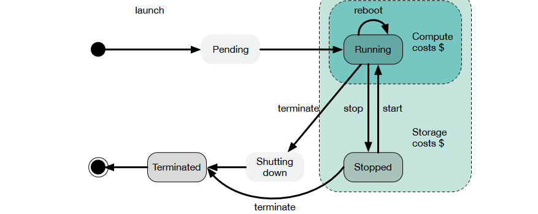
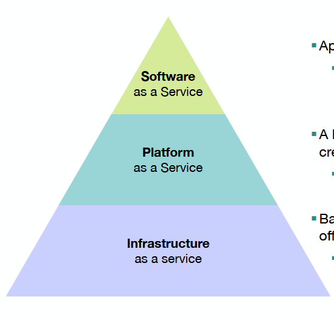
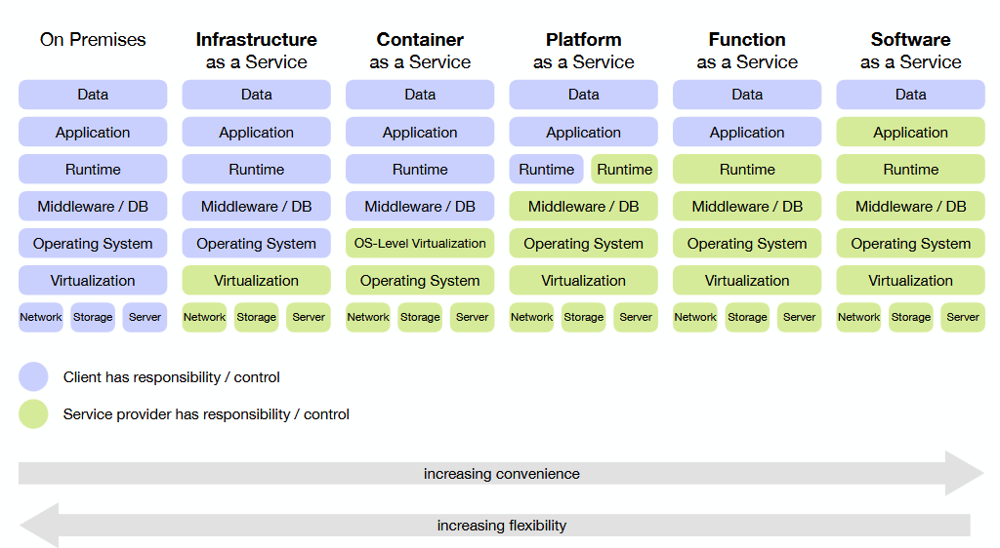
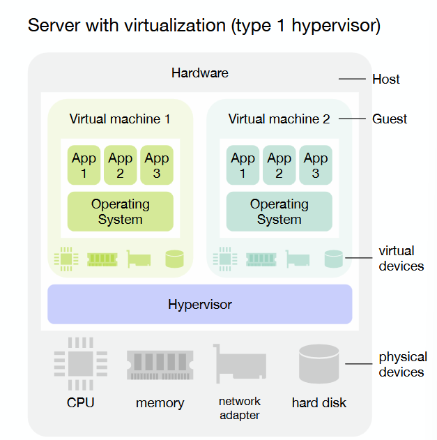
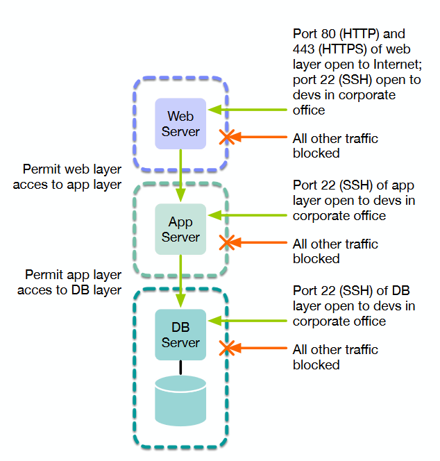
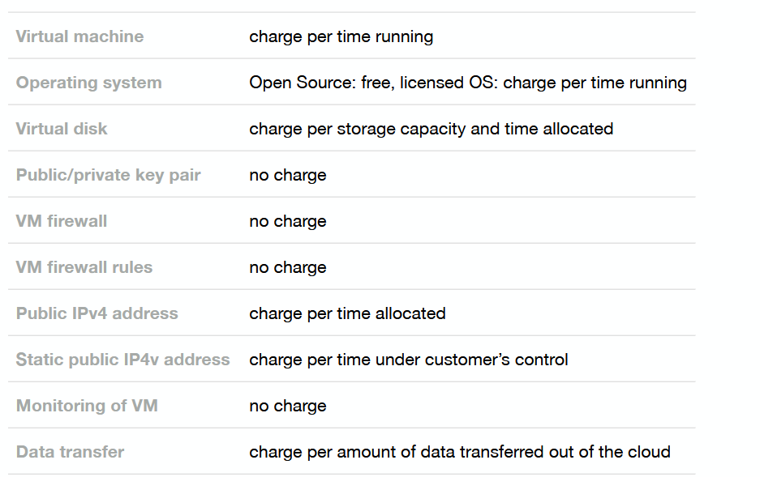
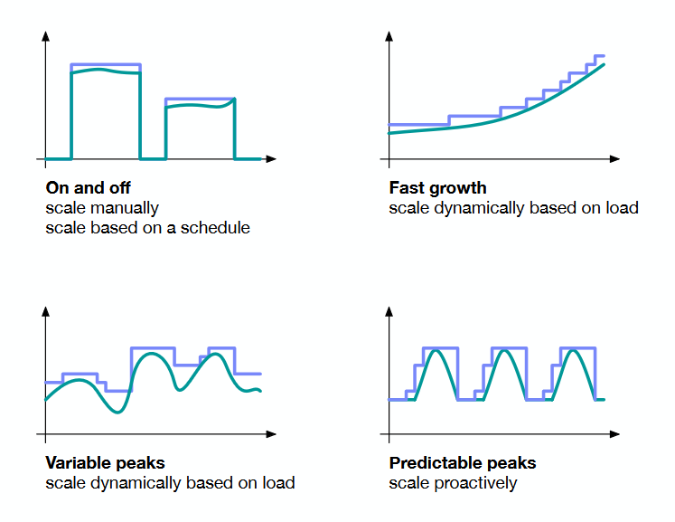

# TE1

## Ch1 base
Instance : {Where, os, CPU cores, memo, disk size, rules of firewall, authentcation}

#### $$

## Ch2 concepts overview
#### Quick random things
- **Cloud computing** : A cloud provider provides the infrastructure as a service to a cloud client which uses it to provide applications and services to its users.
  - AWS : Cloud computing is the on-demand delivery of compute power, database, storage, applications, and other IT resources via the internet with pay-as-you-go pricing.
    1. **On-demand self service** : Automatic provisioning without requiring human interaction
    2. **Broad network access** : Access via standardized protocols from a variety of clients
    3. **Resource pooling** : Serve multiple customers in a multi-tenant model, dynamic assignment of resources from a pool, location independence
    4. **Rapid elasticity** : Rapid provisioning/deprovisioning to scale out/in, seemingly unlimited capacity
    5. **Measured service** : Usage is monitored and controlled, providing transparency in billing
- **Data security** : trust, en gros c'est comme les bank (tkt)
  - 3 rules of trust
    1. All things being equal, minimize the number of organizations and people whom you have to trust.
    2. Use evidence and experience to measure trustworthiness.
    3. Trust proportionally to risk.
- **SaaS** (**S**oftware **a**s **a** **S**ervice) = app dans le browser
- **PaaS** (**P**latform **aaS**) = hardware/software plftaore for dev create cloud-base applications
  - En gros, c'est un ensemble de tool qui permette de faire des app sur le provider
- **IaaS** (**I**nfrastructure **aaS**) = Basic IT ressources in virtual form
  - virtual machines

- **Public cloud** : tous le monde l'utilse, y a un system de credit
  - AWS, Azure, OVH
- **Private cloud** : cloud d'entreprise
- **Community cloud** : tous petit cloud
- **Hybird cloud** : utiliser plusieur type de cloud

## Ch3 Infrasctures as a service
Open source : Openstack

- hypervisor : crée et manage les machine virtuel sur la machine
- EC2 Instance : virtsual machine (AWS)
- USAGE : Charge base on time using the VM
- Stokage : Charge by capacity * time

##### Firwall

##### Charge of data transfer
En gros, on fait payer souvant que quand on sort des donnée pour eviter que les gens se case
##### Pricing

- On-Demande Intsantce : pay by hours
- Reserved Instance : Pay yearly upfront
- Spot Instance : use spare Instance for cheaper

## Ch4 Scaling apps on laaS

#### Scaling System
- Horizontal scaling = more PC
- Vertical scaling = more power by PC

Classic load balancer = (reverse proxy)

- proxy = client -> server
- reverse proxy = server -> client

#### Load balancer
peut marcher dans plusieur niveau
- TCP (layer 4) **(FAST)** = directly open TCP connection with server -> good
- HTTP (layer 7) **(SLOW)(SMARTER)**= decode the HTTP requet -> decide where to forward it -> good

##### Type
- round robin
- random
- Ip hahs : Choose the server by hashing the user's IP address.
- Least connections : le server avec le moins de demande

#### APP state probleme
- Stateless = no data need to respond
- Stateful = need data to respond (e-comerce apps)
- Soft state = data is need but is not permanante (electronic shopping cart ?)
En gros, l'idée c'est de décomposer les app en plusieur partie et load balance là où c'est stateless (MVC)
**Tier = physical serparation, layer = logical**
- (V) Presentation
- (C) Business logic
- (M) Data source

###### Sesion
- classic = server side
- static = client side

#### Cloud load balancer (IaaS)
Pricing = up time * volume
(AWS) {Network load balancer = TCP, App load balancer = HTTP}
- Network load balancer = TCP
- App load balancer = HTTP (3 part)
  - Load balancer
  - Listner = listne HTTP request
  - Target groups = groups of VM to be forwared

VPC = Virtual Private Cloud = Collection of vituel network in a region

#### Auto scaling group
just un group qui permette de dynamiquement horizontal scale des VM
ça utiliser un **Launch Template** qui est en gros une image + config (Genre ssh key pare, secu group, instant type, etc...)

peut être change auto ou manuellement
(Manual, dynamic scaling, fixed schedule, predictive scaling)

PS : faut just prendre en compte le fait qu'une VM ça ce lance pas frame 1 (VM warm up)

## Ch5 Platform as a service (PaaS)
(PaaS base on the same software are compatible)
- Open source
  - Cloud Foundry
  - OpenShift
- Prorio
  - Google App engine : for web and mobile back-end
    - autoscaling
    - y a system de request handling
      - Request arrive
      - Handler is created
      - Handler create a respond -> transfer to auther cloud servcies
      - Handler is remove
    - It live only in the instance

#### GOOGLE

##### scaling to zero
quand y a plus de requet, allou 0 instance
mais du coup quand y a des request qui revienne, ça galère un peut au démarage (cloud start) (4-6 seconde de delay)

#### App service
Une app peut ce diviser en service
##### Data storage
-  Google Cloud Storage: Persistent object (= file) storage (similar to AWS S3)
-  Google Cloud SQL: Persistent data storage in a single-tenant relational database that is MySQL-compatible (similar to AWS RDS)
- Google Cloud Datastore: Persistent data storage in a multi-tenant NoSQL database

###### Data store
C'est genre FireBase

- Kind = type
