# TE 2
## 5 Platform-as-a-Service
(PaaS base on the same software are compatible)
- Open source
  - Cloud Foundry
  - OpenShift
- Prorio
  - Google App engine : for web and mobile back-end
    - autoscaling
    - y a system de request handling
      - Request arrive
      - Handler is created
      - Handler create a respond -> transfer to auther cloud servcies
      - Handler is remove
    - It live only in the instance

#### GOOGLE
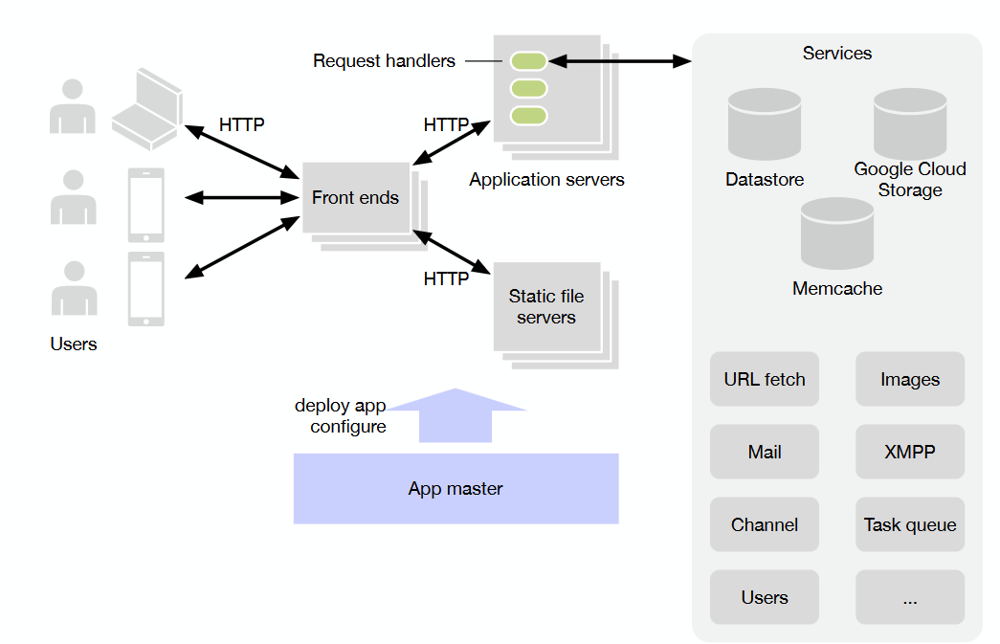
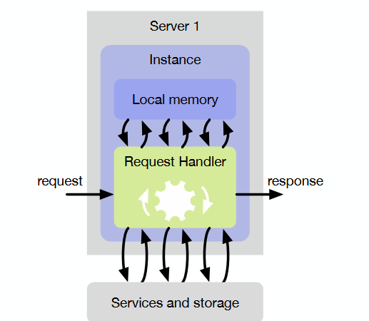

##### scaling to zero
quand y a plus de requet, allou 0 instance
mais du coup quand y a des request qui revienne, ça galère un peut au démarage (cloud start) (4-6 seconde de delay)

#### App service
Une app peut ce diviser en service
##### Data storage
-  Google Cloud Storage: Persistent object (= file) storage (similar to AWS S3)
-  Google Cloud SQL: Persistent data storage in a single-tenant relational database that is MySQL-compatible (similar to AWS RDS)
- Google Cloud Datastore: Persistent data storage in a multi-tenant NoSQL database

#### Cloud build
En gro, tu build direct sur le cloud avec google cloud build `gcloud app deploy`

###### Data store
C'est genre FireBase
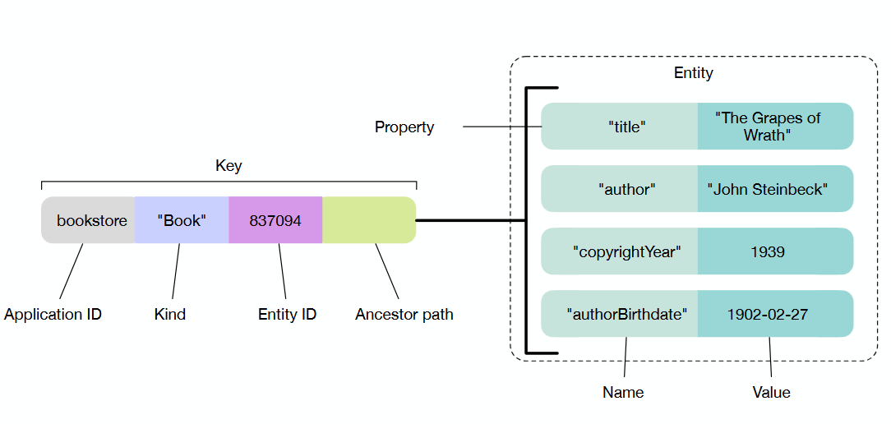
- Kind = type

Key composition :
- app identitfier
- kind
- entity identifier

#### Data store API
```Java
// accessor for the Datastore service
private final Datastore datastore = DatastoreOptions.getDefaultInstance().getService();

// ...

KeyFactory keyFactory = datastore.newKeyFactory().setKind("book");
Key key = datastore.allocateId(keyFactory.newKey());
Date authorBirthdate = new GregorianCalendar(1902, GregorianCalendar.FEBRUARY, 27).getTime();
Entity entity = Entity.newBuilder(key)
    .set("title", "The grapes of wrath")
    .set("author", "John Steinbeck")
    .set("copyrightYear", 1939)
    .set("authorBirthdate", Timestamp.of(authorBirthdate))
    .build();
datastore.put(entity);
```

Class declaration
```Java
@Entity(name = "Book")
public class Book {
    @Id
    private String isbn;
    private String title;
    private String author;
    private int copyrightYear;
    private Date authorBirthdate;
    // ... constructors, accessors
}
```

Store class declaration
```Java
EntityManager em = null;
try {
    em = emf.createEntityManager();
    Book book = new Book();
    book.setTitle("The Grapes of Wrath");
    // ...
    em.persist(book);
} finally {
    if (em != null)
    em.close();
}
```

## 6 1/2 Database-as-a-Service and NoSQL
### Scaling a database
we need to scale :
- Storage capacity
- Read request
- Write request

##### Vertical scaling
same as allway, work but was the cost worst it ?

##### Horizontal scaling
###### Replication (single head) : just copy the entier thing else were
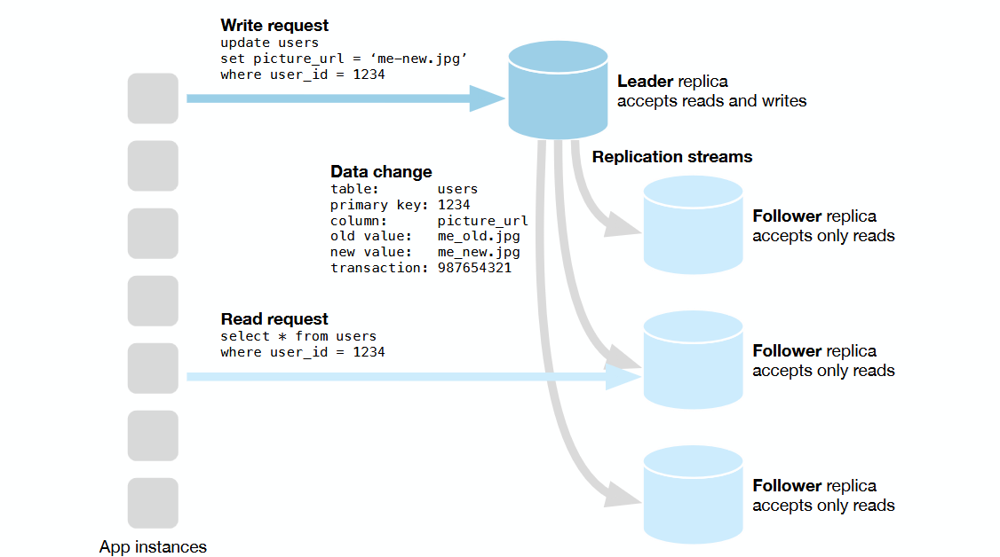
- one instance is the main one (leader) and the other replicate the main one (follower)
- To increase robustness, leader and followers should be in different availability zones.
- Database sow down a bit with synchronous replication
###### Partition : split the data base acrose a multitude of machin
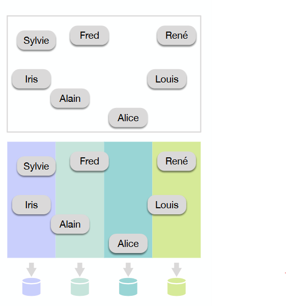
- En gros, a chaque requet faut passé par un "request router" qui vas rediriger la requet ver la bonne instance
- Les request router sont rappide et ne communique pas entre eux
- une hash fonction est utiliser pour determiner sur qu'elle instance vas chaque donner pour que se sois rappide a chercher (comme les bucket d'une hashmap)

*problème* : quand on ajoute une machine faut tous re-hasher (comme quand on agrandi une hashmap)

pour contré on peut utiliser une hash fonction consitente
- en gros, l'idée c'est de hash les value et de les assigner a une position sur un cercle.
- on hash aussi les machin (en utilisant leur nom comme key) et on les mette aussi sur le cercle
- les value sont placer sur la premier machine qu'il croise en continant clockwise
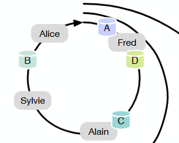
- celle evite de bouger tous quand on ajoute une machin
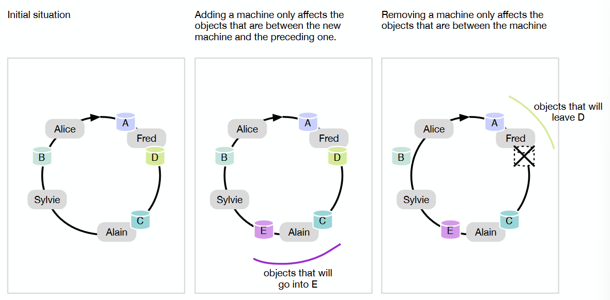

*problème* : si une machine meurt la data base devien inutilisable
pour contré ça, on peut repliquer les donner des instance sur d'autre

#### No SQL
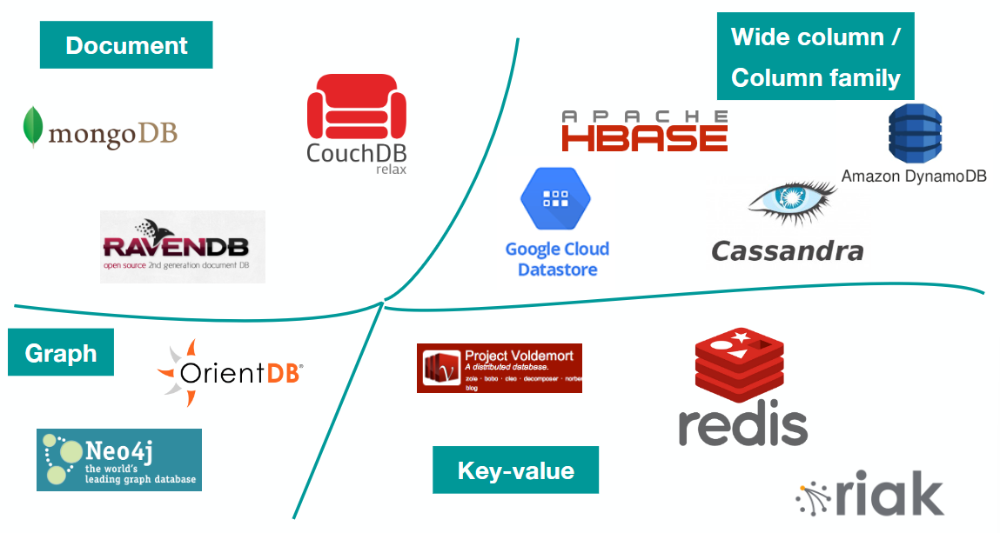
##### Document model
un peut style JSON si on veut
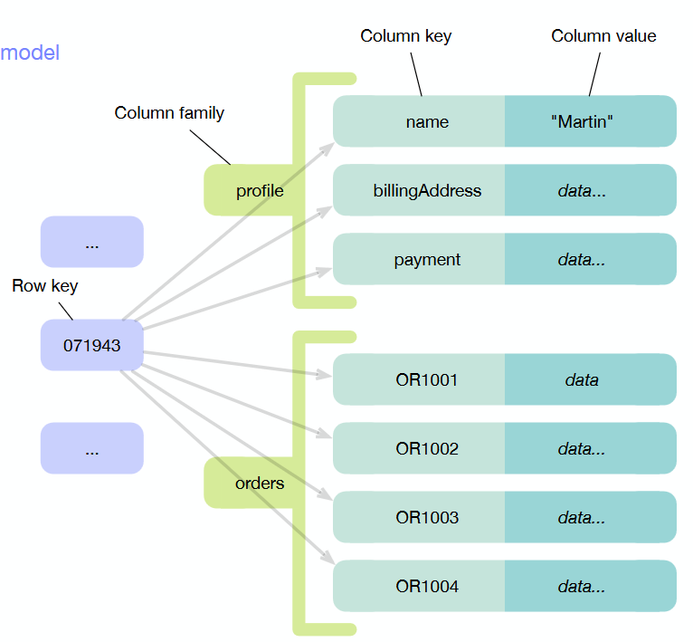

##### Graph model
Cool pour les relation
en gros, bah tu fais un graph d'objet
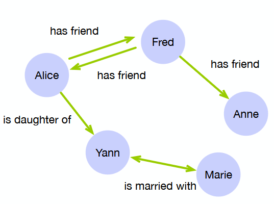
```
START%barbara%=%node:nodeIndex(name%=%"Barbara")
MATCH%(barbara)9[:FRIEND]9>(friend_node)
RETURN%friend_node.name,friend_node.location
```
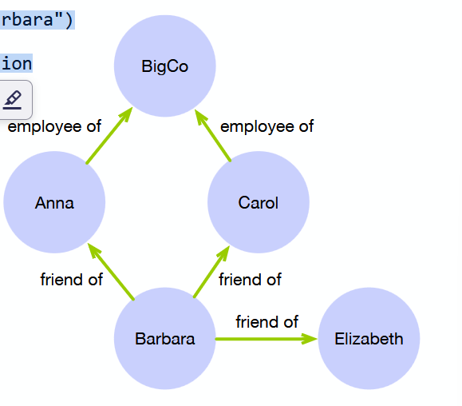

#### Cloud database (Database-as-a-Service)
En gros, c'est une database géré par le fourniseur cloud

##### Single-tenant cloud databases
the database is dedicated to a single cloud client

basé souvent sur une techno existante
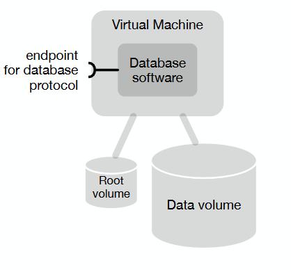
quand on a besoin d'un nouveaux volume, on crée un VM

###### Multi-tenant database
the database is shared between several cloud clients.

utilise souvent du NoSQL

Y a une database distribuer a traver plein d'instance
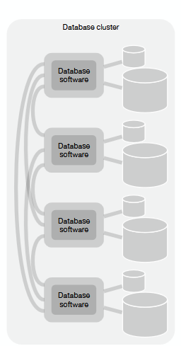

###### En gros
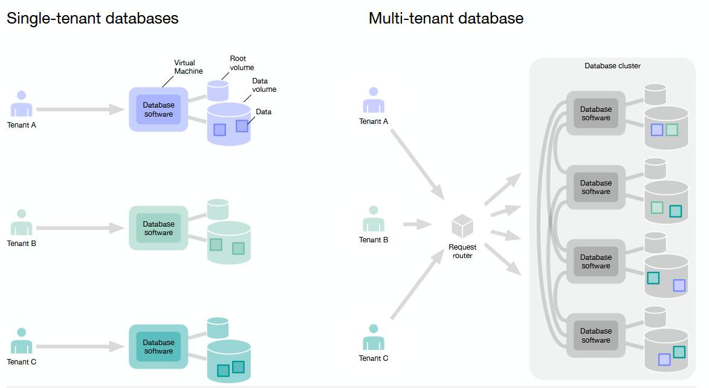

## 6 2/2 Container cluster management and orchestration

### Container
En gros, c'est un moyen de contenire un process (avec un envirnoment defini) et de le run direct sur le l'OS host (un peu comme docker)
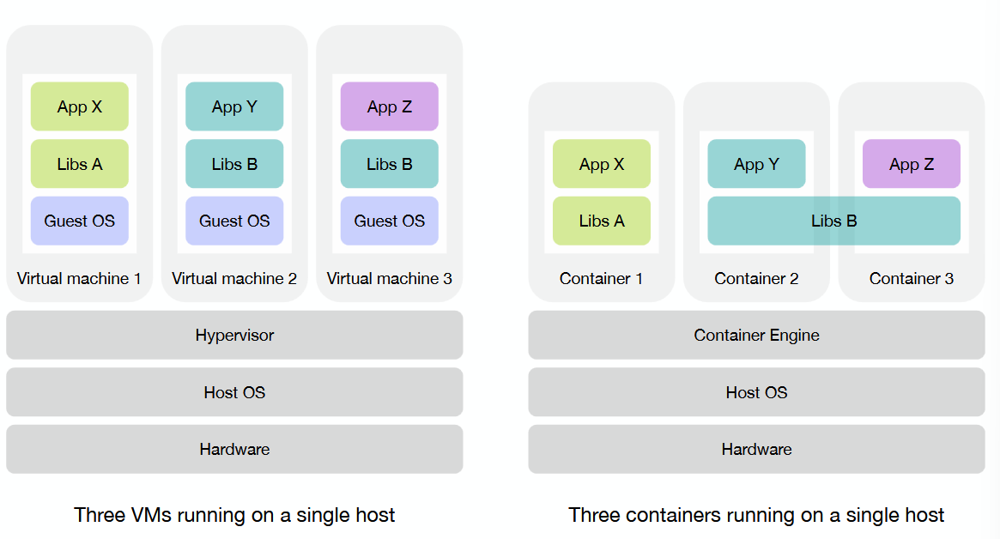
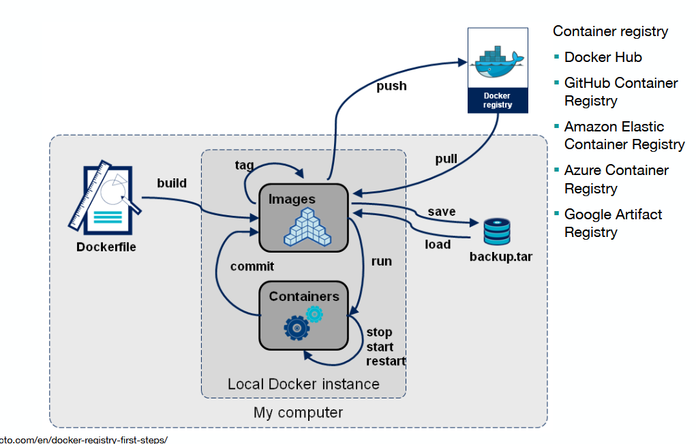

#### Cluster manager
C'est un peut comme un a manager de container, ça permet, en plus de monitorer, de pouvoir crée des container sur d'autre machine toute en gardant la possibiliter de crée des réseaux (style docker compose)
ça a comme bute de :
- augmenter l'utilisation de cluster
- toute en repéctant les contraint des application container
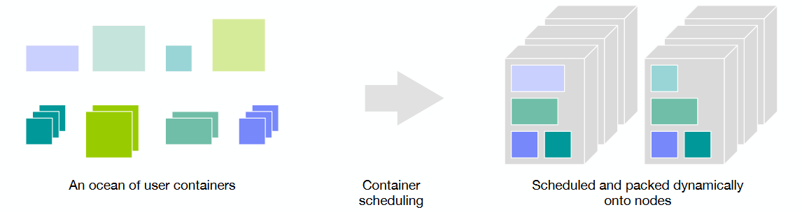

### Kubernetes
C'est une platform pour automatizer :
- déployment
- scaling
- magaement of container app

###### Kubernetes VS IasS
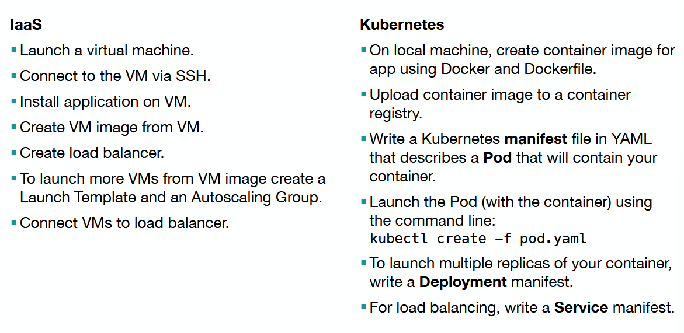

#### Cluster / POD logic
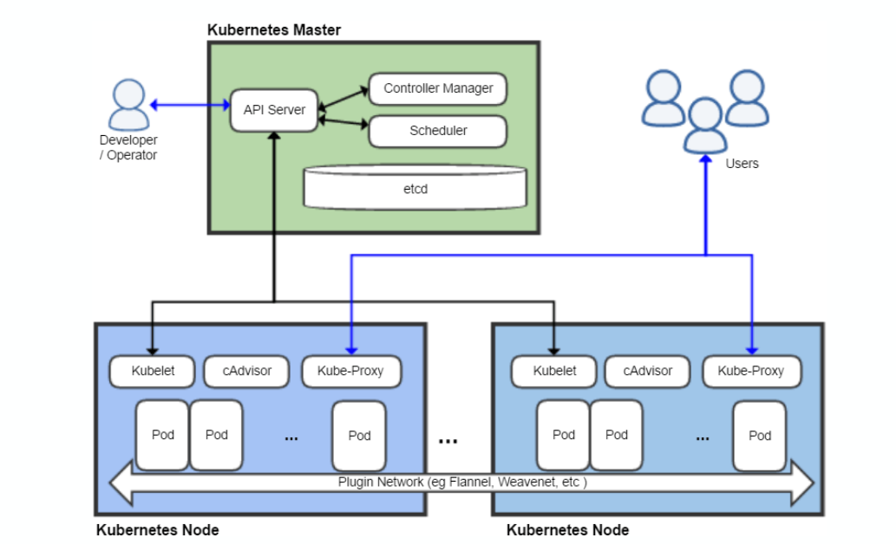
en gros, le travaille est repartie dans des POD qui peuvent être crée et detruit facilment, le Kurbernets Master ce charge des les gréé.

- ETCD : c'est {Key,Value} store qui permette de configurer les cluster, ça représent l'état global des cluster
- API Server : API qui permmet manage pour les devops
- Scheduler : selection qu'elle node devrais run ou non suivant les ressources
- Controller Manager : C'est le process principal qui permette de controller tous le truc

##### Definition
###### Cluster
Ensemble de machin ou les Pods sont déployer
###### Pod
1 à n container qui sont garentie de devoir être ensemble (genre backend et database) sur la meme machine
###### Controller
C'est un process qui permmet au cluster d'aller ver l'état demander par le master
###### Service
Ensemble de Pod qui marche ensemble
###### Label
c'est just un tag

#### Common concepts
Kubernetes a un object API

command pour crée objet `kubectl create -f file.yaml`

##### YAML
exampe :
```YAML
apiVersion: v1
kind: Pod
metadata:
  name: redis
  labels:
  component: redis
  app: todo
spec:
  containers:
  - name: redis
    image: redis
    ports:
    - containerPort: 6379
    resources:
      limits:
        cpu: 100m
    args:
    - redis-server
    - --requirepass ccp2
    - --appendonly yes
```

#### Object
un objet est composé dans l'ordre de :
- api version
- kind
- d'une struct metadata (info de l'objet)
- d'une struct spec (targeted state de l'objet)

Quand Kurb crée un objet, il ajoute des donnée sur sont yaml :
dans le metadata
- uid de l'objet
- ressourceVersion de l'objet

et aussi ajoute la struct **status** qui à des info sur le state actuel de l'objet (en read only)

#### Pod
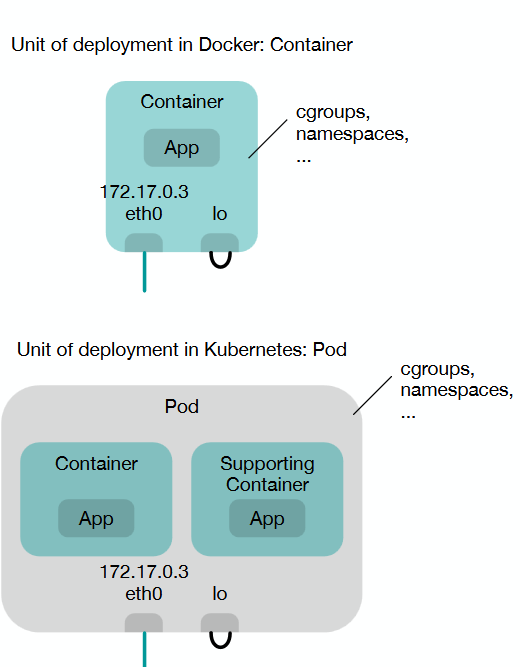

vue que les pod c'est une abstraction, Kurb nous simplifie la vie en nous permettant de les config de 2 manière :
- lossely coupled : chaque container a son pod
- tightly coupled : un pod pour tous les container concerné
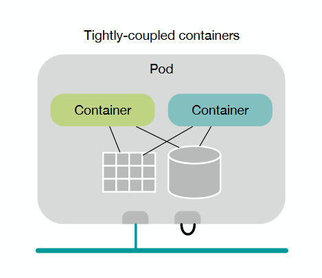
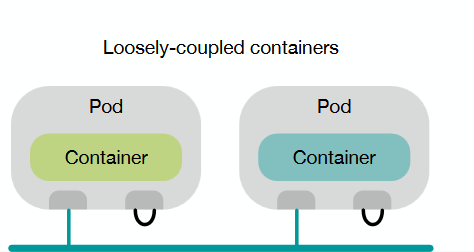

###### Deployment
Les pod sont sencé être de la plus petit unité de scaling (genre en gros, c'est ton container mais au plus simple)

Déployer un pod ne coute pas chère et donc, quand un pod meurt ou crache, on en recrée just un nouveau
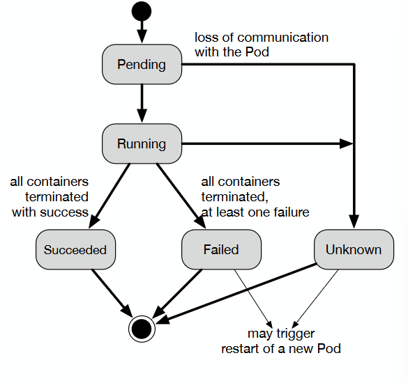

###### Definition
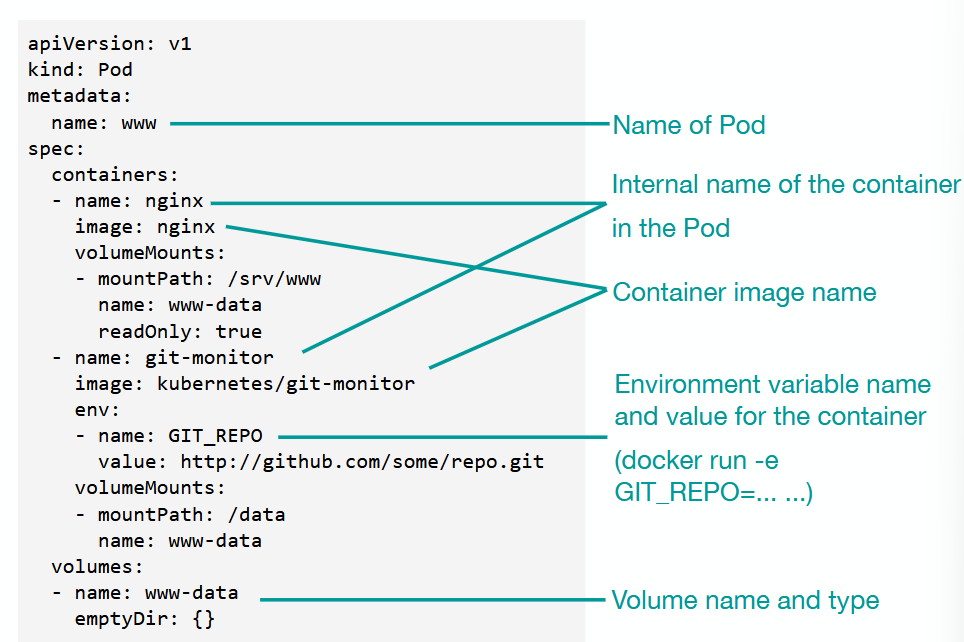

###### Command
- déclare un pod : `kubectl create -f docs/user-guide/walkthrough/pod-nginx.yaml`
- list les pod : `kubectl get pods`
- kill un pod : `kubectl delete pod nginx`

#### Environment variable
On peut déclaré des variable d'environement en ajouant la stuct suivant à **spec** :
```YAML
env:
- name: REDIS_ENDPOINT
value: redis-svc
- name: REDIS_PWD
value: ccp2
```
Aussi Kurb crée par defaut les variable suivant :
- HOME : as the default user within a container is root, the default homedir is /
- HOSTNAME : hostname associated with the container
- PATH : by default includes /usr/local/sbin:/usr/local/bin:/usr/sbin:/usr/bin:/sbin:/bin
- TERM : xterm if the container is allocated a pseudo terminal entry point (interactive mode only)

#### Volume
Les Pod peuvent avoir des volumes. C'est un system de fichier que les app peuvent lire et écrire

Les volume sont partager a travert les container du meme pod

Si les volume ne sont explicitment dit comme **persistent** alors ils meurt avec les pod

###### Type de volume
- emptyDir : empty volume | del with pod
- hostPath : path sur la machin host | persite sur la machine
- secret : volume crypter
- NFS : network file system | persite
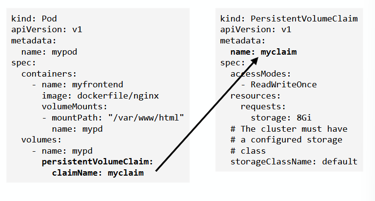


#### Replication Controller
Permette de déployer facilment les pod. En gros, il prend la def d'un pod et il en crée autant que besoin

#### Service
En gros, c'est un proxy, vue que les pod peuvent être detruit et changer rapidement, ça nous permette de garder la meme address IP sans devoir la changer h24
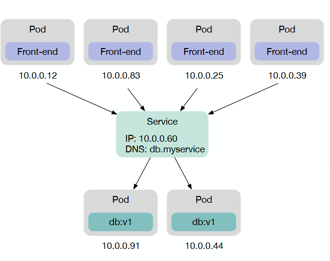
###### Type de service
- ClusterIP : utiliser que dans le cluster pour géré ses IP interne
- NodePort : en plus du ClusterIP peremette d'exposer un port ver les autre nodes
- LoadBalancer : en du NodePort permette de faire office de loadbalancer

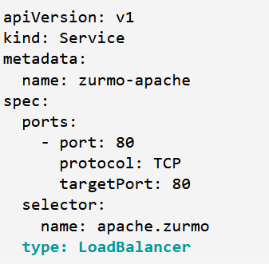


#### Label
Un sevice peut faire le filtre des pod grace au label


#### Deployments
En gros, c'est une task qui vas lentement repliquer des pod avec la nouvel version puit vas detruire les ancien pods, si quelque chose se passe male, ça vas rollback
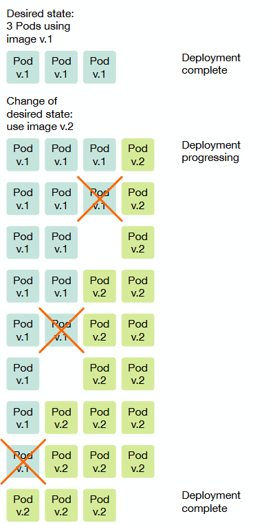
c'est géré par update (rolling update)

#### Multi-host networking
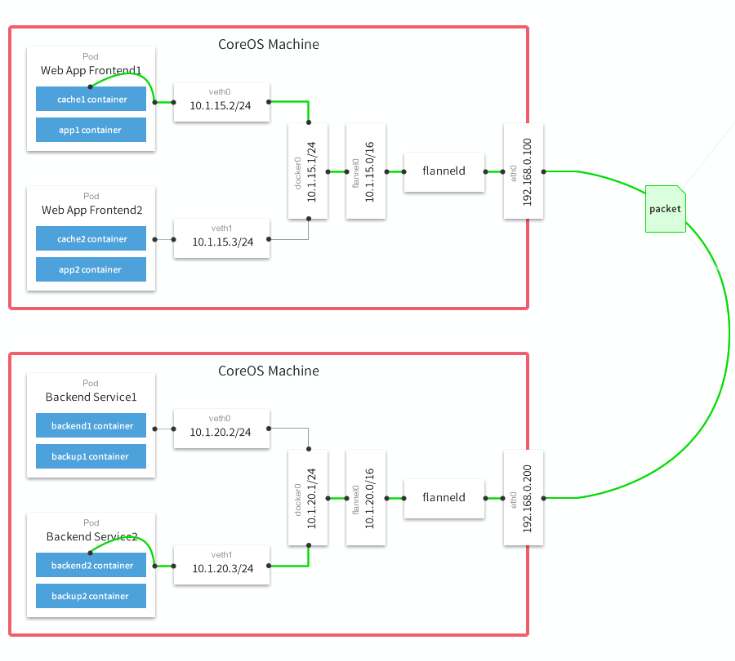


#### Kurb on IasS
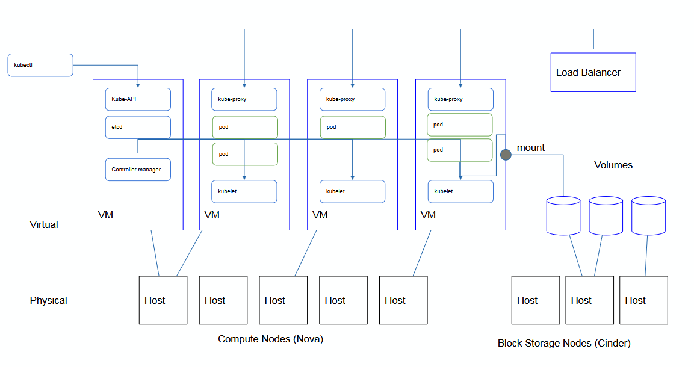


## 7 Infrastructure as Code (IaC)
L'idée est de décrire une infra avec des **definition files**
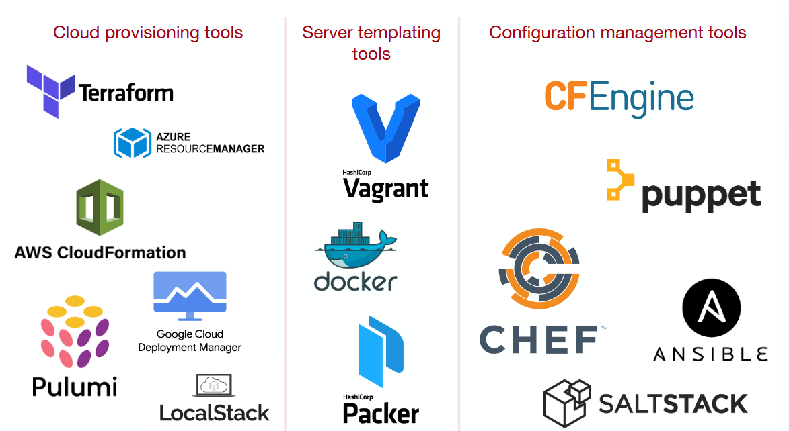

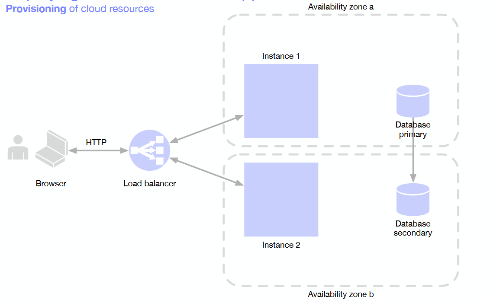
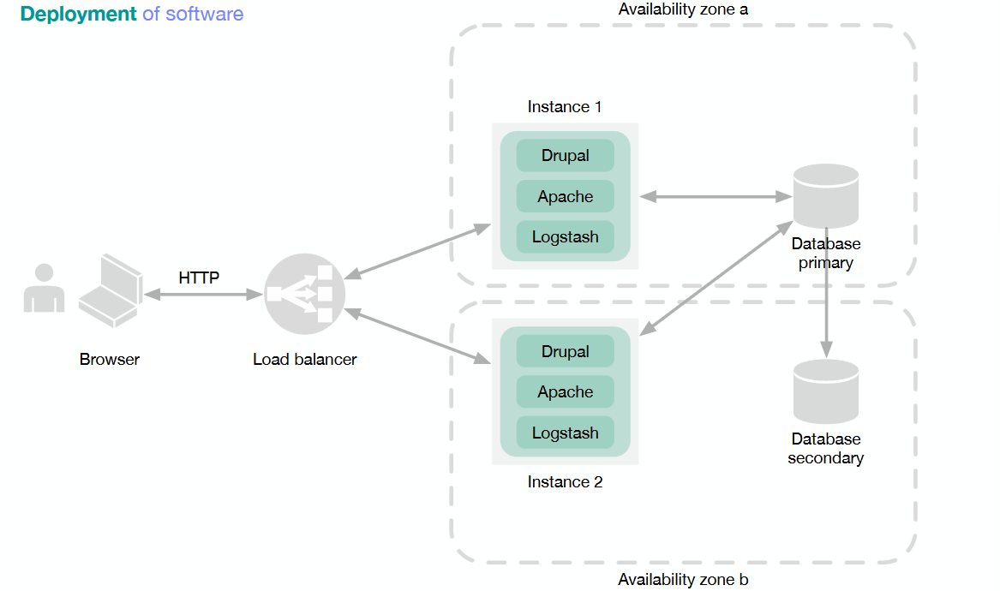

### Cloud provisioning
c'est un outile pour choper des ressources cloud (marche avec une API)
Utilise une interface Web ou un CLI
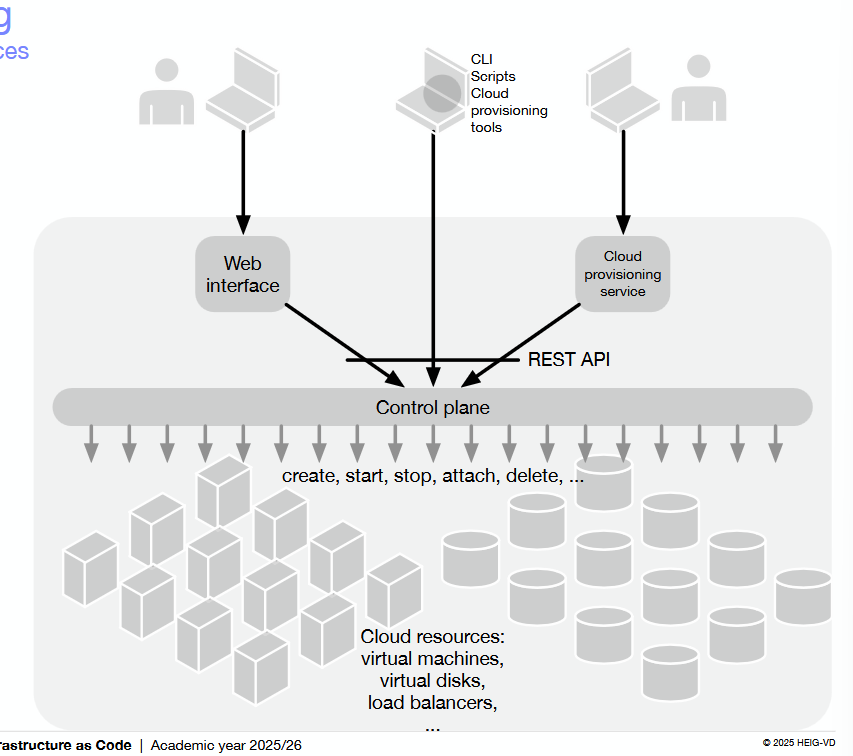

#### AWS cloudFormation
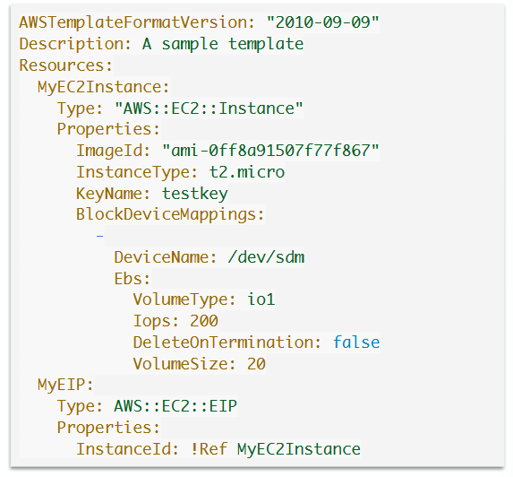
- template : un text file qui containt la desc de la ressource cloud
- Stack : list des ressource unit utiliser par le cloud (typiquement là ou ce retrouve les liste des vm utiliser pour loadbalancing)
- Change set : en gros, c'est un sommaire des changement a apporter au ressource déja en route

