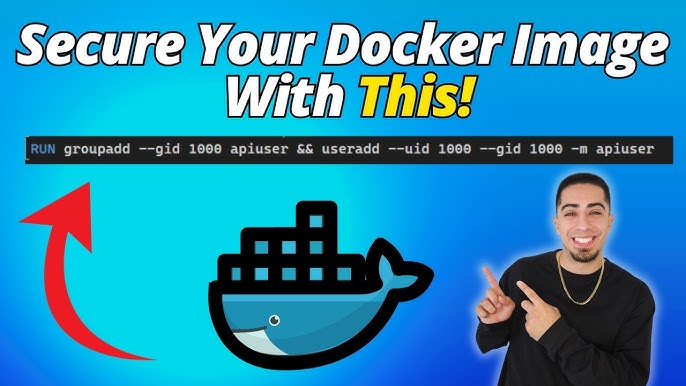

# TE 1
<p align="center">
    
</p>

## Java IO 
##### Package
Y a 2 package IO : 
- java.io -> classic io package
- java.nio -> moderne package depui java 1.4, plus efficace et felixble mais plus complex a prendre en main

##### Data type
Y a 2 type de donner : 
- Binary : c'est les bytes[], donc la donner en brute
- Text : c'est une version interpreter de la donner pour la transformer en text

##### Utiliser IO
En gros, y a InputStream and OutputStream, c'est des, Stream (no way) et ça à le meme fonctionement / logic qu'en c++
- Open the stream
- Use it
- Close the stream
  
###### Pour les bytes[]
Example Output (pour écrir sur un fichier) stream (**FOR BYTES[]**) : 
```Java
OutputStream fs = new FileOutputStream("file.data");

BufferedOutputStream bos = new BufferedOutputStream(fs);

for (int i = 0; i < 256; i++) {
  bos.write(i);
}

// flush le buffer -> écrit le buffer dans le fichier
bos.flush();

// close le stream, Close un buffer close aussi le stream
bos.close();
```

Example Input (pour lire sur un fichier) stream (**FOR BYTES[]**) : 
```Java
InputStream fs = new FileInputStream("file.data");

// utiliser un buffer pour tous charger -> lire
BufferedInputStream bis = new BufferedInputStream(fs);

int b;
while ((b = bis.read()) != -1) {
  System.out.print(b);
}

// close le stream, Close un buffer close aussi le stream
bs.close();
```
C'est fonction peuevent retourner une **FileNotFoundException**


###### Pour les String
Y a une sous type de stream qui permette de géré les charactère facilement
```Java
Reader reader = new FileReader("file.data", StandardCharsets.UTF_8);
```
et le buffer
```Java
BufferedReader br = new BufferedReader(reader);
```

Example de lecture de string
```Java
String line;
while ((line = br.readLine()) != null) {
  // Careful: line does not contain end of line characters
  bw.write(line + END_OF_LINE);
}
```


```Java
Writer writer = new FileWriter("file.data", StandardCharsets.UTF_8);
```
et le buffer
```Java
BufferedWriter bw = new BufferedWriter(writer);
```
après ça s'utilise comme le stream de base 


BREF, faux just foutre tous ça dans un **try/catch** pour choper les **IOException** 

## 💀💀💀 DOCKER 💀💀💀
##### Cheatsheet
```bash
# Build and tag an image
docker build -t <image-name> <build-context>

# Start a container using its image name
docker run <image-name>

# Start a container in background
docker run -d <image-name>

# Display all running containers
docker ps

# Stop a container
docker stop <container-id>

# Access a running container
docker exec -it <container-id> /bin/sh

# Create a Docker network
docker network create <name>

# Start a container and override the entry point
docker run --entrypoint /bin/sh <image-name>

# Start a container and override the command
docker run <image-name> <command>

docker run -d --rm -p --network <networkName> 8080:8080 plantuml/plantuml-server
-d = run in background
--rm = remove the container on stop
-p HOST:CONTAINER = map machin port 8080 to this container port 8080

# Delete all stopped containers
docker container prune

# Delete all images
docker image prune

# run compose
docker compose up -d
-d = run in background

# stop and remove compose
docker compose down

#IF YOU WANT TO exec, run, ps, ... -> JUST ADD 'compose' before the command 
```

##### Create a docker file
```Docker
# Image sur la quelle on ce base pour crée la notre
FROM ubuntu:24.04
# Pour une app java FROM eclipse-temurin:21-jre

# Crée une variable d'environement
ENV key=value

# copie un directory (Sur notre machine) dans un autre (dans l'image)
COPY sourceDir destDir

# en gros, c'est un cd dans l'imagine
WORKDIR path

# Exec command
CMD ["echo", "Hello, World!"]

# Expose port
EXPOSE 8000
```

##### ↗️⁉️⁉️ Docker compose ⁉️⁉️↗️
OK, en gros, un docker compose c'est un fichier qui sert à crée une infra, genre le container c'est les machines et le compose il dit just qu'il faut pour que ça marche et dans quel ordre les lancers
- `service` : Nom du service
- `image` : image à utiliser
- `port` : port a exposer (HOST:CONTAINER)
- `volumes` : mount volumes int the container
- `environment` : ENV variable
- `network` : network entre container
##### Example
```compose
networks:
  pantoufle:

services:
  ncat-server:
    hostname: my-server
    image: ncat
    command:
      - -l
      - "1234"
    networks:
      - pantoufle

  ncat-client:
    image: ncat
    command:
      - my-server
      - "1234"
    networks:
      - pantoufle
```


## Protocol
##### Define 
- Aperçus : Résumer du problème que dois resoudre le protocol
- Protocol utiliser : UDP / TCP ?
- Message : lists de messages du protocol
- Command : List d'action possible
- Example : Example de routine en UML

##### TCP 
###### Client
```Java
// declare socket, writer, reader
try (Socket socket = new Socket(HOST, PORT);
      Reader reader = new InputStreamReader(socket.getInputStream(), StandardCharsets.UTF_8);
      BufferedReader in = new BufferedReader(reader);
      Writer writer = new OutputStreamWriter(socket.getOutputStream(), StandardCharsets.UTF_8);
      BufferedWriter out = new BufferedWriter(writer); ) {
    // ...
} catch (IOException e) {
  // ...
}
```
###### Server
```Java
// declare server socket
try(ServerSocket serverSocket = new ServerSocket(PORT)){
  // ...
}catch(Exception e){
  // ...
}

// declare reader/writer
try (
    Socket socket = serverSocket.accept();
    Reader reader = new InputStreamReader(socket.getInputStream(), StandardCharsets.UTF_8);
    BufferedReader in = new BufferedReader(reader);
    Writer writer = new OutputStreamWriter(socket.getOutputStream(), StandardCharsets.UTF_8);
    BufferedWriter out = new BufferedWriter(writer)) {
      // ...
  }catch (IOException e) {
    // ...
}
```

##### UDP 
###### Client
```Java
// declare socket
try (DatagramSocket socket = new DatagramSocket()) {
    // Get the server address
    InetAddress serverAddress = InetAddress.getByName(HOST);

    // Transform the message into a byte array - always specify the encoding
    byte[] buffer = MESSAGE.getBytes(StandardCharsets.UTF_8);

    // Create a packet with the message, the server address and the port
    DatagramPacket packet = new DatagramPacket(buffer, buffer.length, serverAddress, PORT);

    // Send the packet
    socket.send(packet);

    System.out.println("[Client] Request sent: " + MESSAGE);
} catch (Exception e) {
  System.err.println("[Client] An error occurred: " + e.getMessage());
}
```
###### Server
```Java
// declare socket
try (DatagramSocket socket = new DatagramSocket(PORT)) {
  while (!socket.isClosed()) {
    // Create a buffer for the incoming request
    byte[] requestBuffer = new byte[1024];

    // Create a packet for the incoming request
    DatagramPacket requestPacket = new DatagramPacket(requestBuffer, requestBuffer.length);

    // Receive the packet - this is a blocking call
    socket.receive(requestPacket);

    // Transform the request into a string
    String request =
        new String(
            requestPacket.getData(),
            requestPacket.getOffset(),
            requestPacket.getLength(),
            StandardCharsets.UTF_8);
  }
} catch (Exception e) {
  // ...
}
```

###### cast
- Broadcast : Envoie a tous le monde ans le reseau
```Java
// add this
socket.setBroadcast(true);
// boardcast adress sois un subnet mask
InetAddress serverAddress = InetAddress.getByName("172.25.255.255");
```
- Multicast : Envoie a tous le monde qui correspond au masque
Sender
```Java
// Init multi cast address 
InetAddress serverAddress = InetAddress.getByName("239.0.0.0");
```
Recever 
```Java
// faux crée un MulticastSocket
try (MulticastSocket socket = new MulticastSocket(PORT)) {
  // Crée le group
  InetSocketAddress multicastGroup = new InetSocketAddress("239.0.0.0", PORT);
  // set un nom
  NetworkInterface networkInterface = NetworkInterface.getByName("NomRandom");
  // join le group au socket
  socket.joinGroup(multicastGroup, networkInterface);
}
```


##### Things -> Byte[]
STRING
```Java
String p = "I'm cooked for PCO :[";
byte[] data = p.getBytes(StandardCharsets.UTF_8);
```
Random class
```Java
// jsp si on a le droit mais au pire c'est là
public class IDK implement Serializable{
  ...
}
public static byte[] serialize(IDK obj){
    ByteArrayOutputStream bos = new ByteArrayOutputStream();
    try (ObjectOutputStream out = new ObjectOutputStream(bos)) {
        out.writeObject(obj);
        out.flush();
        return bos.toByteArray();
    } catch (Exception ex) {
        return new byte[0];
    }
}
public static IDK unserialize(byte[] data){
    ByteArrayInputStream bis = new ByteArrayInputStream(data);
    try (ObjectInput in = new ObjectInputStream(bis)) {
        return (IDK) in.readObject();
    } catch (Exception ex) {
        return null;
    }
}
```
##### ADD
- Read-eval-print loop (REPL) (jsp où le mettre)

#### Thread
Y a 2 manière
- les ExecutorService 
- les thread (qu'on vas as utiliser parcequ'on est cringe)
(en vrais, c'est just qu'ils sont plus bare bonne, du coup ça vos pas le coup pour nous)

##### Usage 
- Define "thread" function 
```Java
public Integer SuperThreadFunc() {
  // Manage emitters
}
```
Version thread
```Java
public class ThreadClass implements Runnable{
  public ThreadClass(/*args*/){
    //...
  }
  @Override
  public void run(){
    //...
  }
}
```
- crée un Executor service
```Java
try (ExecutorService executorService = Executors.newFixedThreadPool(2); ) {
  executorService.submit(this::SuperThreadFunc);
  executorService.submit(new ThreadClass(/*...*/));
  //...
} catch (Exception e) {
  System.out.println("[Receiver] Exception: " + e);

  return 1;
}
```

###### Special type
- y a les `AtomicBoolean`, `AtomicInterger`, ...
- et les `ConcurrentHashMap`, `ConcurrentLinkedQueue`
<p align="center">
    
</p>