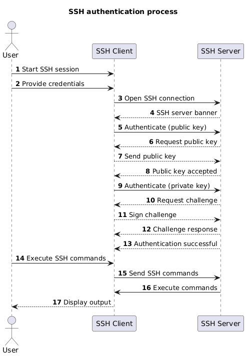
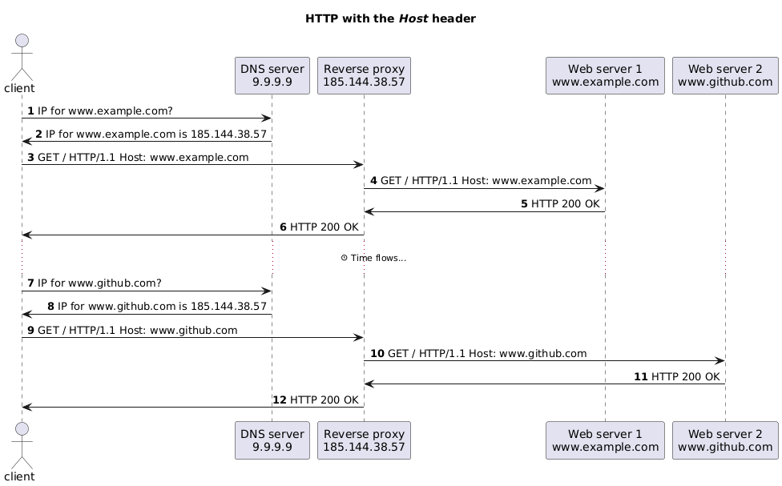
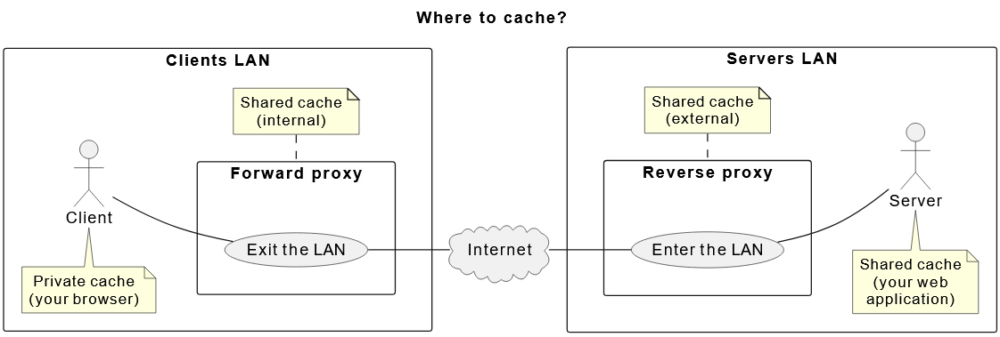

# TE 2
## 💀💀💀 DOCKER 💀💀💀
##### Cheatsheet
```bash
# Build and tag an image
docker build -t <image-name> <build-context>

# Start a container using its image name
docker run <image-name>

# Start a container in background
docker run -d <image-name>

# Display all running containers
docker ps

# Stop a container
docker stop <container-id>

# Access a running container
docker exec -it <container-id> /bin/sh

# Create a Docker network
docker network create <name>

# Start a container and override the entry point
docker run --entrypoint /bin/sh <image-name>

# Start a container and override the command
docker run <image-name> <command>

docker run -d --rm -p --network <networkName> 8080:8080 plantuml/plantuml-server
-d = run in background
--rm = remove the container on stop
-p HOST:CONTAINER = map machin port 8080 to this container port 8080

# Delete all stopped containers
docker container prune

# Delete all images
docker image prune

# run compose
docker compose up -d
-d = run in background

# stop and remove compose
docker compose down

#IF YOU WANT TO exec, run, ps, ... -> JUST ADD 'compose' before the command 
```

##### Create a docker file
```Docker
# Image sur la quelle on ce base pour crée la notre
FROM ubuntu:24.04
# Pour une app java FROM eclipse-temurin:21-jre

# Crée une variable d'environement
ENV key=value

# copie un directory (Sur notre machine) dans un autre (dans l'image)
COPY sourceDir destDir

# en gros, c'est un cd dans l'imagine
WORKDIR path

# Exec command
CMD ["echo", "Hello, World!"]

# Expose port
EXPOSE 8000
```

##### ↗️⁉️⁉️ Docker compose ⁉️⁉️↗️
OK, en gros, un docker compose c'est un fichier qui sert à crée une infra, genre le container c'est les machines et le compose il dit just qu'il faut pour que ça marche et dans quel ordre les lancers (peut aussi servire à crée les images)
- `service` : Nom du service
- `image` : image à utiliser
- `port` : port a exposer (HOST:CONTAINER)
- `volumes` : mount volumes int the container
- `environment` : ENV variable
- `network` : network entre container
##### Example
```compose
networks:
  pantoufle:

services:
  ncat-server:
    hostname: my-server
    image: ncat
    command:
      - -l
      - "1234"
    networks:
      - pantoufle

  ncat-client:
    image: ncat
    command:
      - my-server
      - "1234"
    networks:
      - pantoufle
```

## SSH & SCP
(SSH, GPC, etc.) => public/private keys security

### SSH
SSH is a protocol use in TCP (port 22)
Uliser pour : remote machine connection, copy files (with SCP)

SSH is also the name of the software that implements the SSH protocol on most machine

#### SSH key algo
- RSA.
- DSA.
- ECDSA **<- Most recent/secure**
- Ed25519 **<- Most recent/secure**
#### SSH key fingerprint
C'est le hahs de la public key (utiliser pour identifier la clef public)
ça permette de verifier que la clef utiliser est bien la bonne et d'eviter les **middle man attacks**

(Known hosts (hosts that you have allowed to connect to) are stored in the `~/.ssh/known_hosts` file)

#### SSH key generation
Fait avec `ssh-keygen` (command) => crée une clef public et une clef privée
(public key = `<key>.pub` | private key = `<key>`)
Une passpharse peut être utiliser pour encrypter la private key

### SCP
c'est un protocol utiliser pour copier des fichier d'une machine à une autre en remote (remplace FTP)

## HTTP & curl
**Javalin** (basé sur **Jetty**) (**Quarkus** ou **Spring Boot** pour la production)

**curl** = command line tool pour envoyer des requet (HTTP(S), FTP(S), SFTP, etc.)
`curl -X POST http://localhost:8080` 
`curl -X POST -d "Hello, world!" http://localhost:8080/body-demo`
GET by default
-X = use HTTP
-v = print request headers
-i = print response header 
-d = set http body (to "Hello, world!")
-H = set header | -H "Accept: text/plain"


### Javalin
```Java
public static void main(String[] args) {
    Javalin app = Javalin.create();
    // ### Path parameter ###
    app.get(
        "/content/{contentId}",
        ctx -> {
          String contentID = ctx.pathParam("contentId");
          ctx.result("GET "+contentID);
        });
    // ### query parameter ###
    app.get(
        "/content/{contentId}",
        ctx -> {
            //?id=test&data=prout
            String id = ctx.queryParam("id");
            String data = ctx.queryParam("data");
            if (id == null || data == null) {
                //io.javalin.http.BadRequestResponse;
                throw new BadRequestResponse(); 
            }
          ctx.result("GET "+id+" "+data);
        });
    app.post(
        "/data",
        ctx -> {
            // HTTP body
            String data = ctx.body();
            ctx.result("POST msg").status(HttpStatus.CREATED)
        });
    app.patch(
        "/",
        ctx ->
            ctx.result("PACTH msg").status(HttpStatus.OK));
    app.delete(
        "/",
        ctx ->
            ctx.result("DEL msg").status(HttpStatus.NO_CONTENT));

    app.start(8080);
}
```
WITH Content type
```Java
app.get("/content/{contentId}",
    ctx -> {
        String acceptHeader = ctx.header("Accept");
        if (acceptHeader == null) {
            throw new BadRequestResponse();
        }

        if (acceptHeader.contains("text/html")) {
            ctx.contentType("text/html");
            ctx.result("<h1>Hello, world!</h1>");
        } else if (acceptHeader.contains("text/plain")) {
            ctx.contentType("text/plain");
            ctx.result("Hello, world!");
        } else {
            // io.javalin.http.NotAcceptableResponse;
            throw new NotAcceptableResponse();
        }
    });
```
COOKIE
```Java
app.get("/content/{contentId}",
    ctx -> {
        // get cookie "cookie"
        String cookie = ctx.cookie("cookie");
        if (cookie == null) {
            // set cookie = "new-cookie"
            ctx.cookie("cookie", "new-cookie");
            ctx.result("COOKIE !!");
        } else {
            ctx.result("COOKIE value : '" + cookie + "'!");
        }
    });
```
Body Validator (use to manage missing data in the body)
```Java
app.get("/sing-in/",
    ctx -> {

        Interger id = ctx.pathParamAsClass("id", Integer.class).get();

        User newUser = ctx.bodyValidator(User.class)
            .check(obj -> obj.email() != null, "Missing email")
            .get();

        users.put(newUser.id(), newUser);
        ctx.status(HttpStatus.CREATED);
        ctx.json(newUser);
    });
```

### HTTP
- HTTP/0.9 (1989) | very simple, only use to transfer HTML
- HTTP/1.0 (1996) | HTTP headers, statue codes, methods and other doc (images, video, etc.)
- HTTP/1.1 (1997) | Persistent connections, additional cache control, content negotation (client ask for specific version of a ressource), header can be use to host multiple websites (same server)
- HTTP/2 (2015) | Binary -> text protocol
- HTTP/3 (2022) | Base on QUIC(UDP) instead of TCP


`/users/{user-id}/view` | path parameter
`gaps.heig-vd.ch` -> `gaps` = subdomain | `heig-vd` = domain | `ch` = top-level domain

### URL encoding
`Super test` -> `Super%20test`
| Character | Encoding |
| --------- | -------- |
| Space     | `%20`    |
| `!`       | `%21`    |
| `"`       | `%22`    |
| `#`       | `%23`    |
| `$`       | `%24`    |
| `%`       | `%25`    |
| `&`       | `%26`    |
| `'`       | `%27`    |
| `(`       | `%28`    |
| `)`       | `%29`    |
| `*`       | `%2A`    |
| `+`       | `%2B`    |
| `,`       | `%2C`    |
| `/`       | `%2F`    |
| `:`       | `%3A`    |
| `;`       | `%3B`    |
| `=`       | `%3D`    |
| `?`       | `%3F`    |
| `@`       | `%40`    |
| `[`       | `%5B`    |
| `]`       | `%5D`    |

### HTTP request methods
- **GET** - Get a resource (default method - a browser always requests a resource using the HTTP method GET by default).
- **POST** - Create a new resource.
- **PATCH** - Partially update a resource (like if we want to change a modify a ressource, **PUT** will replace it)
- **PUT** - Update a resource if it exists or create it if it does not exist (this is an idempotent method - it means that making multiple identical requests has the same effect as making a single request).
- **DELETE** - Delete a resource.
### HTTP request format
#### Request 
- The HTTP method.
- The URL of the resource.
- The supported HTTP version.
- Some HTTP headers.
- The HTTP body (optional).
- The query parameters (optional).
- The cookies (optional).
- The content type (optional).
```
<HTTP method> <URL> HTTP/<HTTP version>
<HTTP headers>
<Empty line>
<HTTP body (optional)>
```
```
GET / HTTP/1
Host: gaps.heig-vd.ch
User-Agent: curl/8.1.2
Accept: */*
```
**Host** - The host of the server (gaps.heig-vd.ch in this case).
**User-Agent** - The user agent that sent the request (curl in this case).
**Accept** - The content types accepted by the user agent (any type in this case).
#### Respond 
- The HTTP version.
- The HTTP status code.
- The HTTP headers.
- The HTTP body (optional).
- The cookies (optional).
- The content type (optional).
- The content length (in HTTP/1.1).
- The content encoding (optional).
```
HTTP/<HTTP version> <HTTP status code> <HTTP status message>
<HTTP headers>
<Empty line>
<HTTP body>
```
- **Content-Length** - The length of the content in bytes (6111 bytes in this case).
- **Content-Type** - The content type of the resource (text/html in this case).
### HTTP Response statue code
- **`1xx` - Informational responses**
  - `101` - Switching Protocols (the server switches to a different protocol).
  - `102` - Processing (the server is processing the request).
- **`2xx` - Successful responses**
  - `200` - **OK** (the request was successful).
  - `201` - **Created** (new resource was created).
  - `202` - **Accepted** (the request was accepted but not yet processed).
  - `204` - **No Content** (the request was successful but the server does not send any content).

- **`3xx` - Redirection messages**
  - `301` - **Moved Permanently** (the resource has been moved permanently to a new URL).
  - `302` - **Found** (the resource has been moved temporarily to a new URL).
  - `304` - **Not Modified** (the resource has not been modified since the last request).

- **`4xx` - Client error responses**
  - `400` - **Bad Request** (the request is malformed).
  - `401` - **Unauthorized** (the request requires authentication).
  - `403` - **Forbidden** (the request is forbidden).
  - `404` - **Not Found** (the resource does not exist).
  - `405` - **Method Not Allowed** (the HTTP method is not allowed for this resource).
  - `409` - **Conflict** (the request could not be processed because of a conflict).
  - `410` - **Gone** (the resource is no longer available and has been removed).
  - `429` - **Too Many Requests** (the client has sent too many requests in a given amount of time).

- **`5xx` - Server error responses**
  - `500` - **Internal Server Error** (the server encountered an unexpected condition that prevented it from fulfilling the request).
  - `501` - **Not Implemented** (the server does not support the functionality required to fulfill the request)
  - `502` - **Bad Gateway** (the server received an invalid response from an upstream server).
  - `503` - **Service Unavailable** (the server is currently unable to handle the request due to a temporary overload or scheduled maintenance).
  - `504` - **Gateway Timeout** (the server did not receive a timely response from an upstream server).
The default status code is `200` (OK). This means that you can omit the status code.

### HTTP headers
| Header|EX|Description|
|---|---|---|
| `Accept`|`text/html`| The media types accepted by the client|
| `Content-Type`|`text/html`| The media type of the body sent by the client or from the server|
| `Content-Length`| The length of the body sent by the client or the server|
| `User-Agent`| The user agent of the client (the browser name and version, the curl version, etc.) |
| `Host`           | The host of the server|
| `Set-Cookie`     | The cookies set by the server|

HTTP does not transfer objects, it transfers representations of objects. This means that the server can send the same resource in different representations.
The same resource, i.e. the URL /my-resource, can be sent in different representations:
- Format: HTML, JSON, YAML, PNG, JPEG, etc.
- Language: English, French, German, etc.
- Encoding: UTF-8, UTF-16, etc.
### HTTP session
As HTTP is based on the request-response model --> This means that the server cannot know/identify who is the author

HTTP session is the use of tokens to identify with : 
- Using a query parameter.
- Using a cookie.
### API design
Format : JSON
**CRUD** = Create - Read - Update - Delete
#### REST APIs (Representational State Transfer)

- Client/server architecture
- Stateless: the server does not retain any session information.
- Cache-ability: a REST API should support caching of responses by the client and control which responses can be cached and which not.
- Layered system: it should be able to add intermediate systems (cache, load balancer, security gateway) without any impact for the client
- Uniform interface:
    - Use URIs/URLs to identify resources.
    - Server responses use a standard format that includes all information required by the client to process the data (modify or delete the resource's state).
    - Server responses include links that allow the client to discover how to interact with a resource.
- Code on demand (optional): responses may include executable code to customize functionality of the client.

All REST APIs are APIs but not all APIs are REST APIs.
#### API description
```
# Title
{Des}
## Endpoints
### {request name}
- {url} | ex : `POST /users`
{desc}
##### Request
{desc}
- {params}
...
##### Respond
{desc}
- {params}
...
#### Status codes
- `201` (Created) - ...
- `400` (Bad Request) - ...
- `409` (Conflict) - ...
```
## Web Infra
### Host Header
header use in **HTTP** fto specifies the domain name of the server (send by client) => making multiple domains in the same IP possible (with reverse proxy helps)
The reverse proxy recieve the client request and send it to the right web server

### Proxy
Proxy = composent d'une infra qui est intermediaire au requets de resources 
#### Forward | Client **-->** Server | Extern **-->** Interne
En gros, c'est composant infra qui vas redistribuer les request d'une group de client ver **n'import quel** servers
Configured to handle request from a group of clients to any other server.
Often used to corporate environments (security)


#### Reverse | Client <-- Server | Extern **<--** Interne
En gros, c'est composant infra qui vas redistribuer les request de **n'import quel** client ver un group de server 
Utilser en web infra pour géré plusieur server
##### Can be use
- Load balance: receive all traffic and distribute the requests on a cluster of several identical Web server instances.
- Cache: can keep in cache responses from servers for a certain amount of time - if the same request is received again, the reverse proxy can return the cached response instead of forwarding the request to the server.
- Encrypt and decrypt traffic: manages secure HTTPS connections with clients and unsecure HTTP connections with servers.
- Protect servers from attacks (e.g. DDoS, SQL injection, etc.): By filtering requests, reverse proxy can protect servers from attacks.
- Serve static content (e.g. images, videos, etc.): can serve static content from a cache.
- Serve multiple domains on the same IP address: can use the Host header to forward requests to the correct server.
 
**Traefik** is an open-source Edge Router that makes exposing/publishing your services on the Internet a fun and easy experience.

### Load balancing
Distribution of a set of tasks over a set of ressources (computing units)
With Reverse proxy and Host header => load balancer can be used

A load balancer can distribute requests between multiple servers using different strategies:
- Round-robin: the load balancer forwards requests to each server in the pool in turn.
- Sticky sessions: the load balancer forwards requests from the same client to the same server with the help of a cookie.
- Least connections: the load balancer forwards requests to the server with the least number of active connections.
- Least response time: the load balancer forwards requests to the server with the least response time.
- Hashing: the load balancer forwards requests to the server based on a hash of the request (e.g. the IP address of the client, the URL of the request, etc.).


## Caching data & Performance
### Type of caching
- Client side (private)
- Server side (shared)


### CDN (Content Delivery Networks)
C'est un type de chache que le server peu utiliser pour le contenue static (image, video, etc.)

En gros, c'est un réseau de proxy server qui permette de server les request avec le contenue static recurrent.

- CDN is a geographically distributed network of proxy servers and their data centers.
- CDN can be used to improve the performance of a system by serving static content to clients from the closest server for clients all around the world.
  
### Where to cache ? 
Client side, server side ou CDN
Le mieux c'est de cache partous (lmao) mais c'est souvant impossible (no way). Mais nous on aime que le server-side


### Managin cache with HTTP (server side)
#### Caching model (on peut utiliser le 2 en meme temps)
RFC 2616
##### Expiration model
The cache is valid for a certain amount of time.
On peut l'implementer avec le header `Cache-Control: max-age=<number of seconds>`
##### Validation model
The cache is valid until the data is modified.
###### Main idea
1) Send a request to the server to check if the data has changed.
2) If the data has not changed, the server can return a `304 Not Modified` response to the client. The client can then use the cached data.
3) If the data has changed, the server can return a `200 OK` response to the client with the new data.

La request s'appel une `conditional request (CR)`
Si un client veu update une ressource il doit envoyer un CR
Reponce pour le **POST** : 
`200` = OK = Cache HIT
`412` = Precondition Failed = data all ready modify = Cache MISS

###### 2 type de conditional request (CR)
- Based on the Last-Modified header: 304 si la donner à pas été changer depuis la dérnière fois
- Based on the ETag header: 304 si la hash/version de la donner à pas changer
###### Header `Last-Modified` (HTTP)
`Last-Modified`: indicates the date and time at which the resource was last updated.
###### Header `Etag` (HTTP)
`ETag` : provides the current entity tag for the selected representation. Think of it like a version number or a hash for the given resource.

### Managin cache with proxie
Forward / Reverse proxy peuvent mange le cache
`Treafik` est http reverse proxy qui peut gerer le cache


### Managin cache with key-value stores
A key-value store is a type of database that stores data as a collection of key value pairs.
Ex : `Redis` or `Valkey`


