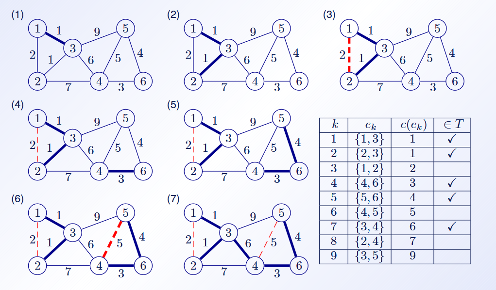
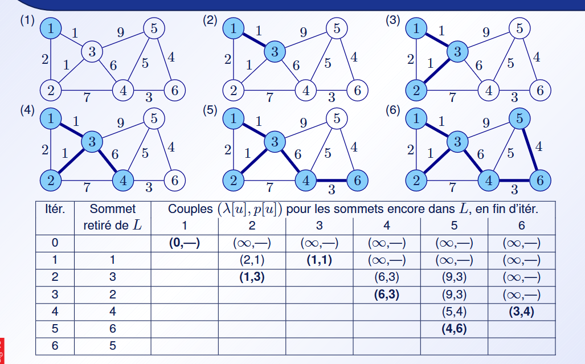
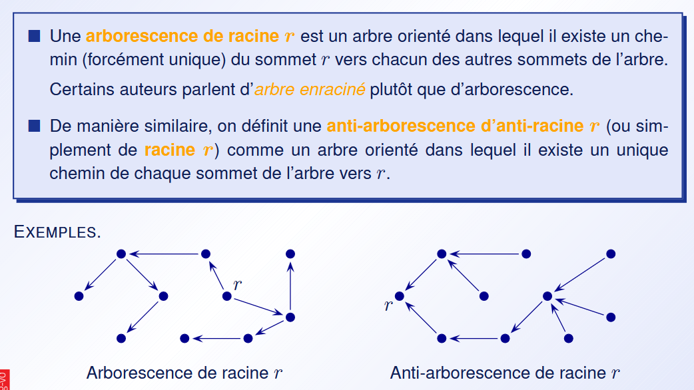
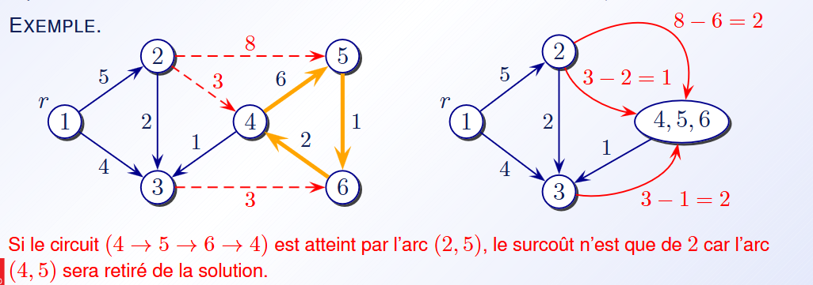
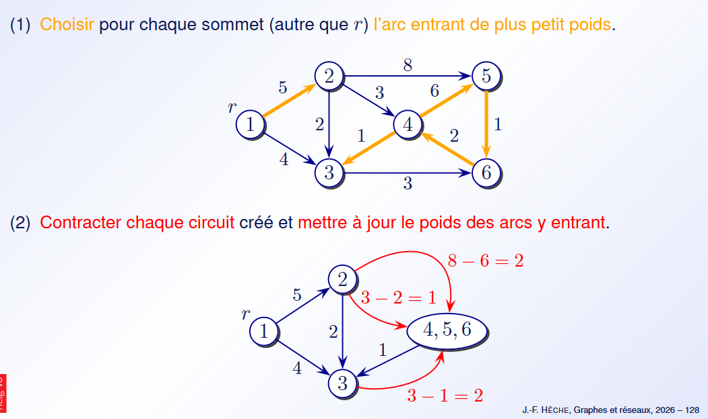
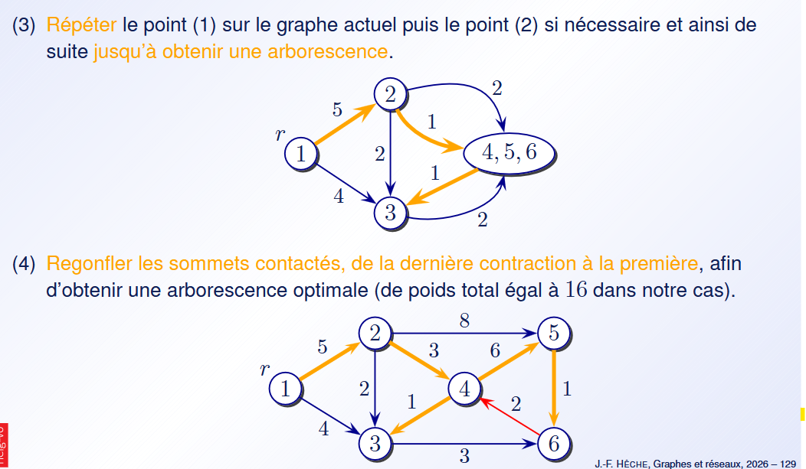
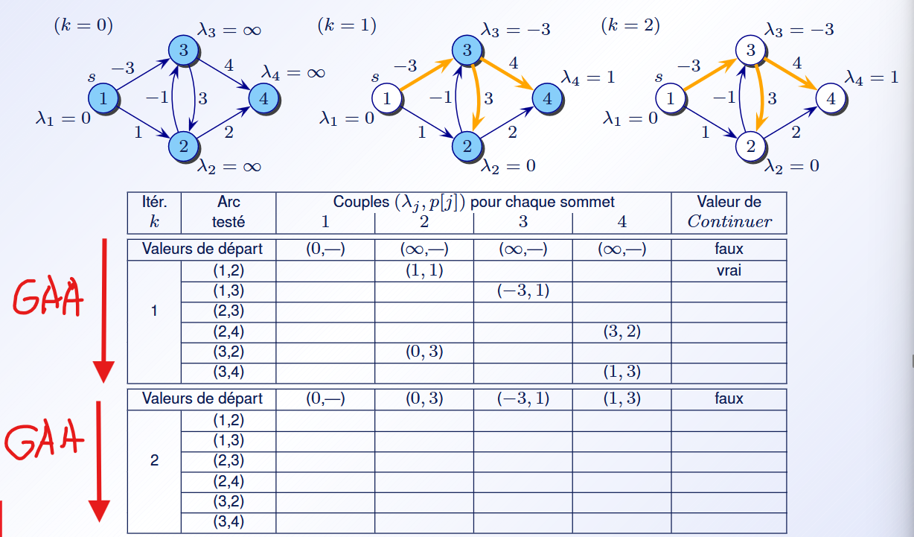

# TE 1

*S* = somette
*A* = arrette

### Chap 1 (Base)

#### Type de graph
- vide = pas d'arrette ( |E| = 0 )
- trivial = 1 sommet et 0 arret
- null = 0 sommet et 0 arret
- graph partiel = on garde les somet mais on dégage des arretes
- sous-graph = dégage des somette mais on grade touts les arrettes de ses sommet
- sous-graph partiel = sous-graph + graph partiel


### Chap 2 (Représentation des graphe)
##### Matrice d'adjacence
Matrice qui donne si a et b on un arrette


##### Matrice d'incidence
c'est matrice qui donne les sommette a qui l'arette est reliser (col = arret et row = sommet)

(peut pas représenter des boucle lmao)


##### Tableau de lists d'ajacence
c'est un tableau de list chainner pour montre qu'elle somet sont accécésible depuis le sommet k


##### Tableau compact de successeurs (forward star representation)
En gros, c'est 2 tableu :
- **TIPS** (Tableau des Indices des Premiers Successeurs) vas permettre de stocker l'index de départ de la plage utiliser dans le **TabSucc** par le somette
- **TabSucc** est utiliser pour stocker les succeseur au somette. ça stocke des somette et leur place dans le tableu indique d'où il vienne


### Chap 3 (Connexité et exploration des graphe)
##### Def
- **Fortement connexe** = minimum 1 chemin de chaque tous les *S* a tous les *S*
- **Composante fortment connexe** = sous-graphe qui sont eux fortement connexe


#### OMG exploration

##### BFS (Breadth First Search)
Explo en largeur

Init = O(n)
Exec = O(n + m) (n = nombre *S*, m = nombre *A*)

utilisable pour trouver les plus court chemin


##### DFS (Depth First Search)
Explo en profondeur

Init = O(n)
Exec = O(n + m)


#### Trouver les composant fortement connexes

##### Algo de Kosaraju
En gros :
- prendre le Graph transposé (G^T)
- faire une DFS sur le G^T et mettre chaque sommet dans une list par ordre de traitement inversé (dernier sommet traiter = premier sommet de la list) (list = LS)
- faire une explo du graph initial (peut importe la quelle) en utilisant la list LS
- Les composant fortement connext ce trouver en explorant et regardant quand on peut plus explorée


##### Algo de Tarjan
Permette aussi de trouver des composant fortement connexes mais en une seul exploration

En gros, on fonctionne avec 2 lists :
- **dfsnum** sert a numéroté les *S* par odre de traitement
- **low** (**low[n]**) sert a stocker le *S* le plus petit atteignable par le *S* [n]

Algo :
SSC {
- Ajoute le somet **u** à la pile **P**
- pour chaqu'un de c'est enfant -> **s**
  - si _s_ à pas été visiter -> SSC(**s**);
  - si _s_ à pas été encore attribuer a une composant ->
    - low[**u**] = min(low[**u**],low[**s**])
- si low[**u**] == dfsnum[**u**] ->
  - nouvel composante
  - get **w** de **P** tant que **w** != **u**
    - attribuer **w** au composante trouver
}


### Chap 4 (Arbres et arborescences)
#### Def
- Arbre = Graph conext et sans cycles
- Arbre recouvrant = Graph partielle de G qui est un arbre G
- coupe = ensemble d'arret ayant une extremiter dans $A$ et l'autre dans $\bar{A}$

#### Union-Find
type de structure qui permette de faire les operation suivante :
- MakeSet(u) [O(n)] : crée un sous-ensemble qui corespond a la condition u
- Find(u) [O(n)] : trouve un sous-ensemble contenant u
- Unsion(u,v) [O(n)] : fusionne u et v

#### Kurskal découverte d'arbre
Complexité : O(mn) {O(m log(n) : trie, O(mn) : parcourt/check)}

Algo :
```C
// not real c, just c like
int[] kruskal(int[] arr){
  int[] fo;
  // trie arrete croissant
  arr.sort();

  for(int e : arr){
    // si e ne crée pas de cycle
    // avec fo -> ajouter a la foret
    if(e not cycle in fo){
      fo.push(e);
    }
  }
  return fo;
}
```


#### Prim

Algo :
```C
// not real c, just c like
int[] Prim(int[] sum){
  int[] fo;

  // marke du sommet
  int[] prio = int[sum.lenght];

  // plus proche du somette
  int[] proche = new int[sum.lenght];

  // init
  for(uint i = 0; i < sum.lenght; i++){
    prio[i]=INFINT;
    proche[i]=-1; // NULL
  }

  // list des sommettes
  // qui ne sont pas encore
  // dans fo
  int[] buffer = sum;

  // choisire un sommet de base
  int s = sum[0];

  while(!buffer.empty()){
    int u = buffer.get(
      sommet avec la plus petit mark[u];
    );

    if(u!=s)fo.push(proche[u],u);

    for (uint i : getNeightbore(u)){
      if(buffer.include(i) && prio[i] > poid(u,i)){
        prio[i] = poid(u,i);
        proche[i] = u;
      }
    }

  }
}
```




##### Abrorescneces et racines


- Aborescnces recouvrantes = arbres recouvrant qui aussi une arborescences


##### Contraction de circuits (Chu-Liu)




### Chap 5 (Plus court hemins dans les reseaux)

##### Bellman
En gros c'est l'idée que le plus court chemin entre a et c est composer des plus court chemin de c'est composant (genre a-b-c, si a-b est le plus court et b-c est le plus court, alors a-b-c est le plus court pout a-c)

équoation : $\Delta_j \geq \Delta_i + c_{ij}$

avec :
- $\Delta_j$ : distande entre s et j
###### Bellman-ford
Algo :
```C
// not real c, just c like

struct Graph{v : vertex, a : arc};
struct Arc{a : v1, b : v2, l : lenght};

// g = gaph, s = origne de l'arbre
Graph BellmanFord(Graph g, int s){
  // distance du sommet
  int[] dist = int[g.v.lenght];

  // plus proche du somette
  int[] proche = new int[g.v.lenght];

  // init
  for(uint i = 0; i < dist.lenght; i++){
    dist[i] = INFINT;
    proche[i] = -1;  // NULL
  }

  // distance from orine
  int d = 0;

  bool ok = true;

  distance[s] = 0;

  while(k < g.v.lenght && ok){
    ok = false;
    k++;

    // go over all arc (GAA)
    for(Arc arc : g.a){
      if(dist[arc.b] > dist[arc.a] + arc.l){
        dist[arc.b] = dist[arc.a] + arc.l;
        ok = true;
      }
    }
  }
  if( !ok )return {dist,proche};

  return reseau avec un circuit a coup negatife :[;
}
```

##### Dijkstra
NE PEUT ÊTRE UTILISER QUE SUR DES CIRCUIT A COUP NON NÉGATIVE

Alog :
```C
// not real c, just c like

struct Graph{v : vertex, a : arc};
struct Arc{a : v1, b : v2, l : lenght};

// g = gaph, s = origne de l'arbre
Graph BellmanFord(Graph g, int s){
  // distance du sommet
  int[] dist = int[g.v.lenght];

  // plus proche du somette
  int[] proche = new int[g.v.lenght];

  // init
  for(uint i = 0; i < dist.lenght; i++){
    dist[i] = INFINT;
    proche[i] = -1;  // NULL
  }

  // distance from orine
  int d = 0;

  bool ok = true;

  distance[s] = 0;

  while(k < g.v.lenght && ok){
    ok = false;
    k++;

    // go over all arc (GAA)
    for(Arc arc : g.a){
      if(dist[arc.b] > dist[arc.a] + arc.l){
        dist[arc.b] = dist[arc.a] + arc.l;
        ok = true;
      }
    }
  }
  if( !ok )return {dist,proche};

  return reseau avec un circuit a coup negatife :[;
}
```

##### Floyd-Warshall

##### Johnson