# TE 1

*S* = somette
*A* = arrette

### Chap 1 (Base)

#### Type de graph
- vide = pas d'arrette ( |E| = 0 )
- trivial = 1 sommet et 0 arret
- null = 0 sommet et 0 arret
- graph partiel = on garde les somet mais on dégage des arretes
- sous-graph = dégage des somette mais on grade touts les arrettes de ses sommet
- sous-graph partiel = sous-graph + graph partiel
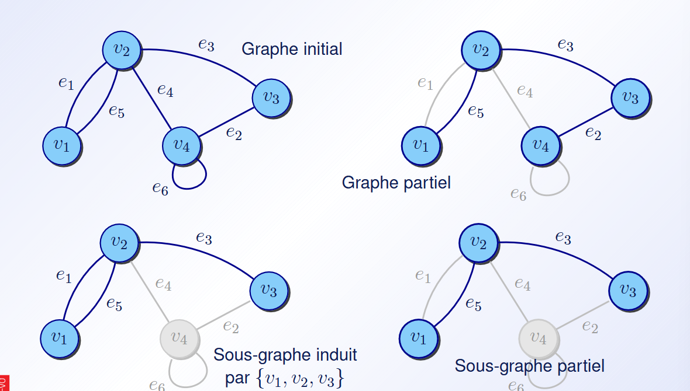

### Chap 2 (Représentation des graphe)
##### Matrice d'adjacence
Matrice qui donne si a et b on un arrette
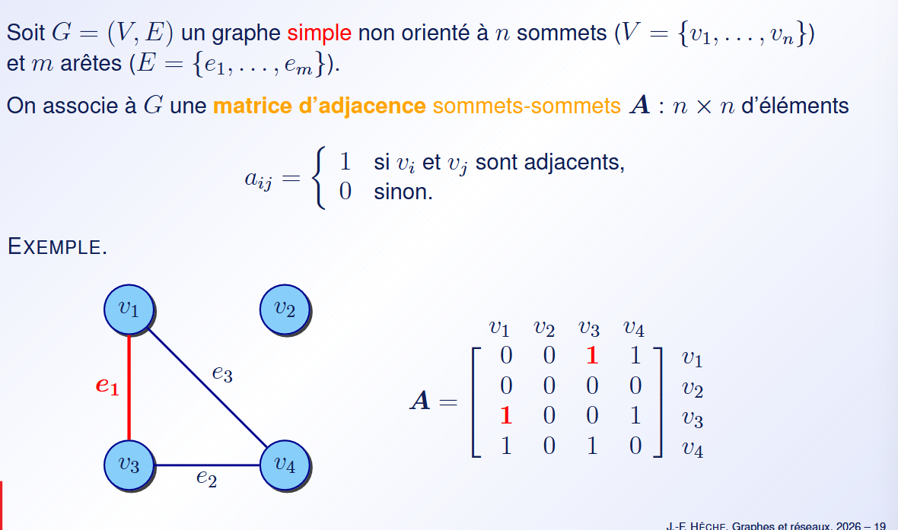
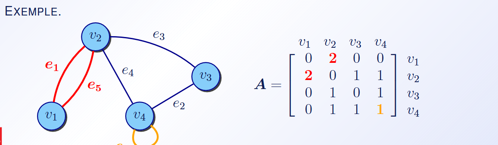
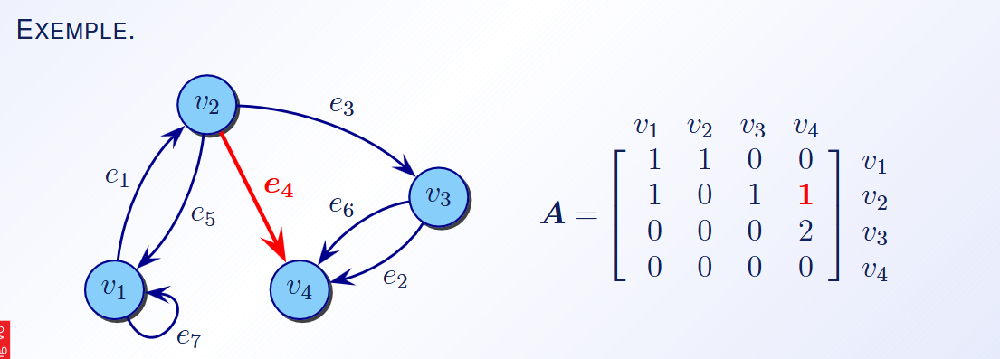

##### Matrice d'incidence
c'est matrice qui donne les sommette a qui l'arette est reliser (col = arret et row = sommet)

(peut pas représenter des boucle lmao)

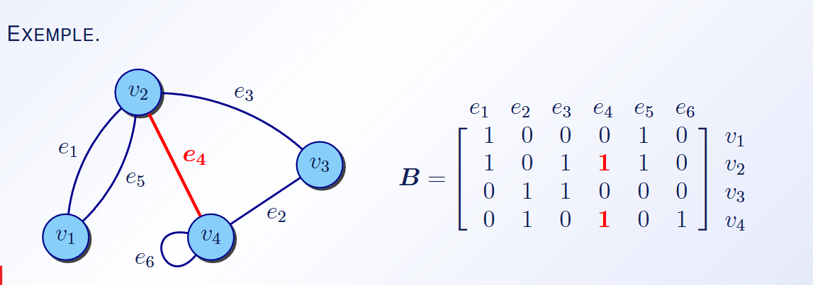
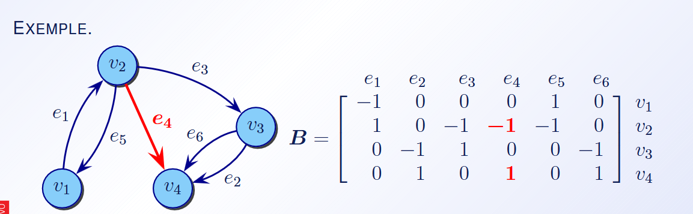

##### Tableau de lists d'ajacence
c'est un tableau de list chainner pour montre qu'elle somet sont accécésible depuis le sommet k
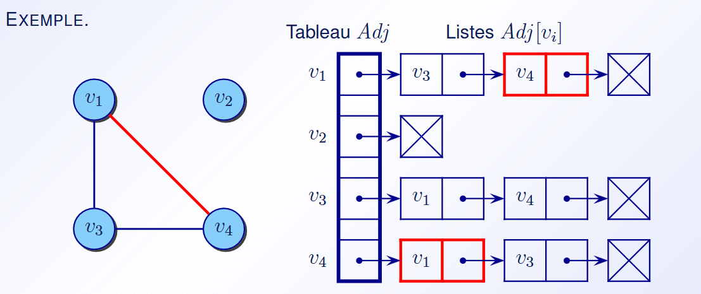
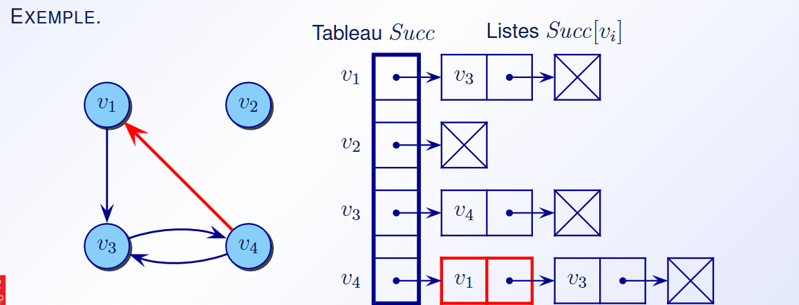
##### Tableau compact de successeurs (forward star representation)
En gros, c'est 2 tableu :
- **TIPS** (Tableau des Indices des Premiers Successeurs) vas permettre de stocker l'index de départ de la plage utiliser dans le **TabSucc** par le somette
- **TabSucc** est utiliser pour stocker les succeseur au somette. ça stocke des somette et leur place dans le tableu indique d'où il vienne

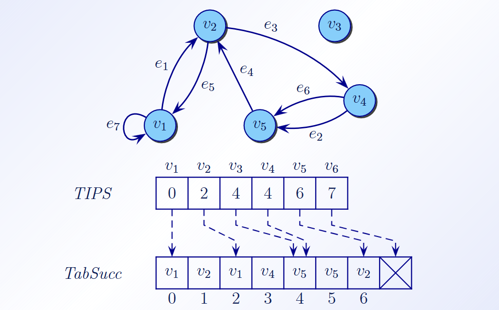

### Chap 3 (Connexité et exploration des graphe)
##### Def
- **Fortement connexe** = minimum 1 chemin de chaque tous les *S* a tous les *S*
- **Composante fortment connexe** = sous-graphe qui sont eux fortement connexe
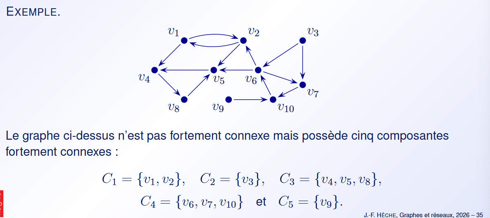

#### OMG exploration

##### BFS (Breadth First Search)
Explo en largeur

Init = O(n)
Exec = O(n + m) (n = nombre *S*, m = nombre *A*)

utilisable pour trouver les plus court chemin

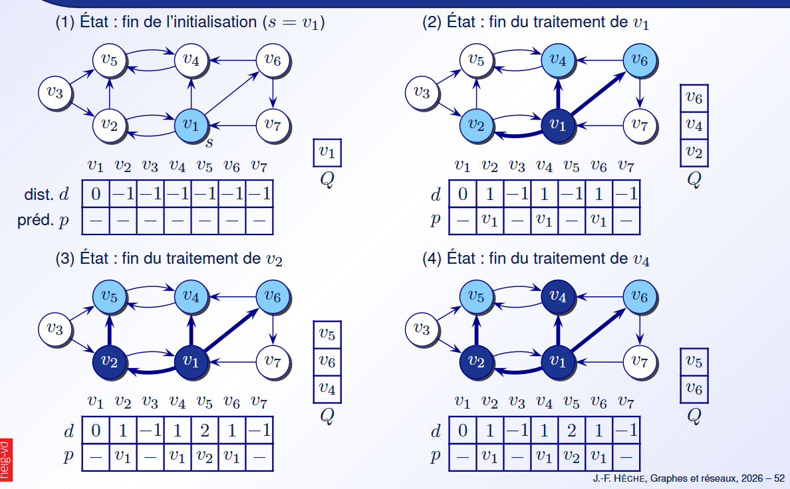

##### DFS (Depth First Search)
Explo en profondeur

Init = O(n)
Exec = O(n + m)

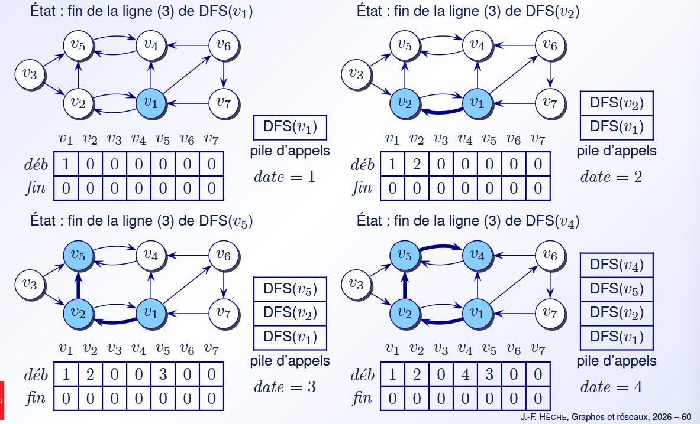

#### Trouver les composant fortement connexes

##### Algo de Kosaraju
En gros :
- prendre le Graph transposé (G^T)
- faire une DFS sur le G^T et mettre chaque sommet dans une list par ordre de traitement inversé (dernier sommet traiter = premier sommet de la list) (list = LS)
- faire une explo du graph initial (peut importe la quelle) en utilisant la list LS
- Les composant fortement connext ce trouver en explorant et regardant quand on peut plus explorée

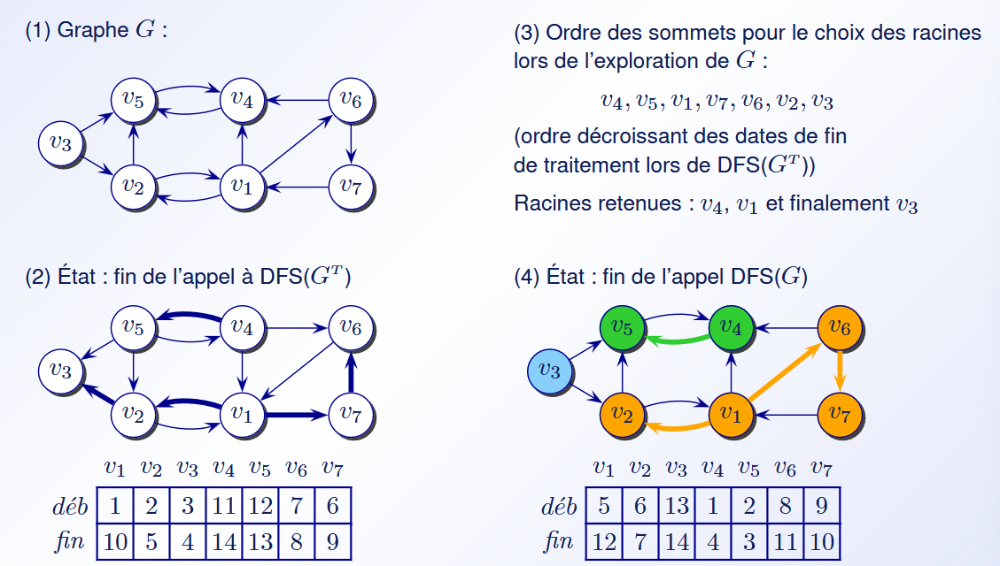

##### Algo de Tarjan
Permette aussi de trouver des composant fortement connexes mais en une seul exploration

En gros, on fonctionne avec 2 lists :
- **dfsnum** sert a numéroté les *S* par odre de traitement
- **low** (**low[n]**) sert a stocker le *S* le plus petit atteignable par le *S* [n]

Algo :
SSC {
- Ajoute le somet **u** à la pile **P**
- pour chaqu'un de c'est enfant -> **s**
  - si _s_ à pas été visiter -> SSC(**s**);
  - si _s_ à pas été encore attribuer a une composant ->
    - low[**u**] = min(low[**u**],low[**s**])
- si low[**u**] == dfsnum[**u**] ->
  - nouvel composante
  - get **w** de **P** tant que **w** != **u**
    - attribuer **w** au composante trouver
}

### Chap 4 (Arbres et arborescences)

### Chap 5 (Plus court hemins dans les reseaux)