# TE 2
### Chap 6 (Graph sans circuits)
[x6.1, x6.2, x6.4, x6.7, x6.10, 6.11, x6.13, 6.9, 6.14, 6.15, 6.12]
##### Definition
Un graph sans cercuit est defini si par posédé au moin un sommet sans prédécesseur et un sommet sans succsseur. Tous les sous graphs partiel doivent être aussi sans cercuit
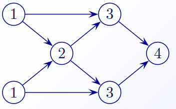

##### Fonction de range
C'est une fonction qui permette de numérotée les sommet du graphe (tri topologique)

Un graph sans cercuit est un graph qui admet une fonction de rang

##### Tri topologic
Tant qu’il reste des sommets non numérotés faire
- Identifier un sommet sans prédécesseurs
- Le numéroter (à la suite de celui de l’itération précédente)
- Le supprimer du graphe

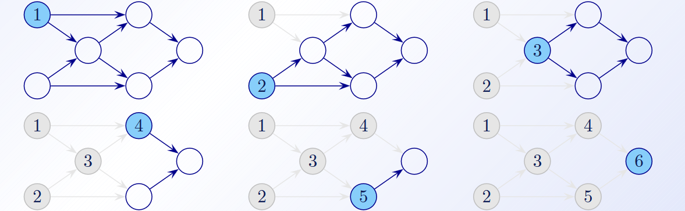
**Complexité : O(N+M)**
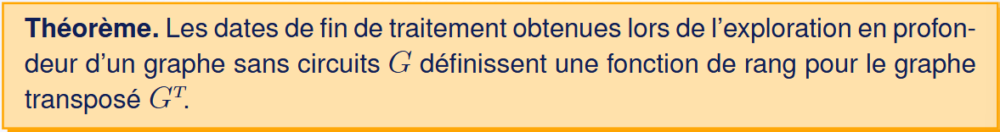

##### Chemin le plus court
Vue qu'on n'a pas de cercuit, on peut just appliquer Bellman, faut juste traiter les sommet par **numérotation topologic**
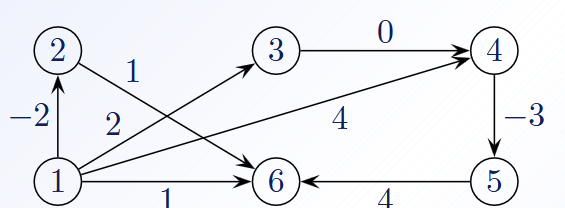

|Somet traiter|1|2|3|4|5|6|
|-|-----|-----|-----|-----|-----|-----|
|1|-(0) |-----|-----|-----|-----|-----|
|2|-(0) |1(-2)|-----|-----|-----|-----|
|3|-(0) |1(-2)|1(2) |-----|-----|-----|
|4|-(0) |1(-2)|1(2) |3(2) |-----|-----|
|5|-(0) |1(-2)|1(2) |3(2) |4(-1)|-----|
|6|-(0) |1(-2)|1(2) |3(2) |4(-1)|2(-1)|

***pred ( distance )***

##### Algorithme PCC_SANSCIRCUITS
- Tri topologic de G → G'
- BellMan sur G' (source sommet #1)
**Complexité : O(N+M)**

##### Problèmes de plus longs chemins
Vue qu'on a un graph sans cercuit, on s'en fous des cercuit à coût negatif ou à coût positif

Donc on peut just fair Bellman mais avec un *max* à la place du *min*

##### Application
###### Problème central de l’ordonnancement
- Un ensemble de n tâches doivent être réalisées.
- Pour chaque tâche i on connaît sa durée di d’exécution.
- La planification doit respecter des contraintes d’antériorité du type :
  - La tâche j ne peut commencer qu’une fois l’exécution de la tâche i terminée.
- L’objectif est de déterminer une planification des tâches respectant toutes les contraintes et minimisant la durée totale de réalisation

###### Les graphes potentiels-ÉTAPES$
les sommets du graphe représentent différentes étapes de réalisation du projet global et les arcs correspondent aux tâches

###### Les graphes potentiels-TÂTCHES
sommet du graphe correspond à une tâche et les arcs modélisent les contraintes d’antériorité

Pour le modélisé, c'est trivial

Faut just pas oublier de rajouter un sommet *début* d'où toutes les taches parte et un sommet *fin* qui représent la fin du projet et qui n'a donc pas de succésseur
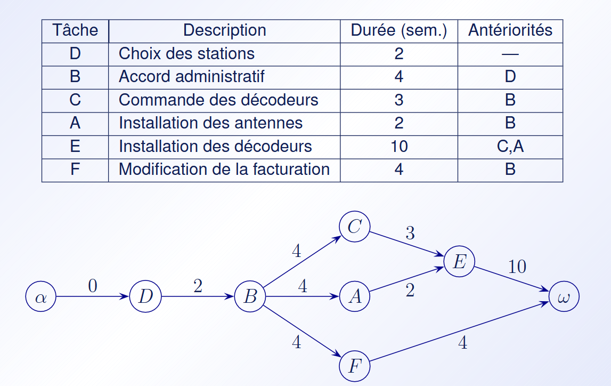

La date de **debut de réalisation** d'une tache est donc donner par son chemin le **plus long**
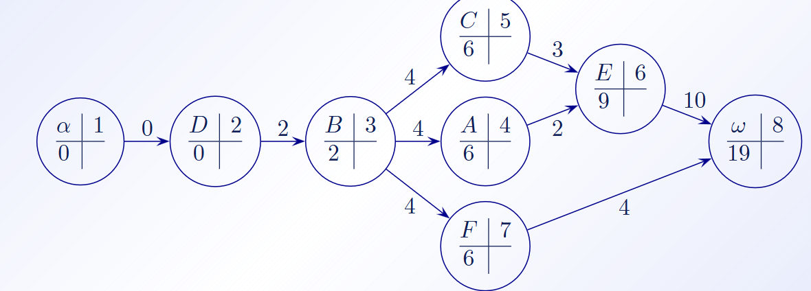

###### Chemin critique
Un chemin critique est un plus long chemin du sommet α (début des travaux) au sommet ω (fin des travaux) (il est donc composé uniquement de tâches critiques). La longueur D d’un chemin critique correspond à la durée minimale nécessaire à la réalisation du projet.
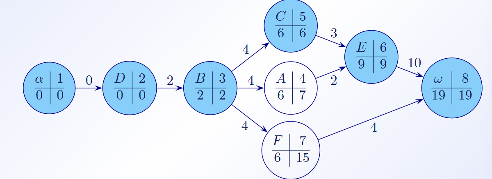

( le petit nombre a droite est égale la date de debut de relisation du la tache précédent - duré la tache, sois la date maximal pour commencer la tache )

### Chap 7 (flots)
[x7.1, 7.2, 7.4, 7.5, 7.8, 7.9, 7.10, 7.12, 7.13, 7.14, 7.15, 7.16, 7.17, 7.18, 7.19]
#### Important
dans un flot, y a toujour :
- une source S (sommet avec 0 pred )
- un puis T (sommet sans succ)
- une fonction U qui associe chaque arc du graph a une capacité maximal
  nomée $x_{ji}$ ou $j$ et $i$ sont les id des sommet de l'arc

Le but est de transmettre un quantité maximal de "truc" sans perte depuis la source jusqu'au puit

#### Équoation de conservation du flot
- flux entrant = $\sum$ des $x_{ij}$ des $pred$ du sommet
- flux sortant = $\sum$ des $x_{ij}$ des $succ$ du sommet
- conservation  du flot = $\sum{pred} - \sum{succ}$
le but est d'avoir un equoation du flot = 0

##### Flot Compatible
Un flot compatibe c'est un flot qui respect l'équoation de conservation

#### Circulation

#### Algorithme de Ford et Fulkerson
1) prender un flot initial possible
2) Crée R*
3) chercher le chemin de s à t dans R*
4) si trouver, augmenter au maximume le flot le long de ce chemin (en deminuant les flot inverse)
5) répéter jusqu'à qu'on ai plus de chemin dans R*

#### Coupe
En gros, l'idée c'est de séparé les sommet en 1 group A, et de faire en sort que chaque arc du group A vas en dehors de celuis ci

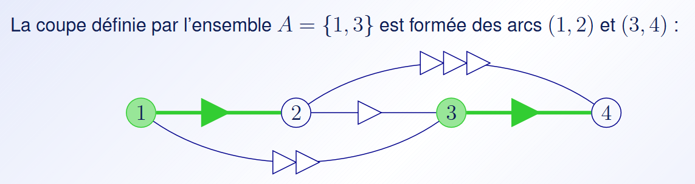

La capacité de cette coupe est defini par la comme des capacité des arc formant la coupe

dans cette example, on a A{1,3} définie par les arc (1,2) et (3,4) => donc une capacité de 2

**si notre flow est égale a la capacité de al coupe, alors la coupe est minimal et le flot est maximal**
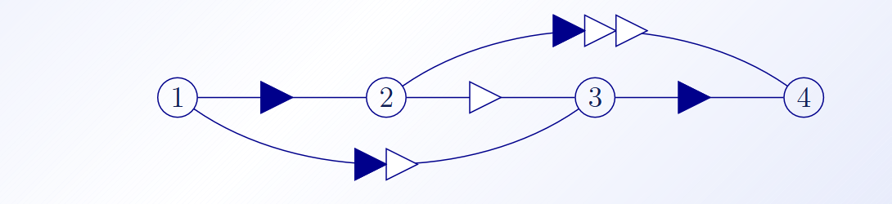

pour le trouver,
- tu prend la denier explo
- tu check tous les sommet que tu atteindre depuis la source
- tu prend chacun de ses sommet et fait ta coupe avec les flot plein
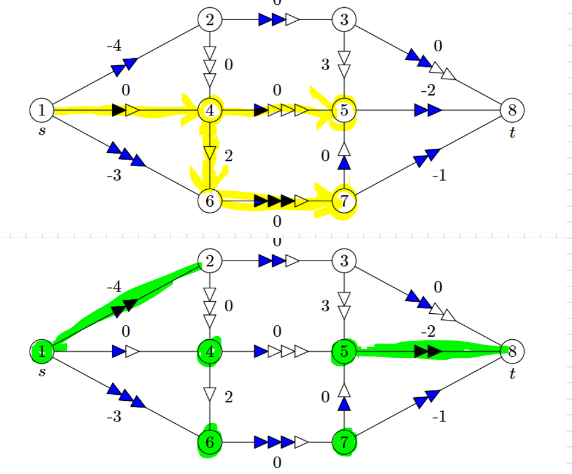

##### Théorème du flot max et de la coupe min
Dans un réseau, la valeur du flot max de S à T est toujour égale a la capacité minmal d'une coupe séparant s de t

#### Couplage maximum dans un graphe biparti
Dans un cas ou le graph est bipartie, on peut voir le problème comme une resolution de couplag max dans un graphe bipartie.

en gros, on prend notre graph :
- on oriente tous les arc d'un groupe ver l'autre
- on mette la capacité de chaque arc a 1
- on ajoute une source "s" et un pui "t"
- on cherche le flot max de s à t

#### Problème a flot max à coût ($) min
en gros, on mette un coup de n par unité sur les arc, dans ce resau on cherche le flot max mais a coût min

##### Algorithme de Busacker et Gowen
1) on commence avec un flot initial null
2) Construire un  réseau d'augmentation R*
3) Cherche un plus court chemin de s à t dans R*
   - si trouver, répéter depuis (2)
   - mettre ajour les cout en fesant $c_ij = c_ij + (\Delta_i - \Delta_j)$
4) end

#### Problème d'affectation lineaire et transbordement
on a N personne avec N tache et on cherche comment les repartire de manière qu'on ai une tâche par personne.
En gros, c'est probème de couplage parfait de coût minimum dans un graphe biparti.

donc on a :
- des sources avec N unité
- des puits avec qui doivent demander le meme nombre d'unité
- et des sommet de transit avec ni offre ni demande

### Chap 8 (Random problème)
[8.1, 8.2, 8.3, 8.4, 8.5, 8.7, 8.8, -8.9, -8.10, -8.11, -8.12]
##### Graph complet
Graph $K_n$ compte $\frac{n(n-1)}{2}$ arêtes
##### Graph complementaire
c'est le graph qui complet (d'un point de vue arrête) le gaph G
ex :
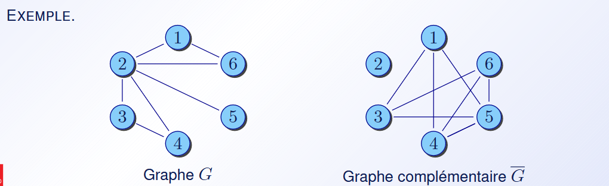

##### Graph bipartie (bi-partie)
En gros, c'est un gaph où l'on gatégorise l'ensemble des Edge en 2 groups et dans le quel chaque Edge est relier par une Vertex a un Edge de l'autre groupe
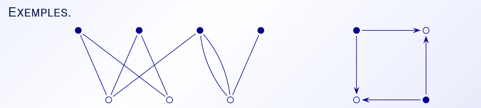
###### Graph bipartie compelet
c'est un graph bipartie dans le quel chaque Edge d'un group est relier a tous les autre Edge de l'autre group

##### Couplage
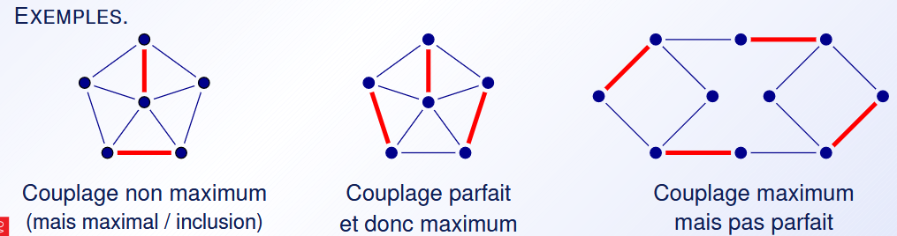
- Parfait = chaque Edge est coupler avec un autre
- Maximum = en gros, c'est quand on utiliser la maximum d'arc et que l'on ne peut plus en rajouter

###### Chain
- Chaine alternée relative à M : chaine dans laténér classic
  
- Chaine alternée augmentante à M : si y a les deux extrermié de la chaine quie ne sont pas dans M
  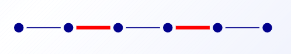

###### Théormèmme de Berge
en gros, il dit que si on a une chaine donnée C, on peut lui ajouter un membre en fesant :
- crée un couplage d'arc non compris dans C
- fair $C \Delta M$
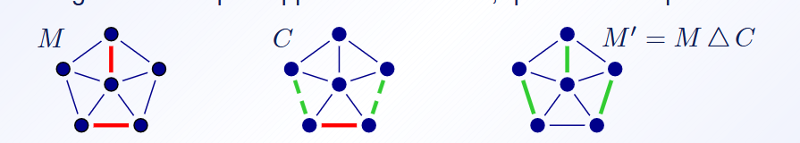

##### Recherche de couplage maximum
1) crée un couplage, peut importe le quel
2) Orient les arc :
   droite → gauche
   et gauche → droite
3) en partant du somet "source" et allant ver un "pui" on optien une chaine alternée C augmentente sur M
4) on fait $C \Delta M$

#### problème de tournois

#####