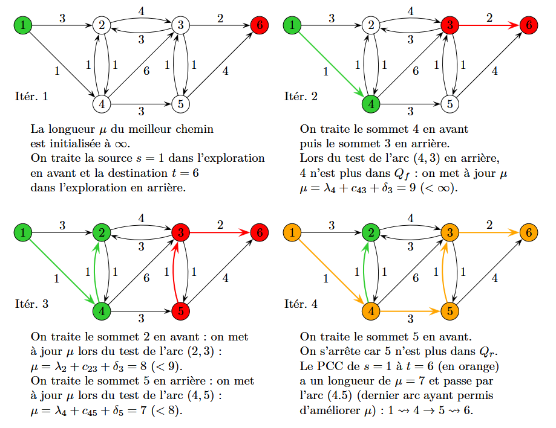
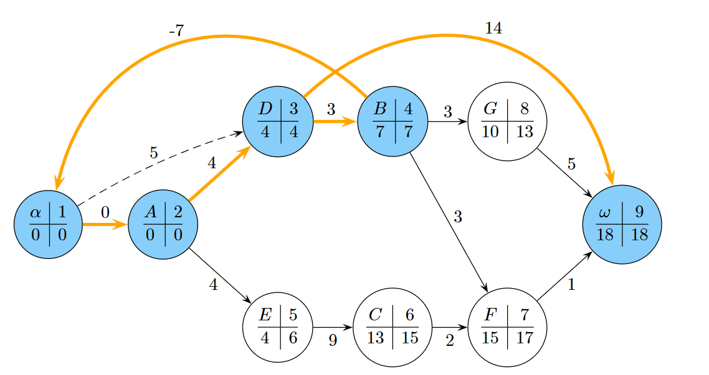
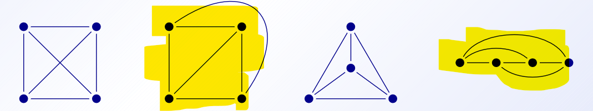

# Exams
#### Explotation
Quand il parle d'exploitation, il ne parle d'une solution concret mais just d'une debut de methodologie et qu'elle truc on peut tirée du graph

## Dijkstra bidirectionnel
3 truc
**(forward)** fils de prio **$Q_f$** et mark **$\lambda$**
**(backward)** fils de prio **$Q_b$ ($Q_r$)** et mark **$\delta$**

**$\mu$** = valeur de critère d'arret

pour chaque iteration :
- itéré de 1 en avant, itéré de 1 en arrière
- **En avant** : si pour l'arc (i,j), j a été **retiré** de la file **$Q_b$** alors mettre a jour si **$\mu>\lambda_i+c_{ij}+\delta_j$** alors **$\mu = \lambda_i+c_{ij}+\delta_j$**
  - même chose en arrière si **j** à été retiré de **$Q_f$**
- Stopé si on trouver un sommet qui vas être traiter pour la deuxième fois (sois un sommet qui a déja été retiere d'une des queue), la longeur du chemin final est de $\mu$

## Chap 6
Pour rajouter une contraint du style : la tâche X dois être executer au plus tard N jours après Y
on ajouter un arc a poid partant de la tâche X ver Y de poid -N, cette boucle dois just ne pas être un cricuit abrobant

raison:
ça crée un chemin alternatife pour arriver a la tâche final qui prend en compte le nombre de jours maximal en gros
**$t_j = t_i + d_i$ → $t_j = t_i - N$** ce qui force la contrainte

Tâche B dois commencer au plus 7 jours après le commencement du projet

## Chap 7
##### Orienter un graph 2 tech
1) sois simplement on doubles les arrete en 2 arc des 2 sense (simple mais efficase)

## Chap 8 2/2

### Graph planaire
**$K_{N}$** = Graph complet a N sommets

#### Graph planaire topologique
En gros, c'est un graph planaire mais aucunne de ses arretes ne se croises

ça découpe un plan en région

##### Formule d'euler
**$n - m + f = 2$**
$n$ = n sommet | $m$ = n arrets | $f$ = n faces
*Effet* :
(1) tout graph planaire simple et connexe avec **$n \geq 3$** et $m$ arrets, on a **$m\leq 3n - 6$**
(2) graph comlet **$K_5$** n'est pas planaire

##### Vocabulaire
**isthme** = arretes qui, si détruite, case la composante connex

### Graph eulérien
#### Definition
- chaine eulérienne = chaine qui passe une seul fois dans par chaque sommet qu'elle parcoure
- cycle eulèrien = c'est une chaine eulérienne qui passe par tous les sommet de G
- Graph eulèrien = graph qui comprend un cycle eulèrien
- ATTENTION : un graph non orienter ne peut être eulèrien que si tous c'est somet sont de dégrée pair
- ATTENTION : un graph orienter ne peut être eulèrien que si les semi-degrée enrant sont égale au semi-degré sortant pour chaque sommet a dergée paire pour chaque somme sauf 2

#### conctruction de cricuit eulerien
1) choisire un sommet et construire une anti aborescence recouvrante en partant du sommet *r*
2) Crée le cercuit iterativement en explorant le graph a partire *r*
   - quand faut choisire l'arc sortant d'un sommet (hors mit *r*)
     - choisire celui de l'anti-arborescnece uniquement s'il s'agit du dernier arc non encore utilisé quittant le sommet

#### Le problème du postier chinois
en gros, on cherche un chemin qui passe par tous les sommet du graph mais avec une longueur min.
##### Version non orienter
dans un graph $G$
1) Posé $W$ comme l'ensemble de tous les sommets de **degré impaire**
2) pour chaque sommet dans $W$ trouver le chemin le plus court ver tous les autre sommet de $W$ (longueur {i, j})
3) Construire le graph complet $H$ dont tous les sommets sont vienne de $W$, chaque arret a comme poid la longueur du chemin entre les sommets(longueur {i, j})
4) Calculer un couplage maximum $M$ de $H$ avec le poid toltal minimal
5) pour chaque arret {i, j} de $M$ doubler, dans $G$, la plus court chain de i à j

##### Version orienter
Besoin que le graph sois fortement connext et sois sans circuit negatife
1) classer les sommets → **$b_i = A$** les sommet avec plus d'arc **entrant** que **sortant** | **$b_j = B$** les sommet avec plus d'arc **sortant** que **entrant**
2) Pour chaque couple **(i,j)** dans **$A \times B$** trouver le chemin le plus court de $i$ à **$j$** (**$d_{ij}$)**
3) Crée un graph Bipartie avec d'un côter les sommet de **$A$** et de l'autre les sommet de $B$ mais, mettre le meme nombre de fois un sommet qu'il n'as de sommet en trop (somment sortant ou entrant)
4) ajouter les arret entre **$i$** et **$j$** avec comme poid la distance entre **$i$** et **$j$**
5) Faire un couplage parfait de poid min
6) Dans **$G$** doublé toute les arc qui sont pris par le chemin le plus court entre **$i$** et **$j$**
7) crée le circuit eulerien

#### Transfromer un grph orienter non-eulerien
1) trouver les sommets avec un **$|deg_+(v) - deg_-(v)|\geq 1$**
2) les isolés
3) ajouter des arc pour équilibrée leur degrées
4) crée c'est arc sur le graph **$G$**

### Tranfomer un grpah orienter en graph eulerier a moindre couts
Faut que le graph sois connext
1) en gros c'est un problème de transbordement
2) definir une offre/demande avec **$(deg_{-}(i) - deg_{+}(i))/2$**
3) mettre toute les arc a poids de 1 et a capacitée 1
4) Resoudre le problème de flow
5) les arc pris par la resolution sont a inversé

#### Type de problème → type de modélisation
Problème de duo → couplage (logic)
Problème de repartition de ressource → flow max

# Vocabulaire
|mots| def|
|---|---|
|Sommet| sommets |
|Arret| truc qui relie des sommets mais pas orienter|
|Arc|arret orienter|
|||