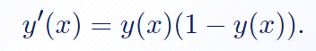
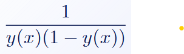
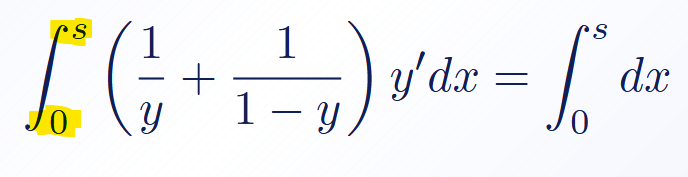
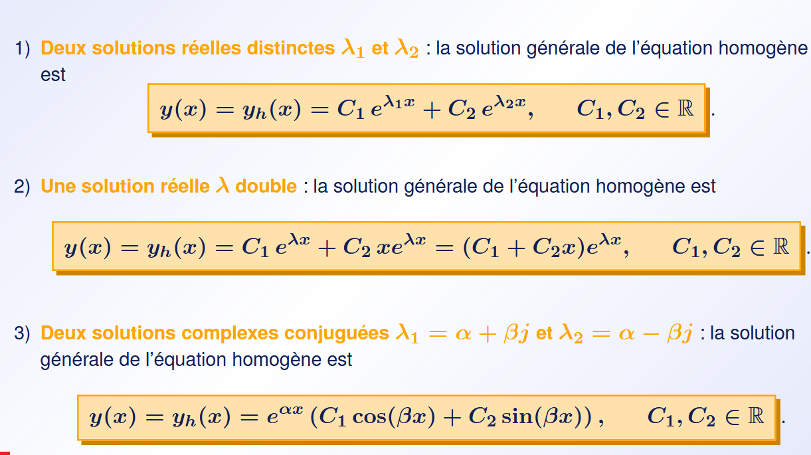

# Resume

Catégorie de EDO (Equoation différentielle ordinaire):
- EDO à var séparable : 
  - From : $h(y)y'=g(x)$
  - Ex :
    -  $y'=y(1-y)$
    -  $y'=e^x\sqrt{1+y}$
- EDO Linaire homogène à coef constant 
  - From : $a_ny^{(n)}+...+a_1y'=0$
  - Ex 
    - $y'' + y' - 6y = (x+1)e^{3x}$
    - $y'+y=x^2$
    - $y'=-3\frac{1}{x}$
- EDO linaire non homogène à coef constant : 
  - meme chose que l'homogène mais y a un seconde membre
  - From : $a_ny^{(n)}+...+a_1y'= b(x)$

# Équation diff d'ordre 1 à variable séparable 

Séparable

Séparé

###### Quand on évalue avec un problème de Cauchy (quand on à une conditon initial)

c'est base -> S et pas l'inverse débille

# EDO homogène linaire a coef constant

### Si 2 solution à $\lambda$ => 

##### Trick

- $y''-6y' = 0$
- $\lambda^2-6\lambda=0$
- $\lambda - 6 = 0$ | $\div\lambda$
- $\lambda = 6$
!!!!! ça veu pas dire double solution (cas 2) !!!!
$y(x) = C_1+C_2e^{6x}$
En gros, ça veut just dire que la solution 1 est null $\rArr C_1e^{\lambda_1} \rArr C_1e^0 \rArr C_1$

RAISON : $\lambda^2-6\lambda = \lambda(\lambda - 6)$

# EDO **|||non|||** homogène linaire a coef constant

En gros, 3 grand étape
1) Equoation caractéristique $\rarr$ Trouver l'ensemble de solution de $\lambda$ ($S_\lambda$) permette aussi de crée la solution homogène ($y_h(x)$)
2) Faire "LE CHECK"
   1) Form : $P(x)e^{\lambda x} \rarr$ checker si $\lambda$ n'est pas dans $S_\lambda$
   2) From : $P(x)e^{\alpha x}cos(\beta x)$ ou $P(x)e^{\alpha x}sin(\beta x) \rarr$ Checker si $(\alpha \pm \beta j)$ est dans la $S_{\lambda}$
   - Si oui, alors faut multipliyer le proto par $x^m$ avec m = à la multipliciter de de la soluce
  Example : EQU Cara = $(\lambda - 2)^2$
  $Ae^{2x} \rarr 2 \in S_{\lambda} $**$\rarr$** 2 est la solution à une partie ^2 (multiplicter 2)
  $y_p=Ax^2e^{2x}$
3) Réunirire les solution pour fabriquer la **SOLUTION GÉNERAL**
$y(x)=y_h(x) + y_p(x)$

# NOTE
#### Si y a un cas : $y'' + 4y'' + 4y= e^{3x} + e^{-2x}$
En gros:
1) EQU CARA : $(\lambda-2)$
2) Faire un proto pour chaque partie de la seconde partie( $e^{3x}$ et $e^{-2x}$ )
   - $e^{3x} = Ae^{3x}$
   - $e^{-2x} = Ax^2e^{-2x}$ (**-2** $\in S_{\lambda}$ + mult **2**)
3) $y_p = Ae^{3x} + Bx^2e^{-2x}$

#### Cas : $C1e^{\alpha x} + (C2cos(x) + C3sin(x))$
c'est normal, en gros, faut retenire que pour les EDO homogène constante superieur au seconde dégré, ça vas être une combinaison des forme vue

#### Si on demande de retrouver l'equoation d'une solution EDO non homogène
1) trouver le $y_h et y_p$
2) depuis $y_h$ recrée l'EQU CARA et recrée le première partie
3) regarder la première partie et dériver $y_p$ autant de fois que demander
    Exemple : $y'' + 4y'' + 4y \rarr$ 2 fois
4) inséré les dérivé là ou il faut
5) reduire $\rarr$ second membre trouvé :]
