# TE 1

## Chap 1 Intro ...
#### Qualité d'un logiciel
- Maintenabilité
- Réparabilité
- Evolutivité
- Réusatilisation
- Portabilité
- Interopérabilité (Capacité à être intégérer dans un autre system)

## Chap 2 Software Development Process
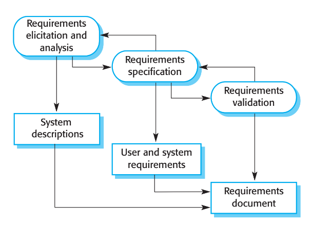

### Les Type de dev et d'implementation (Top 5)
##### Tatical
En gros, t'essayer de faire un truc qui marche
###### Tatical tornado
C'est un gas qui fait beaucoup de truc et dev plus vite que les autre mais qui reste tactic

##### Startegic
En gros, c'est just que dev mais de manière plus refléchie et en prenant en compte plus d'aspet que just "ça fonctionne"

#### Validation vs Vérification
Vérification = ça fonctionne ?
Validation = c'est ce qui est demander en faite ??

### Modèle de Prcessus logiciel
#### Modèle Cascade (planifiés)
On prévois tous tkt
##### Phase
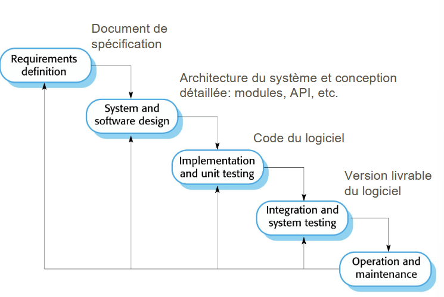
#### Modèle Incrémentaux (agiles)
On prévoie pas trop et change au fure a messure pour s'adapter

#### Modèle Intégration et de configuration
En gros, on essaye de gagner de temps en reutilisant ce qu'on fait avant

## Chap 3 Requirements Engineering
1) étalire les services que le client demande du system
2) Contraintes sous lesquels il opère et est développé

#### System Requirement
Just un doc avec les requirement :
- Bisness : en gros ce que veux l'investieur parceque $
- utilisateur
- system : technique

###### Functionnels vs non-fonctionnels
**Fonctionnels** : en gros, c'est le comment, genre comment le system dois faire X

**Non-fonctionnels** : C'est les contraintes du les fonctions du system, genre quel techno utiliser, standare a utiliser ou la vitess d'exec
(c'est mieux si c'est quantitatife pour tester facilment)

### Élicitation → Spécification → Validation
En gros, l'idée c'est de split les valeur ajouter du projet, exemple avec "une app de note" (element après interview) :
- Pouvoire prendre des notes | cas d'utilisation
- Eviter de perdre des notes | contrainte (parce que pas de valeur ajouter)
- pouvoire partager ses notes avec d'aure apareille | cas d'utilisation
- ce login | etape

### Histoire
Just un doc avec le naratife derier le projet
### Scénario
- état initial
- flux d'évènements
- cas d'échecs
- activité concurrentes
- état final

Peut ce faire avec un UML ou un tableau, en vrais ça dépend de la cible

## Chap 4 Modélisation du système
- Modèle de contexte et de processus : Enviroement du system
- Modèle d'interactions : Interaction entre enviro et le system (ou composant)
- Modèle structurels : Organisation et strucure du system
- Modèle de comportement : Comportement du system

#### Diagramme cheat sheet
- Diagramme de use case : Interaction system et enviro
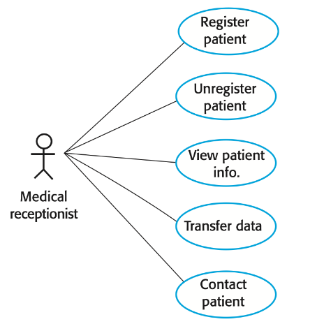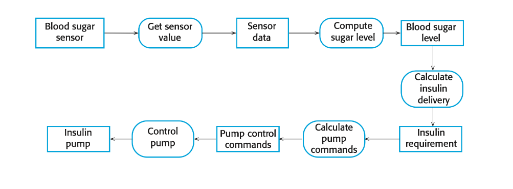
- Diagramme d'activité : activitée impliquées dans le process ou le traitement de donné
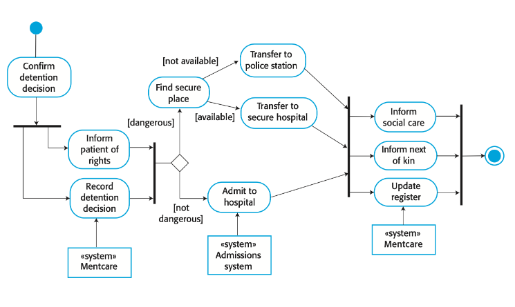
- Diagramme de séquence : interaction entre acteurs et system
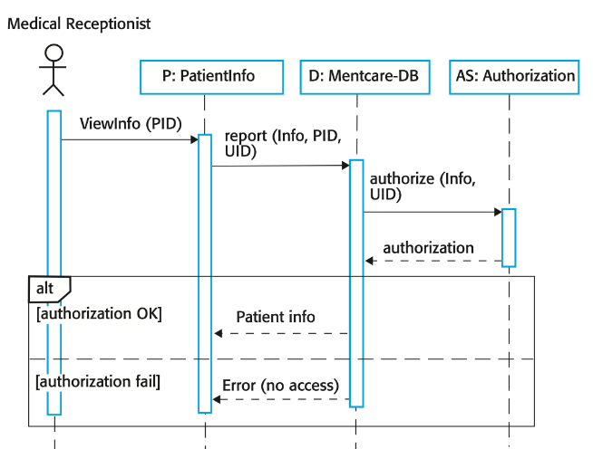
- Diagramme de class : class objets du system
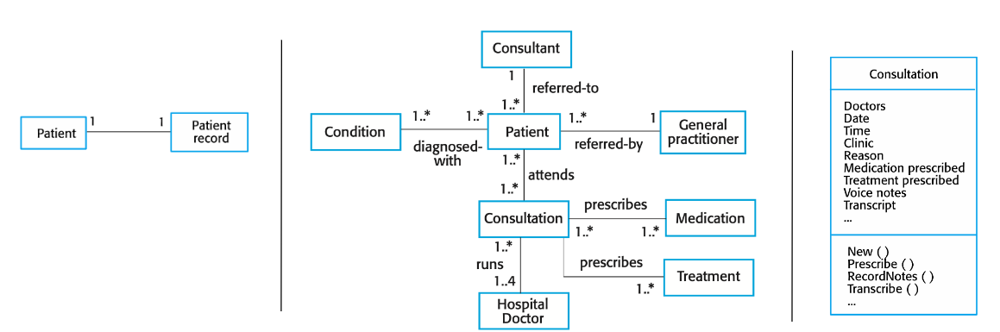
- Diagramme d'état : comment le system react au evenement
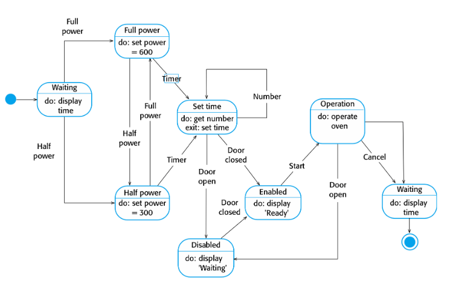

## Chap 5 Modélisation du domaine
Objectif : dentifier et enregistrer les classes conceptuelles les plus importantes du système à développer

En gros, on fait un UML sans les méthodes mais avec :
- Class conceptuelles
- Association
- Attributs
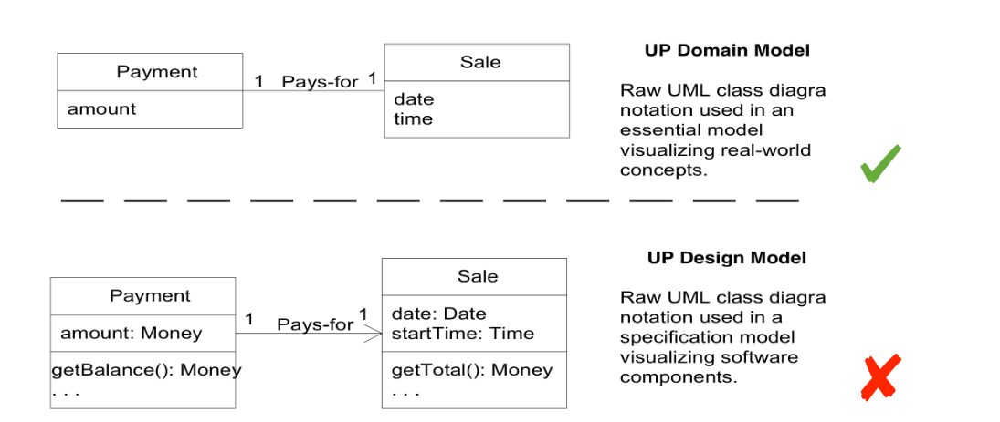

##### Composition
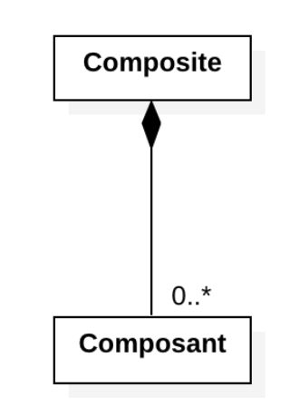$
Pas de partage, exemple :
moteur (composant) → voiture (composite)

A fait partie de B, genre si A explose, B aussi :[

##### Aggregation
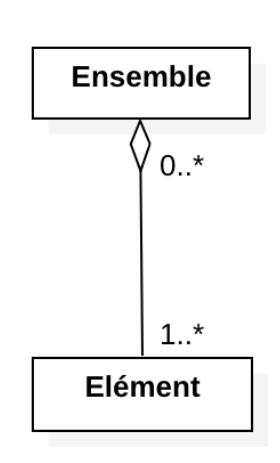
Partage, exemple :
Voiture (élément) → Honda (ensemble)

##### Association
si jamais ça c'est légal
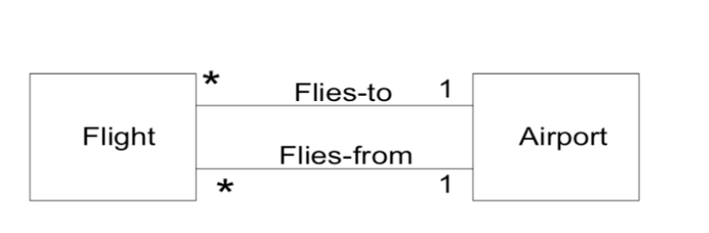

###### Class d'asso
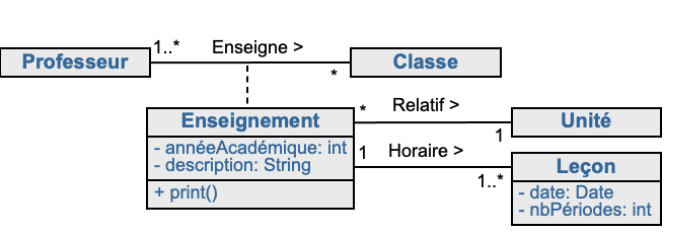

##### Attribut
Si l'attribute est complex, faut crée une class (en gros)
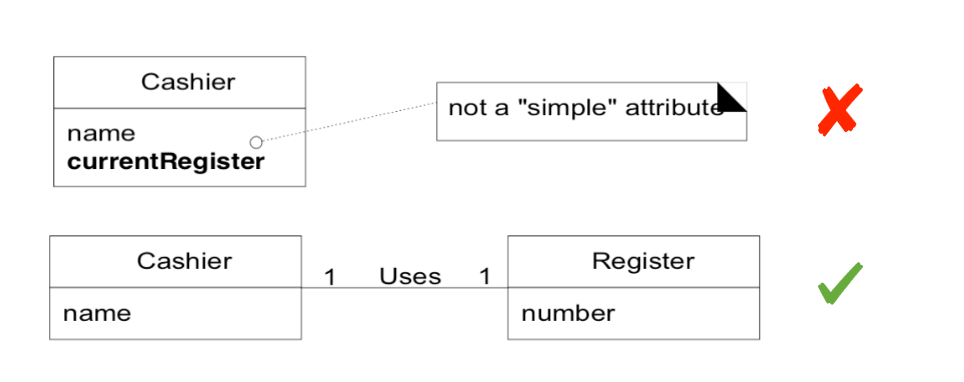

------ demain flème maintenante

## Chap 6

## Chap 7

## Chap 8
