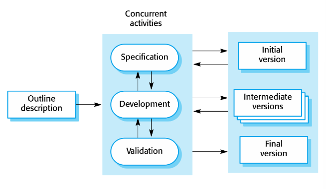
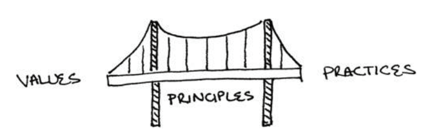
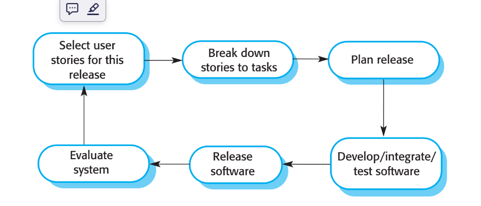
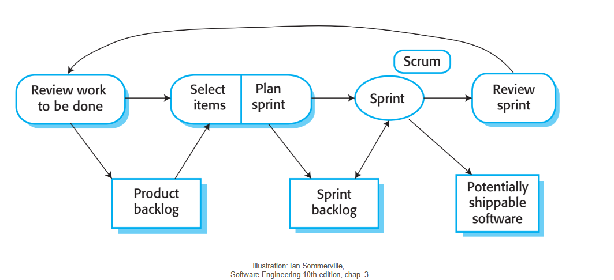
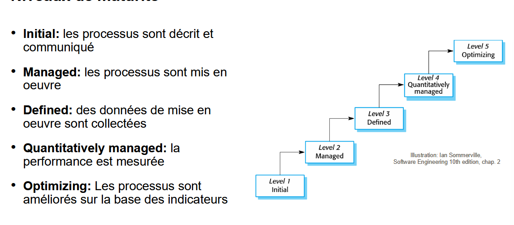
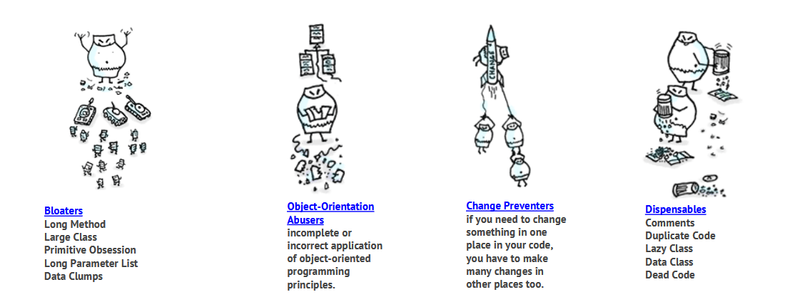

# TE 2

## Chap 9 AGILE

##### LE MANIFEST
• **Les individus et leurs interactions** plus que les processus et les outils
• **Des logiciels opérationnels** plus qu’une documentation exhaustive
• **La collaboration avec les clients** plus que la négociation contractuelle
• **L’adaptation au changement** plus que le suivi d’un plan
### Incrémentales

### XP Extreme Programming
- Cycles court : pour choper un feeback rapide et concret
- Planifcation progressive : plan global qui evolue tous le long du projet
- Planification flexible : genre on s'addapte au besoin de l'entrprise
- Test automatique : on test souvant avec des test ércit par (dev, client et testeur) pour choper les erreur vite

##### Le PONT

- Valeur : sprite du dev qui veut bien travailler
  - Simplicité : faire des truc petit, simple, efficace mais bien
  - Communication : fait équipe stp
  - Feeback : prend en compt les feeback pls et on montre le projet
  - Respect : respectles autre (dont le client)
  - Courage : ments pas et assume
- Principe : reflet des valeur dans le comportement du dev
  - Humanité : pense au fait que les gens c'est des gens et faut bien les respecter
  - Economie : dépense pas de l'argent pour rien, pls focus
  - Bénéfice mutuel : document + écrit les tests
  - Auto-similarité : meme solution pour les meme type de problème
  - Amélioration : toujour s'améloiré
    - Réfléxion : pk je fais ça ???
    - Flux : par opposition aux grand étapes ?????
    - Opportunité : si y a moyen fonce
    - Redondance : pls test plusieur fois par des moyen différent
    - Echec : se raté c'est pas grave
    - Qualité : c'est mieu de faire de la qualité
    - Petit pas : par petit étape
    - Responsabilité : si tu prend un tâche, asume
- Pratique : ensemble de pratiques qui vienne des valeur et des principes
  - Sit together
  - Whole team : tous les compétence nécessaires doivent être représenter
    - 5 = pizza share
    - 12 = daly meating
    - 150 = je te connais de visage
    - eviter de partager le temps entre 2 équipe
  - Espace de travaille
  - Travail énergisé : pas trop travailler mais bien travailler (dépasse pas 40h/semain)
  - Pair programming : for the funnies
  - Stories : unité de fonctionnalité visible par l'utilisateur
  - Cycle hebdomadaire/tri-mestre : planif pour X temps
  - Builder en 10 min : c'est un bon temps pour faire une pause et c'est pas trop long non plus
  - Intégraion continue : intérgér au plus vite pour que ça sois simple
  - Test-first programming : écrire d'abort c'est test
  - Conception incrémentale : unn peu chaque jour


### SCRUM
Approche vision Gestion
3 phase :
- init : on planif
- sprints : on fait
- contrôle : on check


Product owner :
responsable de checker le produit et de donnéer les prio dans le backlog




## Chap 10 PERT Program Evaluation and Review Technique
- $o =$Estimation Optimiste
- $a =$Estimation probable
- $p =$Estimation pessimiste
- PERT distribut : $E(task)=\mu = \frac{o+4a+p}{6}$
- Triangle distribut : $E(task)=\mu = \frac{o+a+p}{3}$
  - Pour projet ensemble : $\sum E(task)$
- Deviation standard : $SD(task) = \sigma = \frac{p-o}{6}$
  - Pour projet ensemble : $\sqrt{\sum SD(task)^2}$

## Chap 11 Testing and Refactoring

Test-Driven devlopment : fair les test avants de fair le travaille

mocks = mocks pour des tests
stub = fournis une reponces prédéfinies


### Anti paterne



## Design Patterns
### Visitor
c'est le classic, tu passe la fonctionailité a un autre objet, exemple :
```
interface Shape is
    method move(x, y)
    method draw()
    method accept(v: Visitor)

class Dot implements Shape is
    // ...

    method accept(v: Visitor) is
        v.visitDot(this)

class Circle implements Shape is
    // ...
    method accept(v: Visitor) is
        v.visitCircle(this)
-----------------------------
class Application is
    field allShapes: array of Shapes

    method export() is
        exportVisitor = new XMLExportVisitor()

        foreach (shape in allShapes) do
            shape.accept(exportVisitor)
```