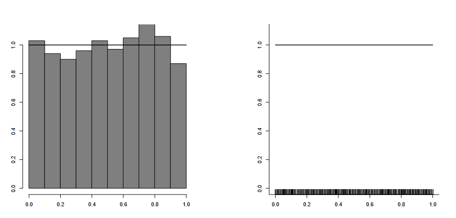
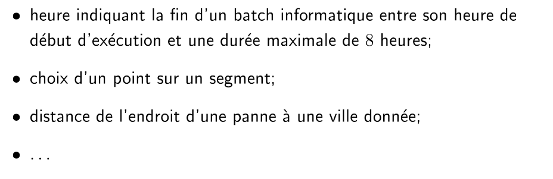
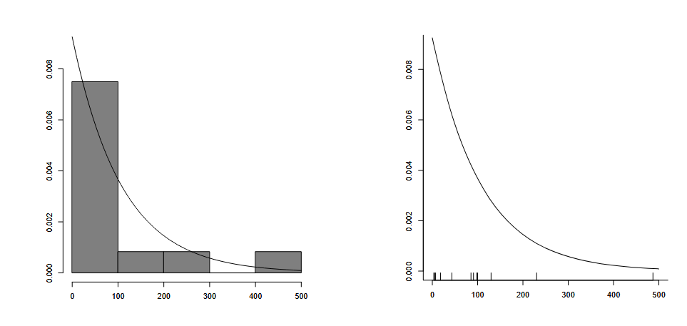
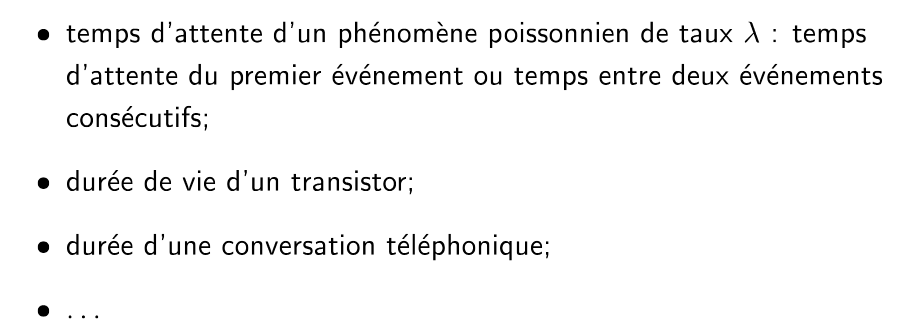
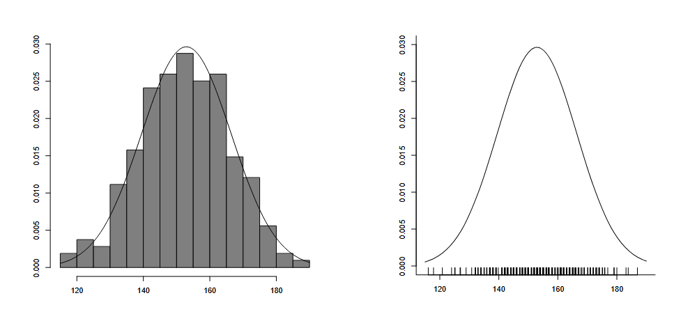
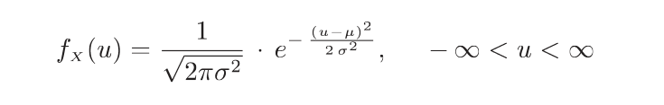
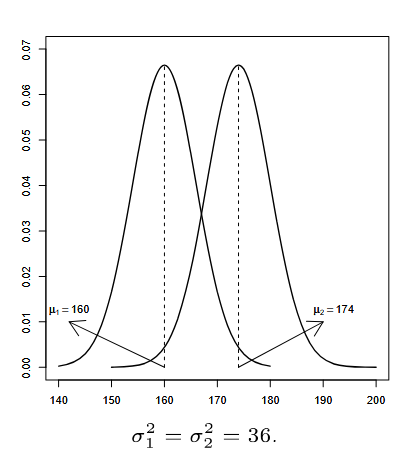
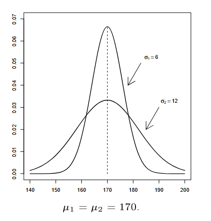

# PST TE 3

## Definition
**Fonction de répartition** = Fonction qui some les proba
**Espérence** = Valeur ver la quel la variable aléatoir vas surment être (genre, la valeur qu'on espère quoi)
**Variance** = à quell point la variable alétoire est étendue

## Variable aléatoir continue
Same que les var normale

En gros, l'idée c'est faire une intergral pour choper la proba que $X$ ce passe
Donc $\rArr$

$P(-\infin<X<+\infin) = \int f_x(u)du$

$P(a<X<b) = \int_{a}^{b} f_x(u)du$

$P(X=a)=0 !!!!$

$f_x(u) \geq 0$

**Fonction de répartiton**
$F_X(x)=P(X<x)=\int_{-\infin}^{x} f_x(u)du$

**Short cut**
$P(a<X<b) = \int_{a}^{b} f_x(u) =  \int_{-\infin}^{b} f_x(u) - \int_{-\infin}^{a} f_x(u) = F_X(b)-F_X(a)$

**Espérence**
$E(X) = \int_{-\infin}^{+\infin} u*f_x(u)du$

**Variance**
$V(X) = \int_{-\infin}^{+\infin} (u-E(X))^2 = E(X^2)-E(X)^2$

$E(X)^2 = \int_{-\infin}^{+\infin} u^2*f_x(u)du$

#### Prop
- $E(b)=b$
- $E(X+b)=E(X)+b$
- $E(aX)=aE(X)$
- $E(g(x))=\int_{-\infin}^{+\infin} g(u)*f_x(u)du$ | moi quand il faut juste recalculer lmao
- $V(b)=0$
- $V(X+b)=V(X)$
- $V(aX)=a^2V(X)$

##### 3 distribution
##### Uniform 

$f_x(u)=\frac{1}{b-a}$

##### Exp 

$f_x(u)=\lambda e^{-\lambda u}$

##### Normal

paramètre : 
$\mu = $ esspérence (oui c'est $E(x)$)
$\sigma = $ l'écart-type
MAIS
on prend $\sigma^2$ (Variance ($Var(X)$)) dans les param

$N(\mu,\sigma^2)$

######

##### Douille 

pour la distribution normal, si on a une situation $P(X)+P(Y)$

en gros, faut crée une nouvel Variable Aléatoire mais avec les paramètre aditionne des 2 autre, genre $\mu_z=\mu_x+\mu_y$

|||||| $P(X) + P(Y) \rArr (\mu_x + \mu_y \text{ | } \sigma_x^2+\sigma_y^2)$ ||||||
|||||| $P(X)-P(Y) \rArr (\mu_x - \mu_y\text{ | }\sigma_x^2+\sigma_y^2)$ ||||||

##### Estimation and stuff ??
Nom : 
$T=(T(X_1,X_2,X_3,...,X_n)) = $ Estimateur
$t=T(x_1,x_2,..., x_n)$ = réalisation de $T$ garce au donnée $x_i$

EX : 
pile/face $\Rarr T(X_1,...,X_n) = \frac{nbPiles}{TotalJets}$

$t=T(1,1,1,1,0,0) = \frac{4}{6} = \frac{2}{3}$ 

#### $\theta$ ~*The Estimator*~
En gros, $T=\hat{\theta}$ et c'est l'estimateur
$\theta$ c'est vrai valeur

Le but du jeu, c'est de trouver un $\hat{\theta}$ tell que $\theta - \hat{\theta} = 0$

**\< Biais \>**
$b_\theta=E(\hat{\theta})-\theta$
- Si $b_{\hat{\theta}} < 0 \rArr$ sous-estime
- Si $b_{\hat{\theta}} > 0 \rArr$ sur-estime
- Si $b_{\hat{\theta}} = 0 \rArr$ Trop style :]

En gros, on messure à quelle point les valeurs sont décalé
ça peut être causer par des mauvaisse meusure

**\< Carré moyen de l'erreur \>**

$CME(\hat{\theta}) = Var(\hat{\theta}) + b_{\hat{\theta}}(\theta)^2$

On veut le plus petit $CME$ possible

**\< Efficacité \>**
Si on a 2 estimateur qui ont pas de bier et qui on le meme $CME \rArr$ on vas regarder $Var(...)$ et celui qui à la plus petit $Var(...)$ gagne (on dit qu'il est plus **efficace**)

##### Estimation par le maimum de vraisemblance
