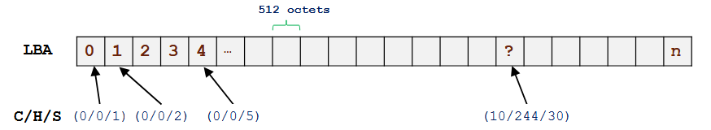
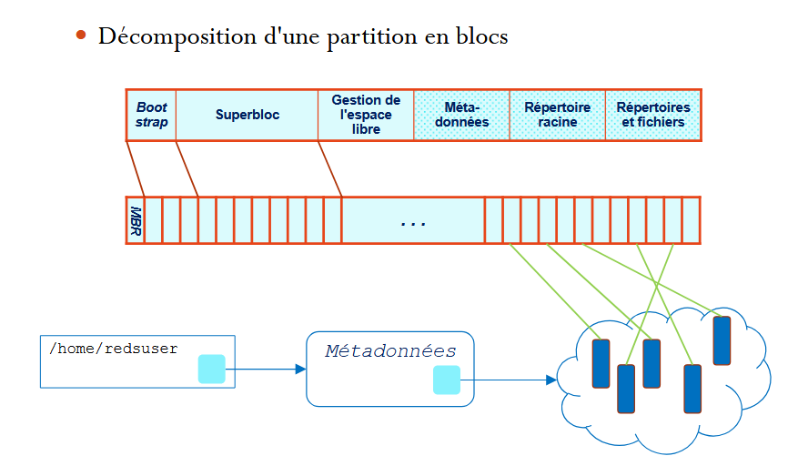
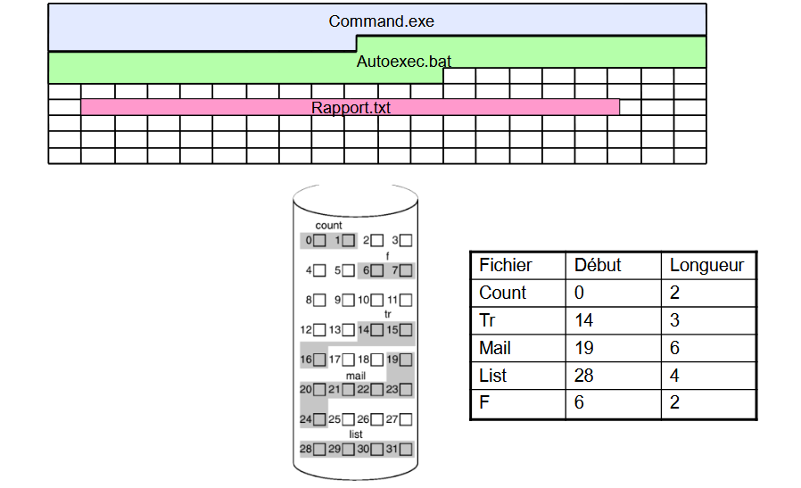
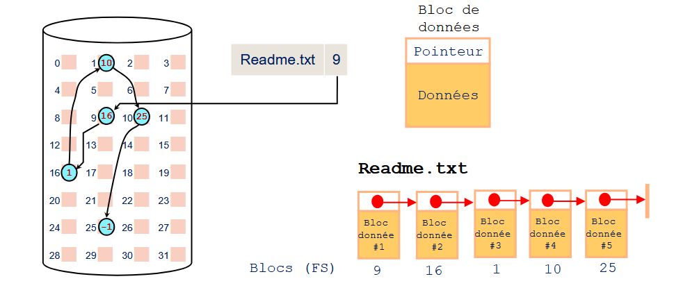
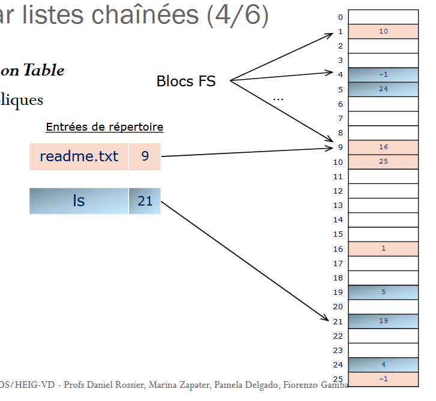
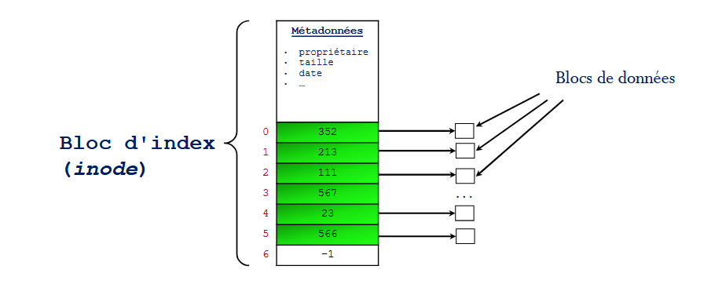
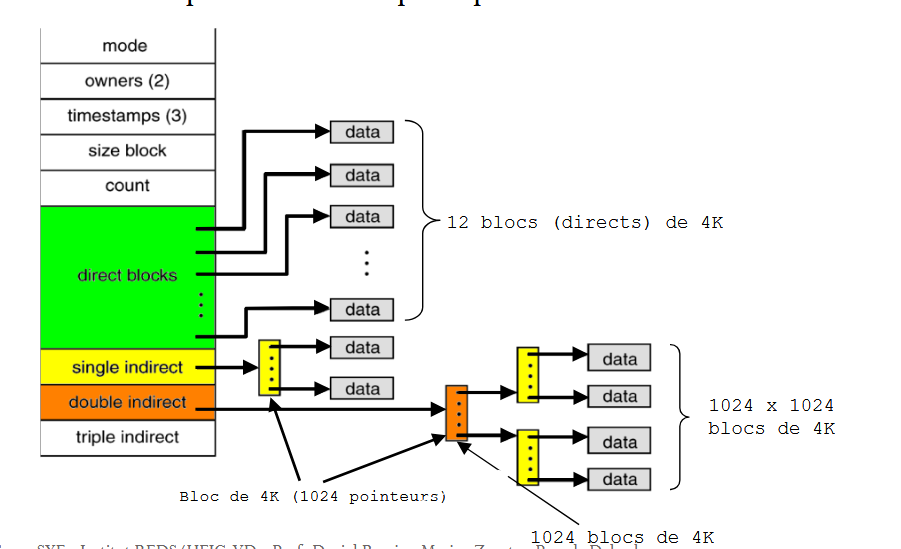

# Exams Add chapter

## C13 | Système de fichier
### Organisation d’un stockage secondaire
Les disc sont split en secteur de 512 octets
On y a 2 type d'addressage
- C/H/S (Cylinder Header Sector) : ça décrite le disque / le rayon de la bande a checker / le secteur  spécifique
- LBA (Linear Block Addressing) : abstraction de la geometr et on numérot just les secteurs

#### Master Boot Record (MBR)
En gros, c'est le premier secteur d'un disque et c'est là que ce trouve toute les info sur le disque, genre taille par exemple (crée par INTEL)

Si c'est le disk de boot, il faut que MBR contien le premier code d'amroçage de l'OS (dois être contenue dans 440 octets), du coup la tech c'est que le code appel directement le reste du code de l'os (no way)

### Systèmes de fichiers et partitions
Y a un truc qui s'appel un **VFS** (**V**irtual **F**ile **S**ystem)

Le système de fichier a sont propre system de bloc (comme la 3ds)
1 block = 1 - n secteur, ça dépend de la taille des blocs
(souvent **4Ko** pour s'alligner sur la taille des pages mémoires)

dés fois c'est plus optimal de stocker dans des bloc de plus grand taille (pour les gros fichier typiquement) | Exemple : **32Ko - 64Ko**

#### Répertoire et fichier
l'idée c'est qu'un répertoire c'est un structure de donné qui contient une list de ref ver les métadonnée des fichiers qui ont les info nécessaire pour retrouver le blocs de partition du fichier

### Allocation contiguë
On allout les bloc a la suite
ça peremette de pouvoir accédé a n'importe qu'elle bloc direct
**mais ça avs crée des trous au fure a messure**
**+ les fichier sont restraint à l'espace allouer (pas moyen de faire des fichier qui sorte de la partition)**

### Allocation par listes chaînées
Bloc sont chainer, donc chaque bloc contien aussi un pointer ver le bloc suivant

- plus lent mais permette d'eviter les trous 
- d'accès direct difficile 
- donnée critque dans les bloc, genre si y a un bloc qui corronput on peut plus faire la chainne

#### FAT | File Allocation Table
FAT c'es méthods d'allocation qui marche avec une table avec les nuémros (address) des blocs composant les fichier.

Vue que FAT est important on le duplique 2 fois (au debut et la fin de la partition)

**grappe = bloc FS**

- FAT-12 : Bloc de 12 bits
- FAT-16 : bloc de 16 bits
- FAT-32 : bloc de 32 bits (28 bits pour encodée l'address du bloc)
- exFAT (extended FAT) : 

## C14 | I-node
Allocation indexée
En gros, on alloue un bloc d'index (**I-NODE**) à un fichier, ce bloc sert de ref et contient les addr des différents blocs de données du fichier

la I-node contient aussi toute les meta donnée

On crée la i-node durant la création du fichier

On crée aussi un collection de i-node durant le formatage de la partition pré-initialisé

Si y a plus de i-node -> on gère avec des bloc libres

##### Multi index
En gros, on vas dire qu'un bloc pointer par l'i-node est en réaliter une sous table de bloc et bam, on a gagner plus de place

type de bloc d'extention
- simple : 1 lvl | [i]=>[data] | 
- double : 2 lvl | [i]=>[....]=>[data] | 
- triple : 3 lvl | [i]=>[....]=>[....]=>[data] | 

depui un répertoire, l'i-nodes est géré comme le fichier, genre c'est un répertoire c'est just une collection d'i-node