# TE 2

Address physique = Addre base + index*PTE-size

## C8 Ordonancer
Calcule temps d'attente de process : **temps de fin d'exec - durée - temps d'arrivée**

Critère de mesure : 
- Taux d'utilisation du CPU
- capacité de traitement 
- **Délais d'attent** : temps que passe le precessus dans l'état READY

En gros, quand y a plusieur processus dans l'état ready, l'ordonnancer doit choisire qu'il y envois sur le CPU.

l'Ordonanceur peut pas prendre la main tous le temps, il dois passer par des "Point de préemption" (c'est un appel fait surtous à la fin des routines qui donne la main à l'ordonanceur)

**BTW, SI process pas READY ou RUNNING -> ordonanceur (peur rien faire :[ )**

### Préemption
En gros, c'est quand l'ordonanceur interompt un process qui était en **RUNNING** -> **READY**
Durant ce moment, un autre process vas passé de **READY** -> **RUNNING** 

### Politics
#### F-C-F-S | First Come First Served
- FIFO
- non-préemptif
- pas optimal

En gros, quand process arriver, il est foutue sur le CPU et il partira quand il auras fini 
Les process qui arrive entre 2 sont mis en attente

#### S-J-F | Shortest Job First
- non-préemptif ou préemptif
- proche de l'optimal
- problème de famine

En gros, on regarde la durée d'exécution des futur burst (ce qui n'est pas possible btw)

L'idée c'est qu'on vas selectioner le process qui vas prendre le moins de temps

pour la version préemptif, on vas checker la durée restant à l'execution, si elle plus grand que la durée du petit job, ça dégage >:[

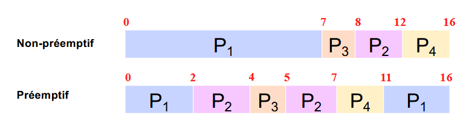

La raison pour la qu'elle il est opti c'est parcque le temps d'attent est reduit de fous (vue qu'on privilégie les petit jobs)

#### S-J-F approximé
On estime la durée du burst par rapport au burst passé

$t_n = \text{durée effective mesurée du burst n}$

$T_{n+1}' = \text{durée estimer du burst n+1}$

$T_{n+1}' = a * t_n + (1-a)T_n$ avec $0<a<1$

$a = \text{facteur pour pondéré, si a est proche de 1 -> estimation volatile}$

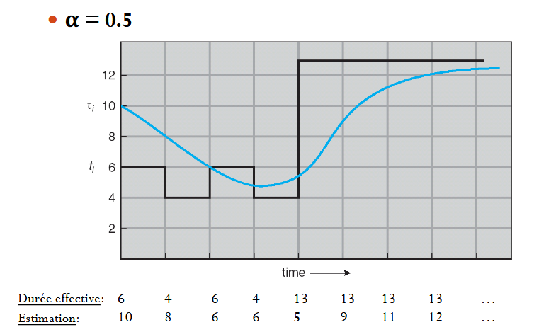

#### R-R | Round Robin
- Basé sur le **FCFS**
- Besoin d'un timer
- préemptif
- populaire 
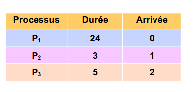
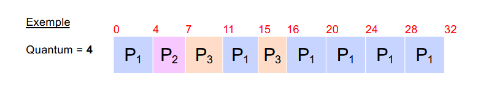

Si Quantum trop faible => trop de changement de context :[
Si Quantum trop élever => famine 
Quantum idéale = on veut que 80% des process puisse s'exec normalment durant les burst

Quantum ce trouvent souvant entre 10 - 200 ms

#### Par Priorité
- Priotité examinée en premier
- si égal -> FIFO
- non-préemptif ou préemptif
- Priorité constant ou dynamique
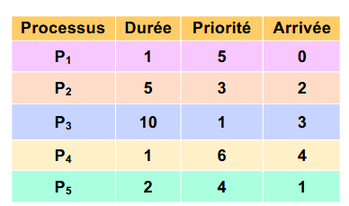
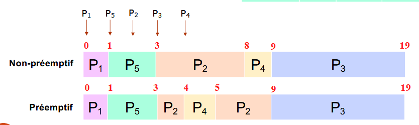

La priorité peut être set à la création du process et rester constant

Mais souvant on a une prio variable (pour eviter la famine). En gros, plus un process attent, plus ça priorité monte (quand il passe on lui remette la priorité qu'il avait à la basse)

#### Fils d'attentes
- plusieur fils d'attentes
- basé sur **Par Priorité**

- Haut : **RR**
- Bas : **FCFS**

BTW, il peut implémenter les priorité variable comme un être normalment constituer

## C9 Géstion mémoire
### RAM 
|Perfomance|Nom|
|--|--|
|1ns|Registre|
|5ns|Cache Lvl 1|
|5ns|Cache Lvl 2|
|50ns|**RAM** Mémoir principal|
|5**ms**|**Disque dure** Mémoire secondaire|
|5**s**|DVD-ROM memoire tertiaire|

Les address son linaire, on veut pouvoir acceder tous de la meme manière

Donc avec le meme system d'addressage on peut accédée de la **RAM - Disque dur - Mémoire externe (genre prétiphériques)**

### Abstraction de mémoire
En gros, l'address qu'on a dans un process c'est une abstraction, la memoir n'as pas réellement ces address et n'est pas aussi compacte
### Memory Management Unit | M-M-U
c'est un composant **matériel** qui traduit les address virtuelles (use par la process) en addresse physiques dans la mémoire

Gère aussi la protection et l'isolation des espaces moimoire (pour eviter qu'un process puis accédéer à la memoire d'un autre)

Et permette l'implémentation de la pagination et la segmentation
###### Isolation des process
L'OS fait en sort que chaque process s'execute comme si il était seul

### Allocation de mémoir phisique
Le **Loader** d'une image binnaire dois trouve un emplacement mémoire
Vue qu'on utilise des addr virtuel, faut change tous les saut pour que ça marche

Quand le **Loader** à trouver l'emplacement du process, il config le registre de "réalocation" dont la valeur vas être addtioner au address "générées" ar le CPU

Si y a pas de matérièle pour (pas de  registre de "réalocation") alors c'est le loader qui vas devoir aller change l'image binaire pour que ça marche

### Algo d'Allocation mémoir
#### First-Fit
on cherche la première zone libre assé grande
  - On utilise le pointeur courant
  - recherche circulaire
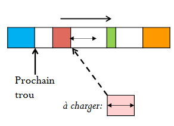
! génère des résidus (NO WAY)

#### Best-Fit
on cherche la zone la plus adaptée
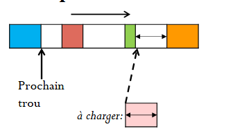
génère peu de résidus
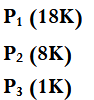
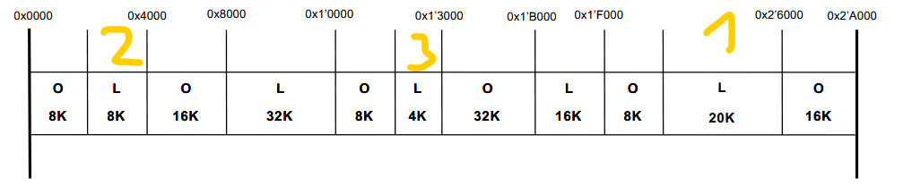

#### Quick-Fit
On utilise une list dynamique à deux niveaux
Chaque entrée de la list designe un list de trous de meme taille
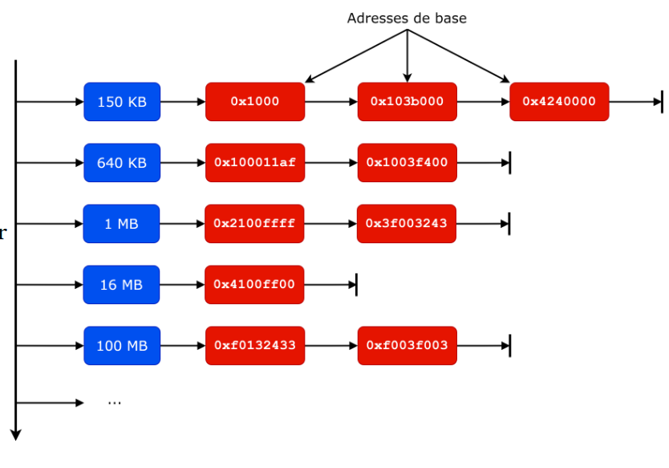

Quand un process est libéré que l'on trouve 2 trous adjacent => alors on les fusionne

### Espace d'addressage virtuel
Y a moyen d'avoir des address virtuel qui donne sur aucun address phyisque du coup ===> Espace d'addressage virtuel > Espace d'addressage phyisique

L'espace d'addressage est diviser en 2 partie 
- Kernel
- User

Pour une architecture 32 bits on peut allouer 4Go -> 
1Go = Kernel | 3Go = users (y a aussi 2/2 ou du 4/4 mais le 4/4 demande des reconfiguration des la table de traduction du MMU durans les changements de context)

#### 64 bits
y a trop d'esspace, du coup on utilsie pas tous
les address utiliser son applé "adresses canoniques"
(Si on essayer d'aller dans une address non-canonique -> exeption au niveau processeur)

Les bits utiliser pour l'addressage peuvent varier entre 39-57 bits de poids faible 

##### Avantage des address virtuel
- isolation des process
- gestion facil des adress 
- peremette l'utilisation de memoire étendue

## C10 | Mémoire paginée
Une page = ensemble d'octet contigus (généralement de 4Ko) un peut comme les blocks de la 3DS

Une page virtuelle est mappé à une page phyisique
Les page sont indexer

l'idée c'est que l'on allous une page au minimume comme ça moins de trous dans la memoire

Si jamas on demande combien y a de tables de pages dans un sytsme, c'est "autant qu'il y a de programms"

### Addr virtuel décomposition
addr de 32 = [numéro de page][offset]
faut utiliser un table de page pour passé de page virtuel à page phyisique

découpage : xxxx yyyy yyyy yyyy | x = numéro de page / y = offset

Si la page fait 4Ko => 12 bits pour l'offset

### P-T-E | Page Table Entry
c'est la table des pages dont je parlais
contiant : 
- numéro de page phisique assigner
- droits d'accés à la page
- présence en mmoire ou non
- ...
L'entrée est souvant de 32 bits
BTW pas de stockage sur l'offset, c'est le meme que le virtuel (logic)
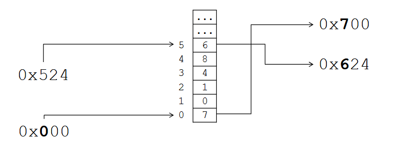

### T-L-B | Translation Look-aside Buffer
En gros c'est une plus petit table pour accédé vite au page demander reguluèrement
c'est stoker dans le cache (lvl 2 et 3) et c'est en 2-12MB

on regarde d'abort la **T-L-B** avant de checker dans la RAM la **P-T-E**

### Optisation de mémoire
Si y a 2 process qui utilise le meme binaire, on vas associer les page virtuel du noyau au meme page phisque, comme ça on vas eviter de le charger 2 fois, funny
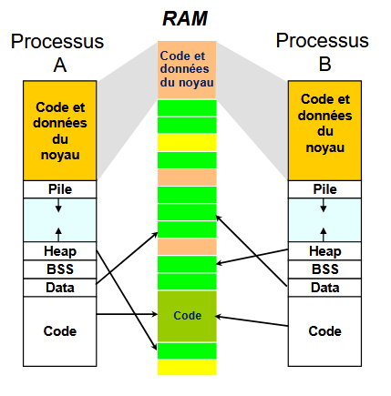

### Process et pagination
- Le **Page Table** est stoker en mémoir physique sur le **Page Table Base Register**
- Le **M-M-U** connais sont emplacement
- Chaque **process** dispose ça **propre** table de page
- Changement de context d'un process => changement de context mémoire => reconfiguration du **M-M-U**

### Pagination multi nieaux
En gros, plusieur table de page
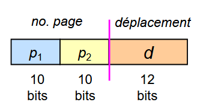
le num de page est divier, le premier indique qu'elle table de page, le second indique qu'elle page dans cette table de page

(just la premirer table, elle done l'addre de la table phisique ou ce trouve la seconde table de page)

## C11 | Extention mémoire et faute de page
Y a certaine zone mémoire virtuel qui demande des page physique qui ce suivent (**D-M-A** | Direct Memory Access) 
Typiquement pour les transfère de donné entre une périphérique et le CPU
### Bits map
Pour géré les pages libres, on utilise souvent 2 structure.
- Une bits map avec chaque bit = si page # est libre ou non (0 = libre)
  - Utiliser pour trouver rappidement les pages libre qui se suivent
- List de page libre (chain list)
  - utiliser pour ajouter des info au page (genre les drois , tous ça tous ça)

#### Quand la RAM est plaine
- Sois on give up (Mémorie Overflow)
- Sois on transfer des pages sur le disque dûre (vue que le system virtuel est général, ça constie juste a copyer la mémoire à une autre address physique et mettre la table à jour, les process y veront rien j'ai **jurée**) ====> ç s'appel du **swapping** 
Sous windows : **C:/pagefile.sys**

**SWAP** = zone mémoire où on stoke des pages (parfois)

### Pagination à la demande (OMG)
- les pages sont charger en mémoire uniquement si on en à besoins

Faut pas déconner avec le swap du coup (parceque c'est couteux de fous)
- On swap que quand c'est obligée
- On vas beaucoup intéragire avec le system de fichier du coup

Y a des opti a faire, typiquement, un fichier binaire, on sait qu'il est en Mémoire et on sait qu'il risque de ne pas trop bougée, du coup à la place de le charger en RAM on peut direct aller le chercher dans la mémoire.

Fichié mappé = projeter un contenu de fichier dans la mémoire (vue qu'addre virtuel)

### Faute de page
- Faute de page => page plus en RAM :[
- Remplacement de la page 

Si y a pas la page en RAM et qu'on la demande alors 
1. Interuption syteme
2. Noyaux vas chercher la page en mémoire
   a) y a de la place en RAM => :]
   b) y a pas de place en RAM => trouve de la place en dégagent des page dans la mémoire

#### Detection
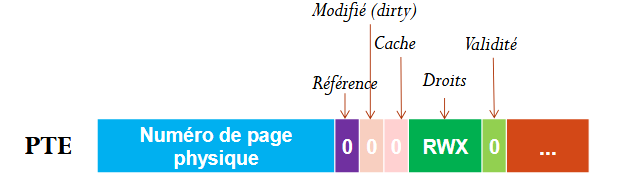
- Référence = si la page est référé ou non
- Modifié (dirty) = quand la page est en train de ce faire modifié
- Cache = si la page est dans un cache (CPU ou RAM)$
- RWX = droit d'accet à la page
- **validité** = si la page est RAM ou non

#### Swaping 
1. l'instruction contenant une ref mémoire est exec
2. Le MMU check dans la PTE si la ref mémoire est dans la RAM (ave le bit de validté) ==> Si page absente ==> Interuption faute de page
3. Aller chercher la page manquante
4. Si y a pas de place, on en libère

## C12 | remplisage des pages
Remplacement Global :
- N'importe quelle page peut être remplacée$
- peut apartenire a n'import quell process
- Bonne startegie global 
- Permet de préserver des pages du processus en cours d'exec
Remplacement Local :
- Seul les pages appartenant au process peuvent être remplacer
- Pas d'interférence entre les process 
- Startégie au niveau du CPU seulement
### Algorithme de remplacement
#### OPT (Optimal)
Algo théorique utilise comme référence

#### FIFO 
On remplace les pages selon l'ordre d'arriver
Simple | Pas optimal
#### L-R-U | Least Recently Used
On remplace les page qui n'ont pas été lue réçament
- Proche de l'optimal
- Besoin de garder les tarce d'accès

On peut en faire une version de approcimative en utilisant le **bit de Référence** mais cella dois impliquer le replacer à **0 avec un timer**

(dans ce ça, on auras juste à selectioner la première page avec le bit à 0)

#### Seconde chance
- basé sur **FIFO**
- utilise le bit de Référence
- 

Alogo : 
- on choisi la page selon l'ordre d'arrivée
- Si le but R est à 1
  - la page est considérée comme nouvellement arrivée dans le FIFO 
  - le bit R est remis à 0
- si non (R = 0), page remplacer >:[

détaile, en gros on parcourt la list des pages jusuqu'à trouver une page avec R = 0, on la remplace, on avance de 1 et la page où l'on ce trouve devien la tête du FIFO.

Si tous le monde vien d'arrivée => faire du classic FIFO 

#### WS-Clock | Work Set Clock
C'est un algo pour du **remplacement local**
L'idée c'est que chaque process garde en mémoir les page visité dans ce qui s'appel une "fenètre d'observation" et l'ensemble de travaille (toute les pages différente visiter par le process)

En gros, ça marche avec un system de time stamp (TDU) et une fenêtre $\delta$ (taille fenêtre de travaille)

- basé sur Seconde chance

Algo : 
- on regarde la page en tete du FIFO
- Tester le Bit R
  - 1 => mettre à 0 => set TDU au temps actuel => go next
  - 0 => 
    - Si la page à une durée de vie (temps actuel - TDU) =< $\delta$ => go next :]
    - Sinon => mort >:[

## C13 ?